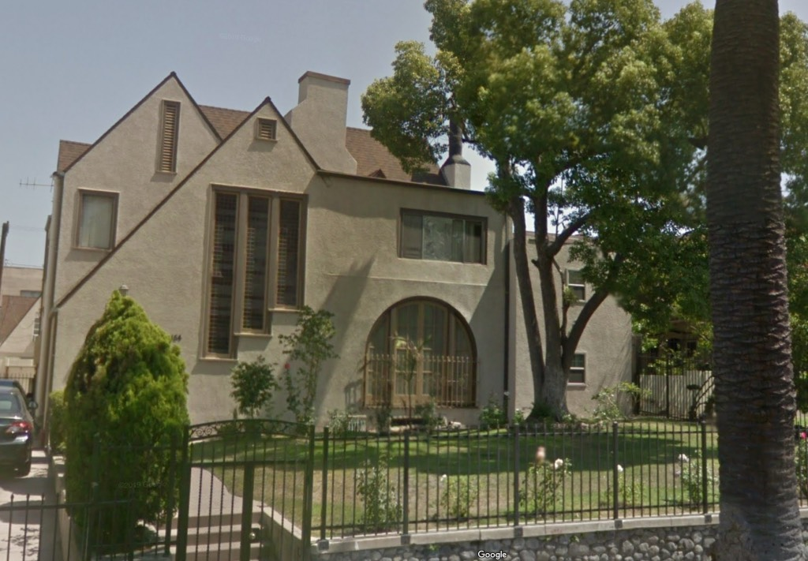
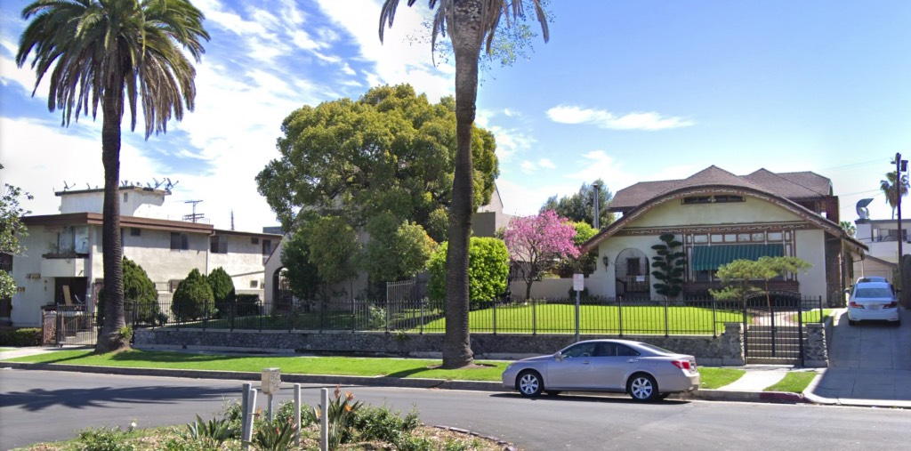

Los Angeles was sold to me, as she had been to countless others, on the booster's promise of light and air and orange trees. That I would move here and live in a charming little Spanish stucco fourplex until such time as I'd be able to get a house in the 'burbs with a yard and, you know, an orange tree. Somehow I managed the dream, shuffling between apartment complexes until I _got_ the house with the light and air and the dang orange tree.

But the Los Angeles I moved to back in '93 is fast disappearing. Where once single family homes blanketed the landscape, they are now routinely felled for massive construction. Human-scale garden court apartments are swallowed up by megadevelopments.

But, you say, _housing_! To which you add, _homelessness_ and _density_ and _urbanism_ and _growth_! But I'm not here to argue politics. Though in the course of things I likely will.

Rather, I'm here to show you what's going away. The premise of this blog is simple: after a demo permit is pulled, I'll show you a picture of what they're demolishing, and tell you about its forthcoming replacement. For example:

Here is 154 South Occidental Blvd. It was built in 1923.

_Records show the living room had to be enlarged in 1937 to accommodate the installation of a pipe organ._

154 is being replaced by a five-story, thirty-six unit project.

_Look at the roofline on its neighbor 160, built in 1920. Holy smokes._ _Is it next?_ _According to [UrbanizeLA](https://web.archive.org/web/20190901195541/https://urbanize.la/post/1920s-single-family-dwellings-could-make-way-apartments-westlake)_ _it is similarly doomed, but the_ [_plans_](http://planning.lacity.org/pdiscaseinfo/CaseId/MjMxNzUx0) _don't make mention of it. Seems like the folk at Urbanize got a fly in their ear at the TOC lobbyist bar._

154 is there behind the tree (also not long for this world). You can imagine the way in which a five-story building is going to change the neighborhood. Strictly speaking the developers are not _allowed_ to build that big but the City awarded them a zoning variance. Which is dubbed the friendly-sounding "density bonus." Basically, if you set aside 8% of your units for subsidized housing, and it's near a bus stop, local zoning gets thrown out the window. (That's simplifying matters grossly, but it's too early in the game to begin hashing out the Density Bonus program, or, more to the point, incentivizing entitlements under the Transit Oriented Communities Affordable Housing Incentive Program Guidelines.)

In short. The Los Angeles I came to know, the trees and wide spaces—you might call it sprawl, and deride it as [ticky-tacky](https://www.youtube.com/watch?v=2_2lGkEU4Xs) replete with [conformity](https://www.youtube.com/watch?v=sUzs5dlLrm0) suitable only for watching it burn, [all Halloween orange and chimney red](https://www.youtube.com/watch?v=1I9GqxDA4ac)—well I love it, each and every 154 South Occidental, every stucco fourplex, every orange tree. And I love all y'all, each and every Angeleno, and want you to forever share in the programmatic tamales, the Late Moderne pylon signs, the dingbats, the whole Norman-Chinesque-Spanish-Egypto mélange that Evelyn Waugh so dutifully chided us about.

And with that, here we go!  Please be advised we are as well associated with the besocial'd media that are [Facebook](https://www.facebook.com/groups/2252126351695468/) and [Twitter](https://twitter.com/AngelesRip).  If _you_ are on a social network and sharing a threatened or lost landmark, may I suggest you use the #RIPLosAngeles hashtag?  Thank you! 

- [South Occidental Boulevard](https://www.google.com/maps/search/?api=1&query=34.06942,-118.28076)
