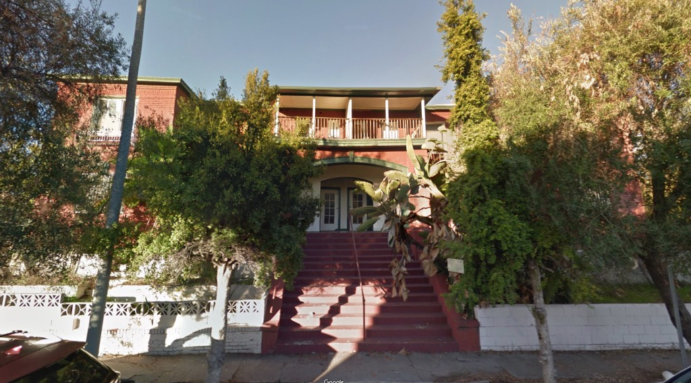
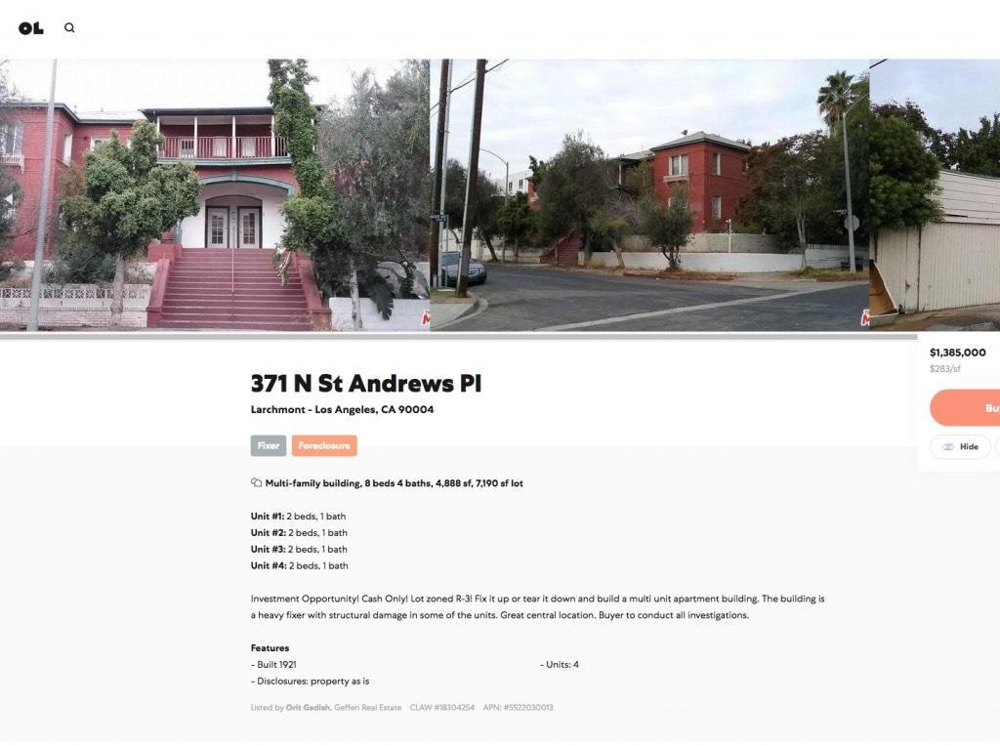
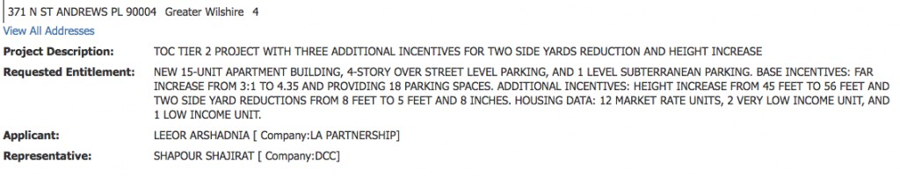
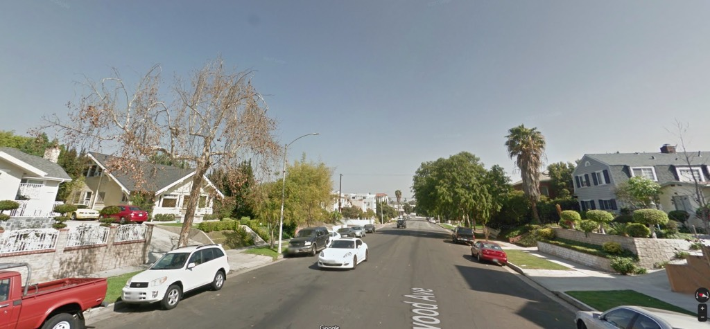
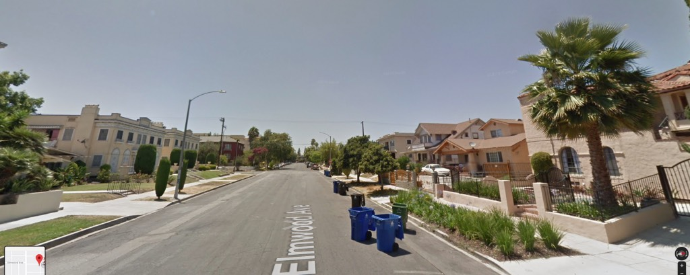
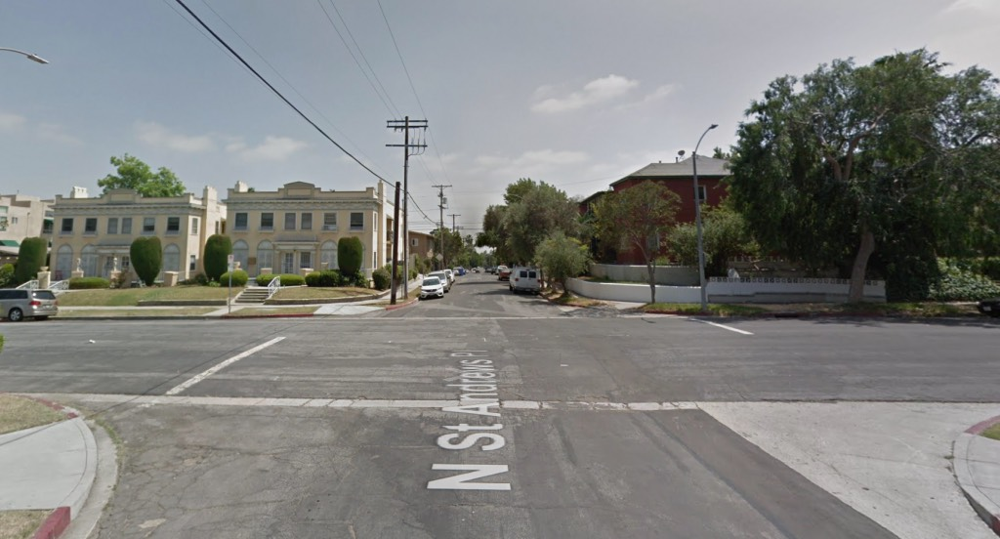
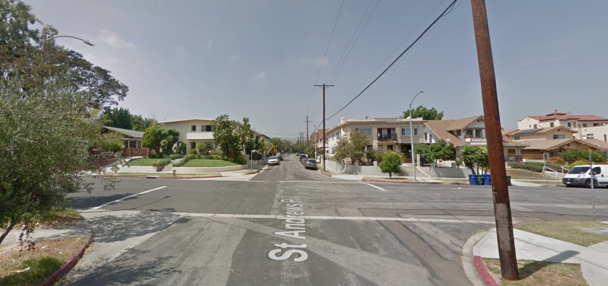
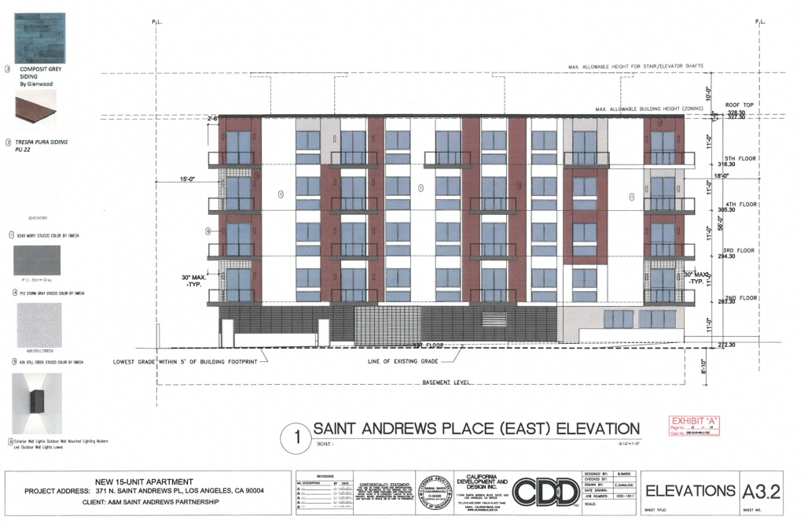
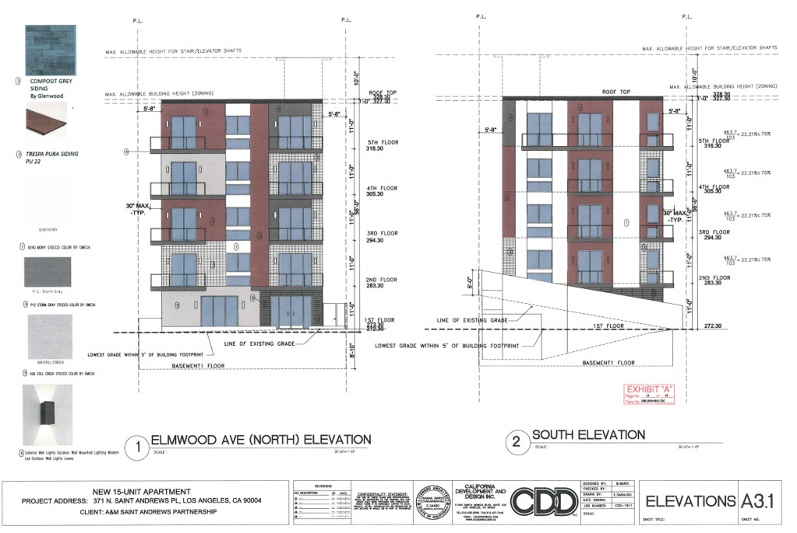

_A certain overgrown charm_

For our first post, we'll take a look at 371-377 North St. Andrews Place, at the southwest corner of St. Andrews and Elmwood Avenue.

Permits are pulled in March 1919 for a $16,000 twenty-room fourplex of flats; the Assessor pegs it as being built in 1921. The four-unit apartment house was owned by F. G. Fritz, who had hired [Edward Butler Rust](https://en.wikipedia.org/wiki/Edward_B._Rust) as the architect, and [Luther T. Mayo](https://www.flickr.com/photos/michael_locke/6650844495) as contractor.

Architect Rust is best known for his [Los Altos](https://en.wikipedia.org/wiki/Los_Altos_Apartments). [Another of Rust's fourplexes](https://la.curbed.com/2017/1/9/14207580/1920s-french-normandy-condo-complex-west-adams), also from 1921, was recently made a Historic-Cultural Monument. Other notable works of Rust's are the [ill-fated](https://www.kcet.org/history-society/sign-of-the-times-the-strange-fortune-of-the-hotel-californian) 1927 [Hotel Californian](http://jpg1.lapl.org/00007/00007203.jpg) on Sixth, the [nearly ill-fated](http://www.tedsoquiphoto.com/2010/09/apartment-fire-in-ktown.html) 1928 Versailles down St. Andrews, the National Register [Maryland Apartments](https://hdl.huntington.org/digital/collection/p15150coll2/id/2785/rec/1) in Pasadena, and, from later in his oeuvre, the Art Deco [Linder Residence](https://takesunset.com/2012/04/7975-woodrow-wilson-drive-in-hollywood-hills/) of 1938.

371 a handsome structure. I like the bilateral symmetry, the keystone arch, the Monterey balcony.

But as they were quick to point out in the listing, _fix it up or tear it down_:

Can you guess which they've elected to do?

Five stories, with a zoning variance to make it fifty-six feet high. No more banana palms and wide stairs, this thing will be built to the edges of the property on all sides, because they got a zoning variance for that, too. I can tell you what it will look like, and I bet they haven't even hired an architect yet. It will be your typical wood frame over concrete box, with some jagged part to the façade to give it "character" and some pastel color to give it "humanity." It will use flat windows, rainscreen cladding to create the skin of the building, fiber cement Hardie panels. It will be depthless. It will express the essential vacuity of the 21st century.

Mostly, it will be fifty-six feet tall. Let's look around the neighborhood a bit:

_Looking east on Elmwood across St. Andrews Place; 371 behind the palm_. _It's a two-story neighborhood._

_Looking west on Elmwood; hard to miss 371, dark-red as she is, center-left_

_North on St. Andrews. (I trust you've noticed the two incredible matching flats at the southeast corner. They were built in 1919 and designed by [A. B. Crist](https://patch.com/california/hollywood/hollywood-royalty-only-castle-will-do), who [built the first house in Hollywoodland](https://ladailymirror.com/2016/06/20/mary-mallory-hollywood-heights-hollywoodlands-first-house/).)_

_And looking south on St. Andrews._ _371 to the left behind the bushy tree._

Why am I showing you all these captures through the interesection? To indicate there's nothing remotely so modern and monstrous around. That's what's plopped down here. _Because, you know, it's a half-mile from a bus stop_.

Does that make sense? That's the ambit of [TOC](https://la.curbed.com/2018/8/31/17796388/preservation-density-transit-affordable-housing) (and the [density brownshirts](https://live.staticflickr.com/65535/48621073023_37fa1ee3c2_o.jpg)). It's all out-of-state developers lighting cigars with dollar bills. Worse yet, it's social engineers like Mark Vallianatos and his comrade Scott Wiener as they try to force upzoning on cities.

And that's our first post! Keep coming back!

Because your neighborhood is next.

- [North Saint Andrew's Place](https://www.google.com/maps/search/?api=1&query=34.07783,-118.31146)
