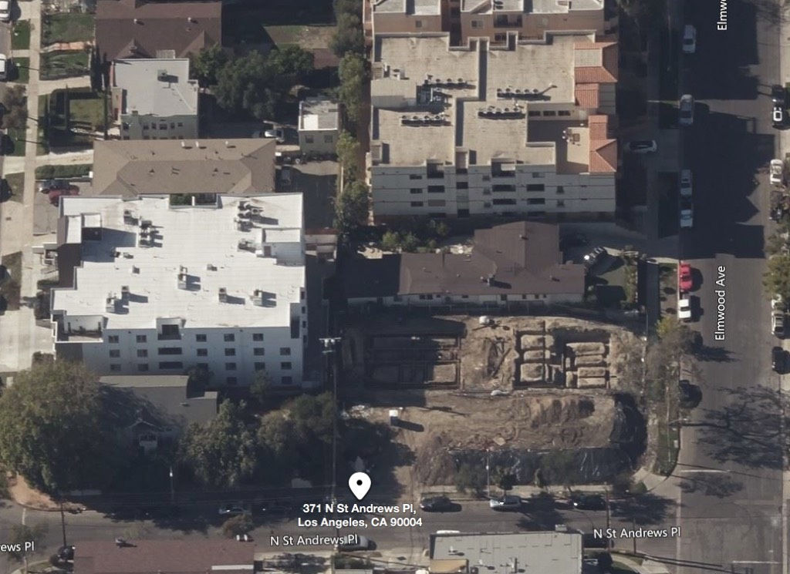
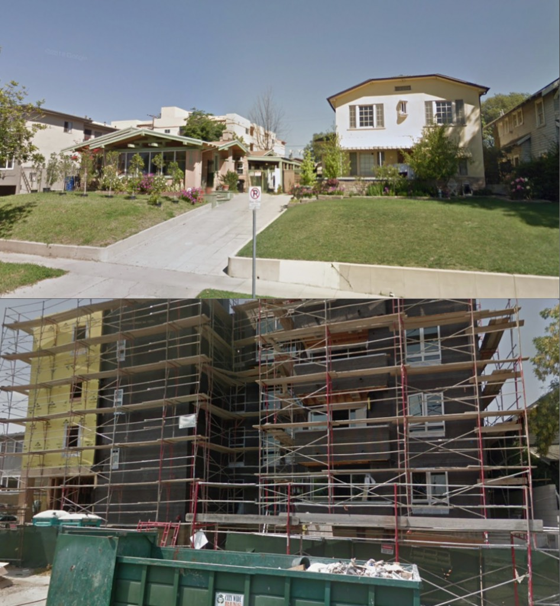
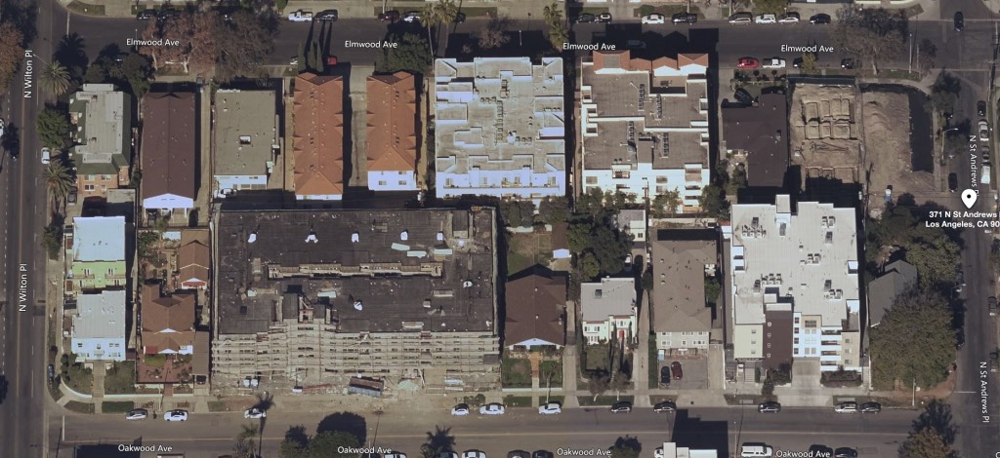
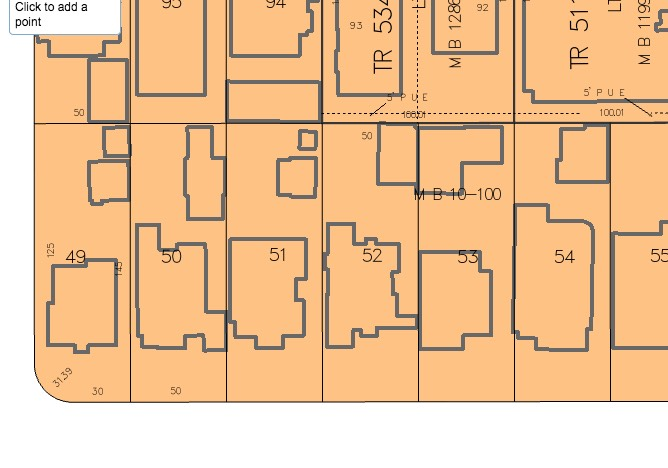
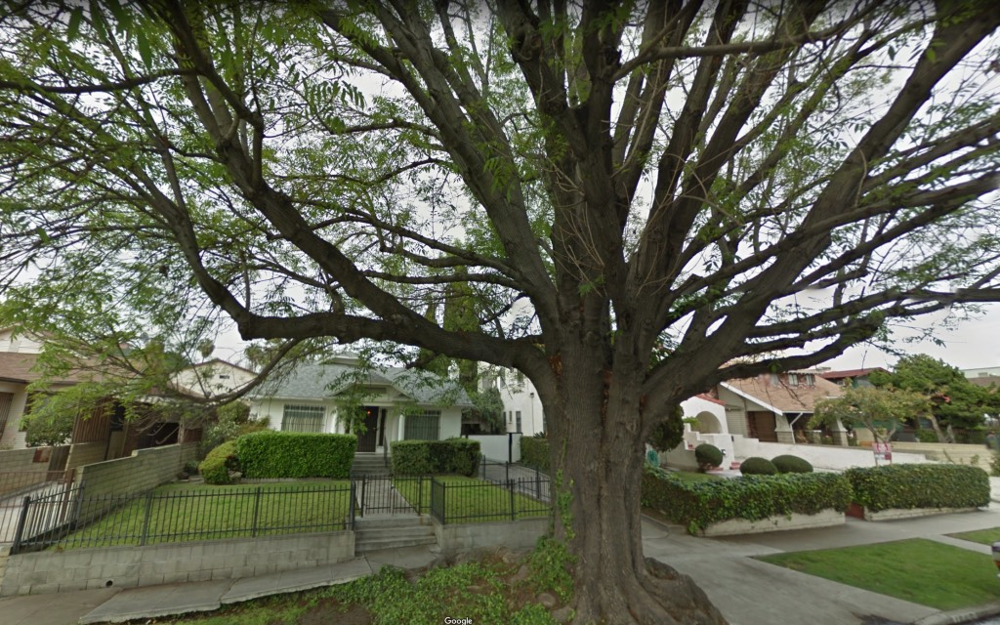
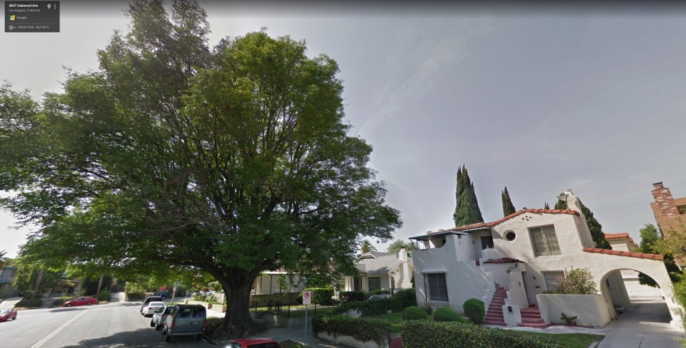
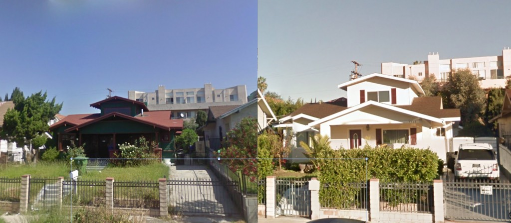

Well, this is how we learn. R.I.P. Los Angeles is not an exact science, yet.

In my defense, the blog was in its infancy when I posted that [371 North St. Andrews Place was not long for this world](https://riplosangeles.com/2019/09/03/371-77-n-st-andrews/); I had the [Planning Dept info on that corner](http://planning.lacity.org/pdiscaseinfo/CaseId/MjMxNjU40) and I found no demolition permit on [Zimas](http://zimas.lacity.org/).

So after posting that this wonderful building is threatened, I was contacted in short order by a couple of good folk saying you knucklehead, this building is long gone! Well, they didn't call me a knucklehead, but I felt like one. Here's what they said:

From _LC:_ This lovely building was demolished before the date you listed for the permit. I think it was pulled down last fall of winter. After the property was acquired by a developer, they got all the tenants out, then sort of boarded the place up. Naturally, the local homeless community took up residence immediately. They responded by boarding it up a little more securely. That last a few weeks. Eventually, it caught fire. Happily, no one was injured but the roof burned and the building had to be pulled down. We live on this block and construction on the new structures (there are two or three because the developer also acquired the house next door) has been well under way since spring. While your photos show many of the beautiful older buildings still standing in the immediate vicinity, there are in fact four other new construction projects within just a few feet of this one. All are the hideous, boxey eyesores that developers favor. There are now more new buildings than old on these two blocks of Elmwood and Oakwood. It’s depressing.

From _allison schallert_: this was torn down over a year and a half ago. the young and old people were evicted without payment, and the only good thing is the construction crew, or the owners are letting some unhoused invididuals live in a small corner. I live on the 500 block of North St Andrews Place

So here's something else I found out. A Bing maps aerial is a lot more current than a Google street-map.

Lookit that. A big lot full of dirt. The first thing that caught my eye was the large white building to the south. Didn't my ninety-two intersection images prove that there were no VeryTall buildings in the vicinity?

The one on the right, a ten-room, two-unit, designed by A. J. Badger and built in 1920. On the left, a bungalow from 1913. It's nice to know Los Angeles can be so cavalier about tearing down its [bungalows](https://laist.com/2016/04/15/bungalow_history.php). And this one is on record as being designed by female architect Anna K. Hallock. Well, was. Protip: invest in landfills.

So while we're on the subject of the immediate neighborhood (as LC states, there are "hideous boxy eyesores" scattered about the immediate landscape) I pulled up a bit and said what the hell is _that_?

So recently lost are 4847 (51) , 4843 (52) , 4837 (53), and 4833 (54) Oakwood, for whatever that big grey thing is. Because unless I do it, no-one else will and they will be lost forever, let's look at them.

4847 Oakwood. Look at that amazing, healthy tree. They ripped it out, because they could. Imagine you lived across the street for fifty years and that tree was already old when you moved in.

_Look, I'm not an eco guy, I'm a building guy. But aren't the folks who, really, really like trees upset that developers are ripping up and destroying all the trees in Los Angeles? Shouldn't the knowledge of that be, you know, a_ thing_?_ Hey tree people you're losing your canopy.  
_Oh, and 4847 Oakwood was apparently built before 1905, because no building records exist of it._

_Oooo look honey, curb appeal! Hey you sonsabitches, here's a protip, don't paint everything white and put in vinyl windows and CUT OFF YOUR RAFTER TAILS! But I guess it doesn't matter when Dan Zaharias of Oakwood Development comes to town and destroys it a couple years later anyway._

Above: 4833 Oakwood was one of Los Angeles' earlier bungalows as its construction records predate 1905. Good work there, LA! But in the name of all that is holy don't tell me you've left some! Are you bereft of your duties? Don't you have flamethrowers or something?

And here is a summerhouse built by Leonard Jones, designed by A. M. Brown, in 1923.

Ooop! Despite the fact that there are more buildings that died, that need to be remembered, I have to go right now, so if you will, excuse me.
