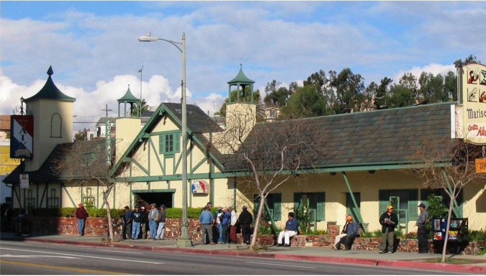

_More than just a shadow encroaching; that's doom.  
_[_Pinterest_](https://i.pinimg.com/originals/f8/fc/61/f8fc61dbfb16a0b039b7207fcad247a0.jpg)

Taix Restaurant, at 1911 West Sunset, has not had her demo permit pulled.

Yet. But it will happen. As [recently reported](https://www.theeastsiderla.com/eastsider_on_the_go/restaurants_and_bars/echo-park-s-taix-french-restaurant-to-become-part-of/article_19af5e40-c4fc-11e9-8693-bbe93bc2e642.html#utm_campaign=blox&utm_source=twitter&utm_medium=social), Taix is not long for this world.

Curbed readers, being Curbed readers, reacted as Curbed readers generally do.

[_Curbed LA_](https://la.curbed.com/2019/8/22/20828722/echo-park-taix-redevelopment-holland-partner-group)

Other people, however, reacted differently.

_[Facebook](https://www.facebook.com/photo.php?fbid=10156119226616205&set=a.10150894949096205&type=3&theater)_

Full disclosure: I dig Taix the most. In fact, when installed as president of Burbank Shrine Club, I angled to have my installation held at Taix rather than in Burbank, because why wouldn't I?

Dude, seriously, anyone who isn't instantly charmed by its Norman-Tudor village vernacular has a dead soul. The most common negative epithet hurled by the Curbed Class is "well if preservationists like it so much why don't they give it business?!" (a whole twelve disingenuous points below "well if you love it so much why don't you buy it?") and the answer is we do give it business, you sad, sad, little men.

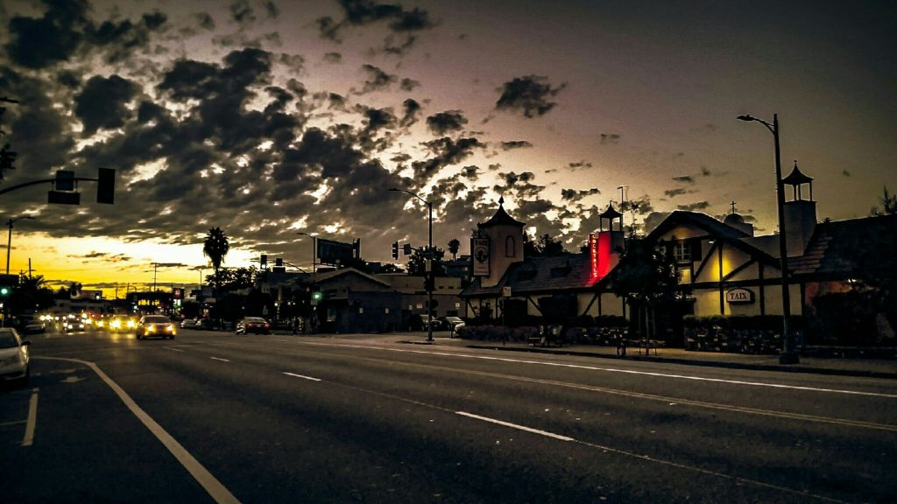

[_LocalFoodEater_](https://www.theeastsiderla.com/eastsider_on_the_go/restaurants_and_bars/echo-park-s-taix-french-restaurant-to-become-part-of/article_19af5e40-c4fc-11e9-8693-bbe93bc2e642.html#utm_campaign=blox&utm_source=twitter&utm_medium=social)

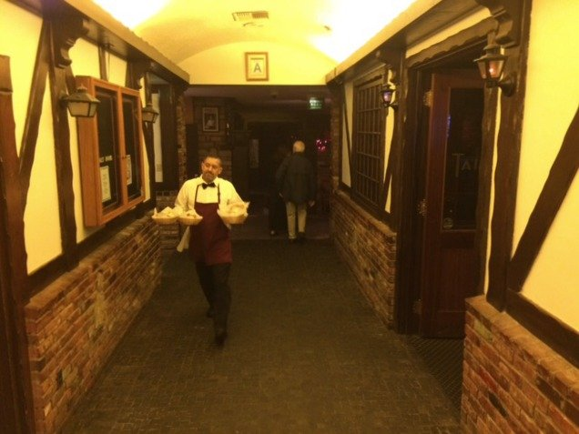

_Look at the fanciful way they merge interior/external space. This image taken from an_ [_excellent write-up of Taix in Ellen Bloom's wonderful blog_](https://ellenbloom.blogspot.com/2017/02/pre-valentines-day-dinner-at-taix.html)

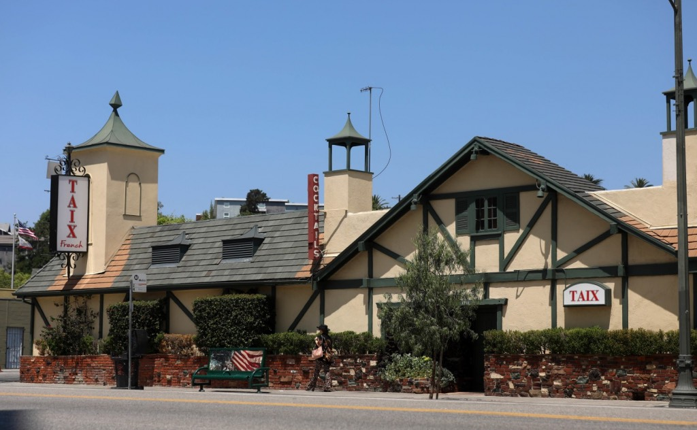

_Fun fact: see the second-story window in the gable? There's no actual room up there—it's not a real window. Yes! Just like Disneyland!_  
_Image courtesy_ [_LATimes_](https://www.latimes.com/business/story/2019-08-22/taix-restaurant-sold)

Taix, of course, is a Los Angeles institution, and you can read about its history—and see images of its original home at 321 Commercial—[here](https://laist.com/2017/10/04/90_years_taix.php).

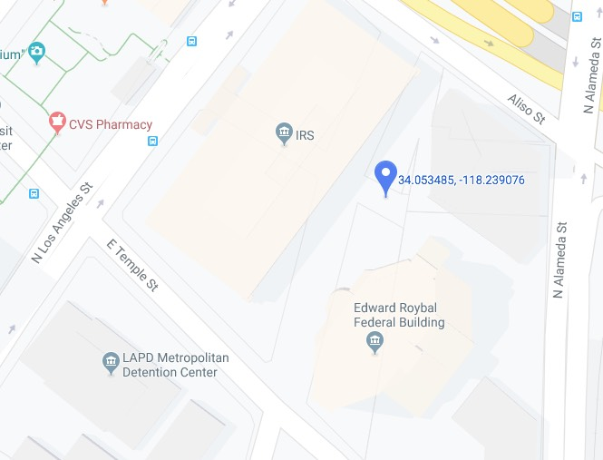

_Folk get confounded when they try and figure out where the old Taix structure used to be; rightfully so. Commercial Street ran NW from Alameda; I've marked the approximate site of Taix [where it stood from 1927-1962](https://laistassets.scprdev.org/i/f7479533da22626866cb591c63ae7f21/5bf5dc633c7450000b05d79f-eight.jpg)._

Less has been said of its post-relocation building. 1911 West Sunset began as a restaurant built for Mrs. Ona Spaulding, designed by architect Edgar E. Butler, and built in 1929; it is run by restaurateur Noah Botwin and is famously known as a hangout for the politicos and police bosses. Spaulding hires architect C. F. Plummer to add a cocktail lounge in the summer of 1938, and hires architect Henry Dean to give it an addition in 1947. It remains Botwins for over thirty years before becoming Rafael's for all of one year, in 1961, before Mr. Taix's purchase in 1962. There's a permit in June of that year to stucco and wood trim the front, thus giving the place its French Provincial character. The west half of Taix to the left of the center gable, with the tall tower, is added in the summer of 1968, and is by Nielsen, Moffat & Wolverton.

Its original incarnation looked, presumably, like this:

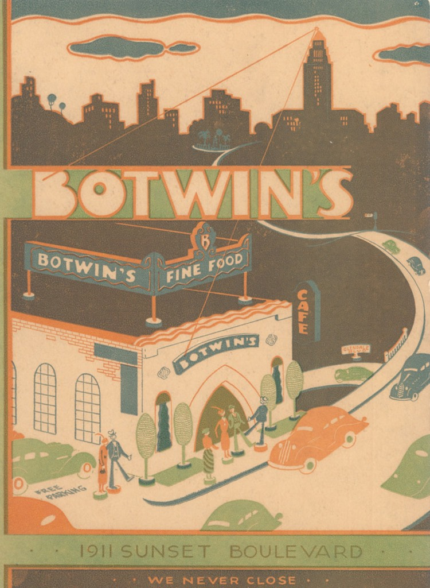

_From the Flickr feed of_ [_jericl_](https://www.flickr.com/photos/79761301@N00/2366656181/in/photolist-4B8JqV)

...magnificently illuminated by City Hall. One wonders if it did indeed have such impressive rooftop signage.

Here it is after its 1938 expansion to the east:

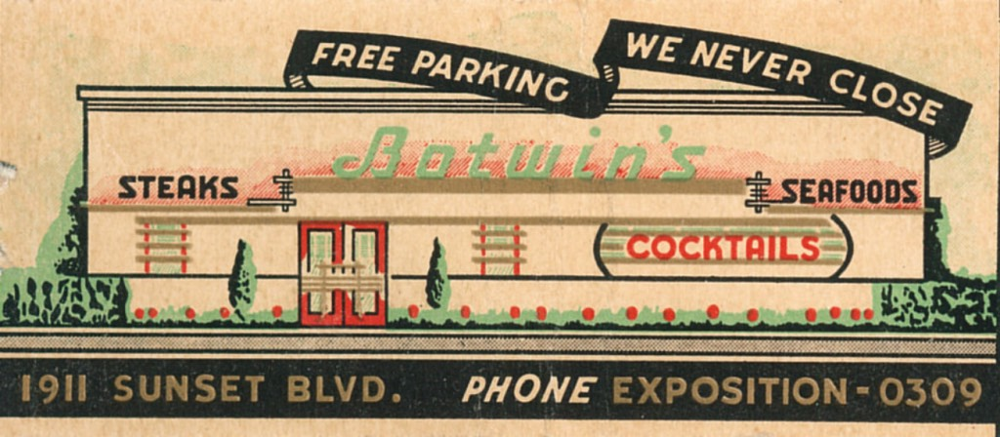

[_jericl_](https://www.flickr.com/photos/79761301@N00/2314560833/)

And how it appeared after the 1947 expansion to the west, doubling its size.

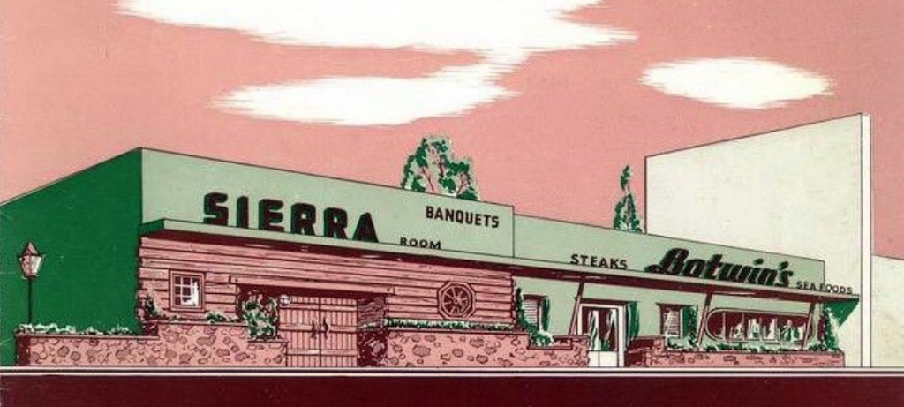

And its Late Moderne-meets-Klondike bones lurk beneath to this day:

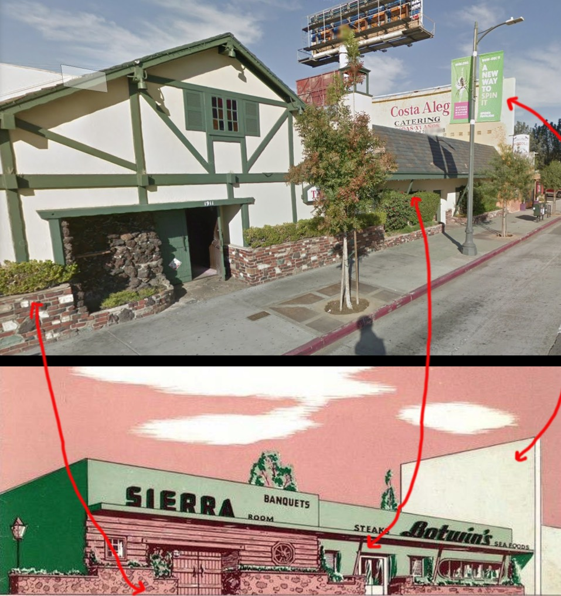

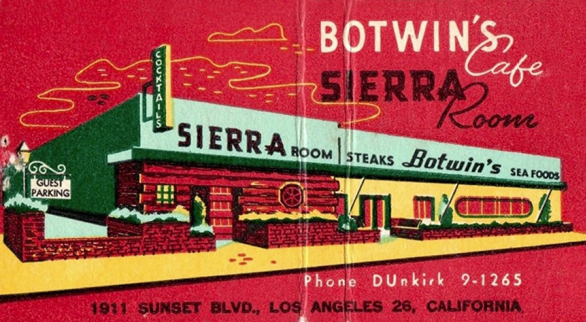

Something else: when Taix moved in and put a gable and half timbering where it once said "Sierra Room," he elected to retain and maintain the 1940s neon sign:

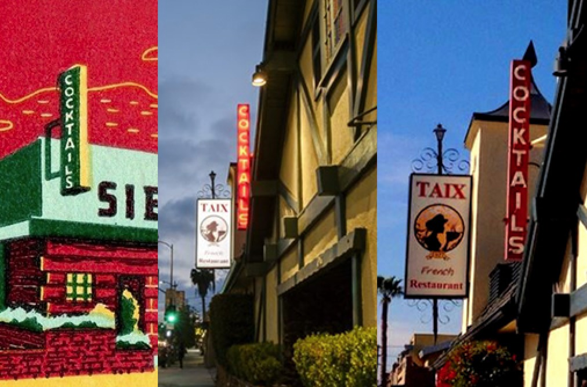

And so, you might want to spend some time at Taix before she goes away. _Yes_, I am aware that there will be a mini-Taix reconstructed within the new six-story, 170-unit development.

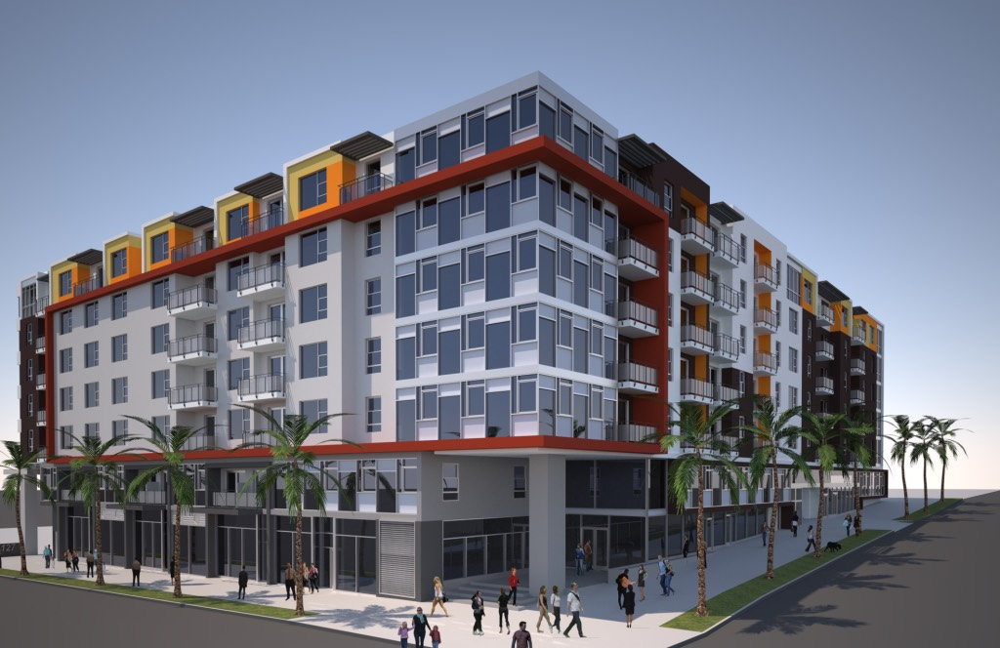

_1111 Wilshire, a typical Holland Residential development, of similar size to that proposed for the Taix site. So now you know what to expect._
