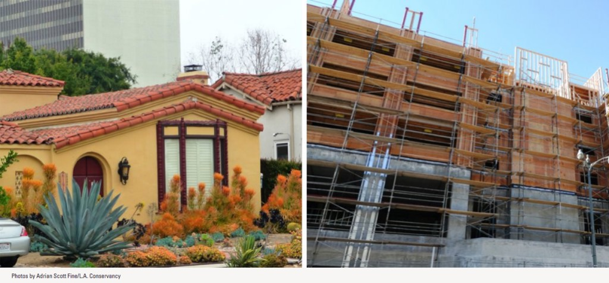

We launched and were going gangbusters there for a little while, when all went dark...because the _City of Los Angeles_ decided to _halt all demolitions_, making this blog _obsolete_!

(Well, maybe not. I just had to go do some dumb things and get them out of the way. Trust me, there's plenty to talk about. )

So while I prepare today's post, let me toss this out there: if you're not familiar with Senate Bill 330, you might want to read [this assessment](https://www.laconservancy.org/issues/senate-bill-330) by the LAC. Then, should you be so moved, [sign the petition](https://www.change.org/p/gavin-newsom-tell-governor-gavin-newsom-to-protect-historic-places) to Governor Newsom (I know, _that_ guy) asking him not to support the bill unless it includes safeguards for historic preservation.

Then come back here later this afternoon for some pix of a 1917 Colonial in Country Club Park...\*

\*...which'll have to wait till tomorrow. I got all worked up about House of Spirits.
