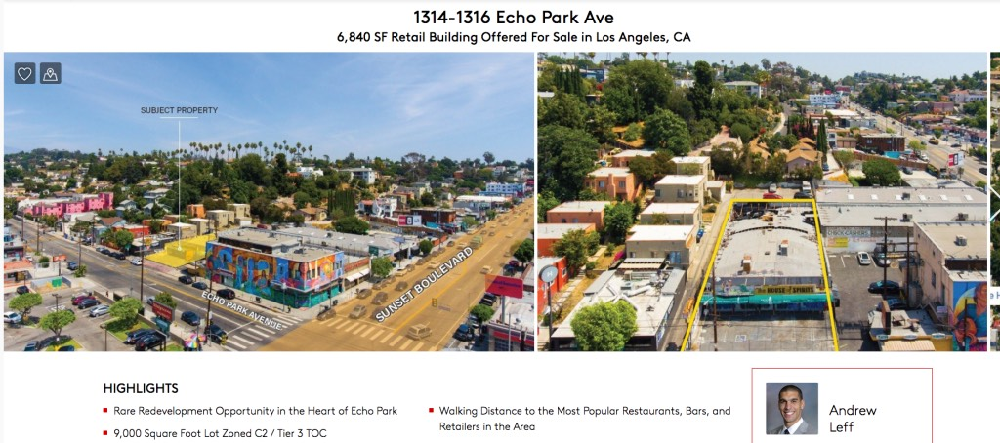

In February 1958, one Mr. Norman Leibow bought Carmen's Garage (U. J. Gray, 1924) at 1314 Echo Park Avenue. Leibow tore off the front thirty feet facing Echo Park and rebuilt it, converting the whole works into the House of Spirits.

To advertise his new venture, Leibow called up Mueller Brothers Neon Company of 1229 West Sunset, and had this $1000 sign erected in March of 1958:

[_Yelp_](https://www.yelp.com/biz/house-of-spirits-los-angeles)

_Thomas Hawk via_ [_Flickr_](https://www.flickr.com/photos/thomashawk/6907481346/)

Two months later, to the tune of $1200, Leibow had Mueller Brothers construct this roof sign:

_Mark Peacock via_ [_Flickr_](https://www.flickr.com/photos/7623944@N03/4182335604/in/photolist-7nzyEy)

_[RoadsideArchitecture.com](http://www.roadarch.com/signs/cala4.html)_

Yes, it's a quaint little cottage (hey, like the kind we used to have in Los Angeles!) with a wonky-donk chimney puffing out animated smoke. With a sunset behind, or maybe that's a rising orange moon? It may be the greatest sign in Los Angeles, which would therefore make it the greatest sign in the world. (Why, of course there's [an image of it](https://live.staticflickr.com/65535/48723891311_60ce29316e_o.jpg) in [my book](https://www.schifferbooks.com/los-angeles-neon-1410.html).) [Here](https://vimeo.com/14548833) is a time lapse of HOS on any given night. Any given night some nights ago, anyway.

Because the House of Spirits went up in flames [one morning, in a rainstorm](https://twitter.com/Silverlake_Pete/status/1070742427437215745), about nine months ago. We were all waiting for her reopen because it appeared the fire was contained to the back and the neon was undamaged.

But, no. According to this fellow Mr. Leff, the newly-listed property is Tier 3 TOC (Transit Oriented Communities), which means, because it's a half-mile from some bus stop, the developer can add two additional stories for up to twenty-two additional feet, increase density by 70%, reduce parking to half a spot per resident, decrease the setback 30%, and on and on. This thing is going to be three times as big as anything within miles. Of course the screeching schoolgirls for density have begun [wetting themselves with glee and calling everyone the N-word](https://la.curbed.com/2019/9/12/20862778/house-of-spirits-for-sale-development-echo-park#comments), because what else is new.

You know what disqusted over at Curbed wants for you? The deleterious effects of high-density living seen in _[mental illness, children’s health, respiratory disease, heart attacks, cancer and human happiness](http://www.newgeography.com/content/003945-health-happiness-and-density)_.

That, and no cool neon signs.

- [Echo Park Avenue](https://www.google.com/maps/search/?api=1&query=34.07722,-118.25685)
