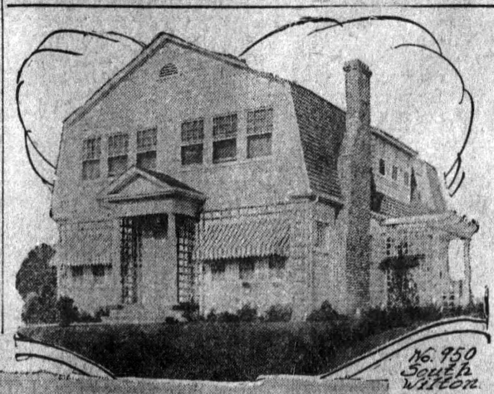
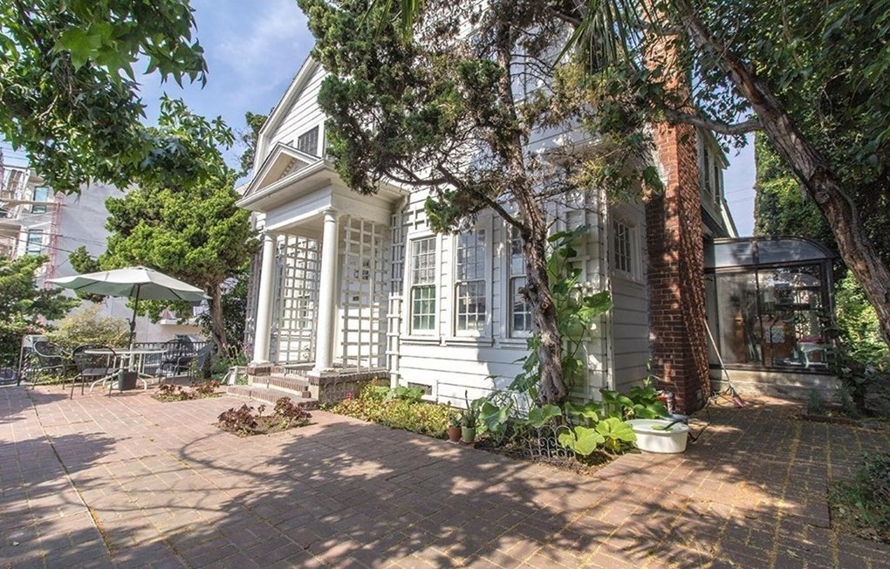
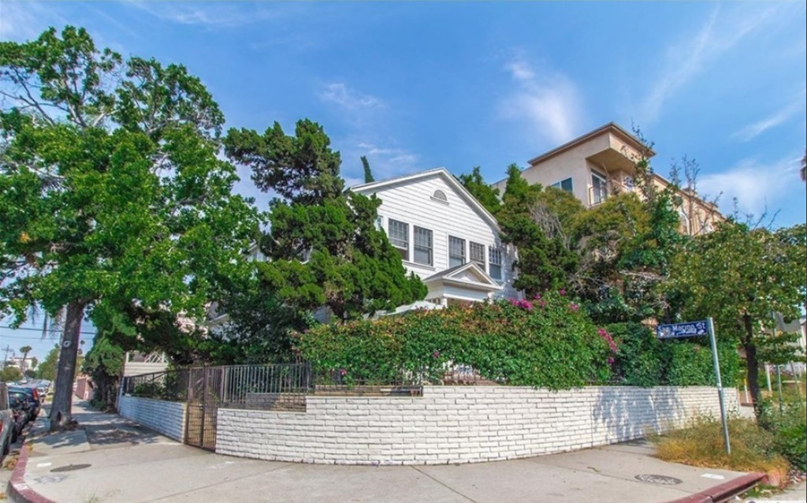
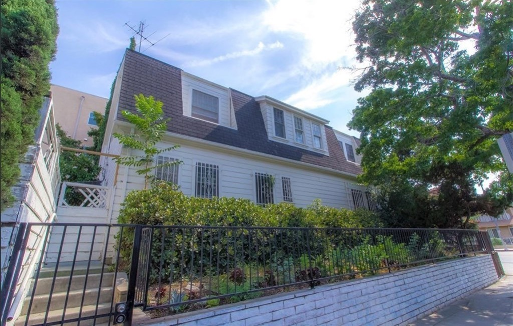
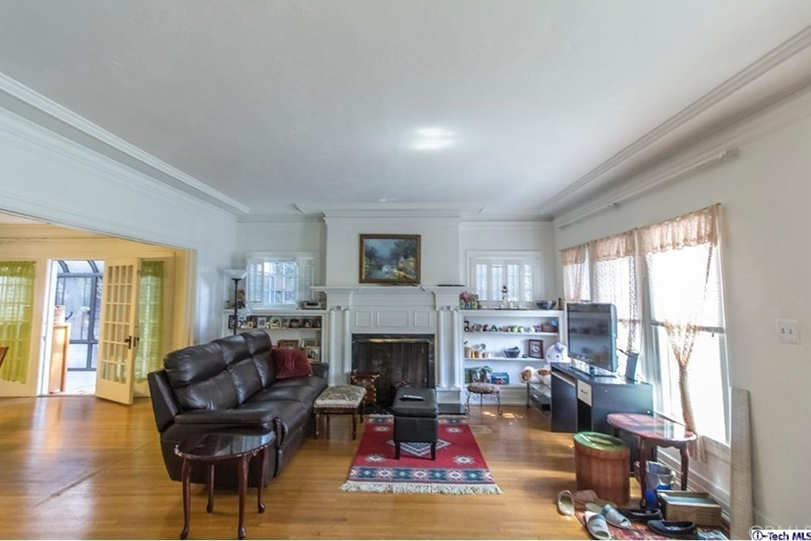
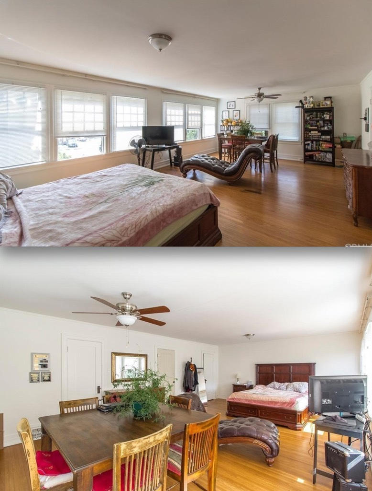
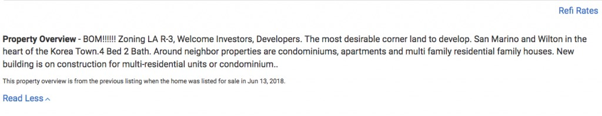
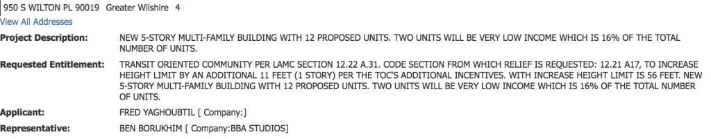

In December of 1916 it is announced that Andre H. Cuenod—a Swiss lumberman who came to Los Angeles in 1891—was putting up this nifty Colonial he'd designed himself. The two-story, seven-room $4000 frame residence would feature a concrete foundation, shingle roof, hardwood floors, hardwood and pine trim, and mantel. (The picture above from a January 1918 blurb in the _Times_ about how he'd sold his place to M. S. Phillips for $9000. Tidy little profit.)

One hundred years and change later, she still stands proud, with her great gambrel roof and dentil-filled pedimented entryway. Even has all her original windows and giant chimney!

_Sure the lawn has turned to brick and they've glassed in the side pergola, but that ain't the end of the world_

_Not crazy about all the white paint, but that's an easy fix. And no can lights! This could be a breathtaking room._

_A shot of an upstairs bedroom. Jeeps, it's as big as a football field. But God forbid we have genteel living and room to swing a cat in this lifetime; density Nazis won't be happy till we're all living in the same airless cubicles we work in. "But it's micro-living! It's good for the environment!" No it's not, Obergruppenführer._

So where did I get interior shots? From the realty listing. But where one sees all this restoration potential—what's the point in them? Who is buying this to live in it, especially when it is marketed as a teardown:

_Dream Realty, La Crescenta_

I don't have to tell you, I suppose, where the story goes next. Coming soon, its five-story, twelve-unit replacement.

- [South Wilton Place](https://www.google.com/maps/search/?api=1&query=34.05422,-118.31407)
