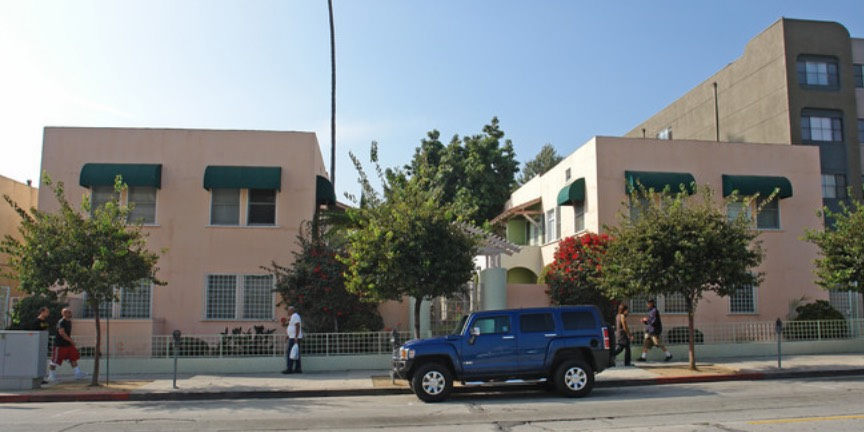
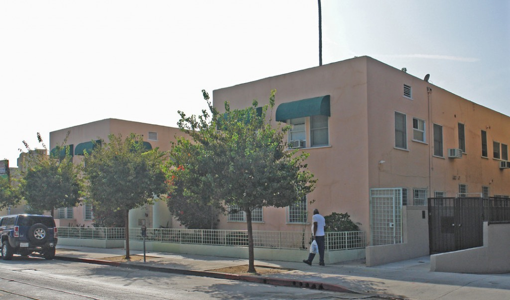
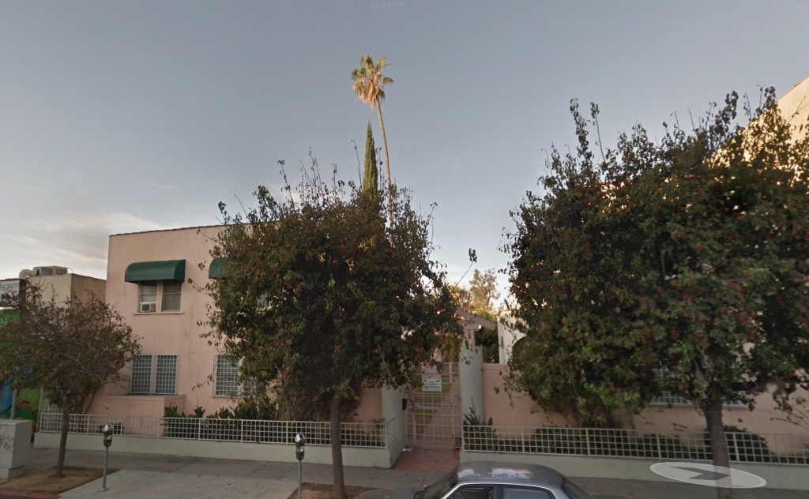
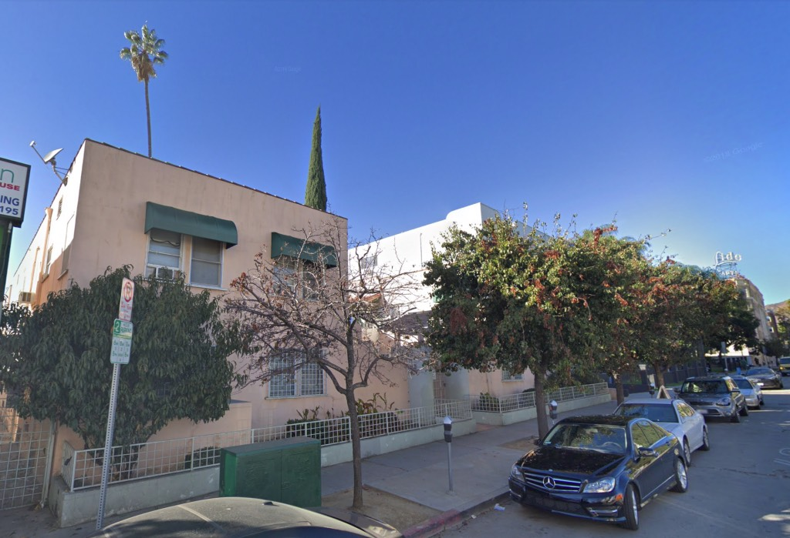
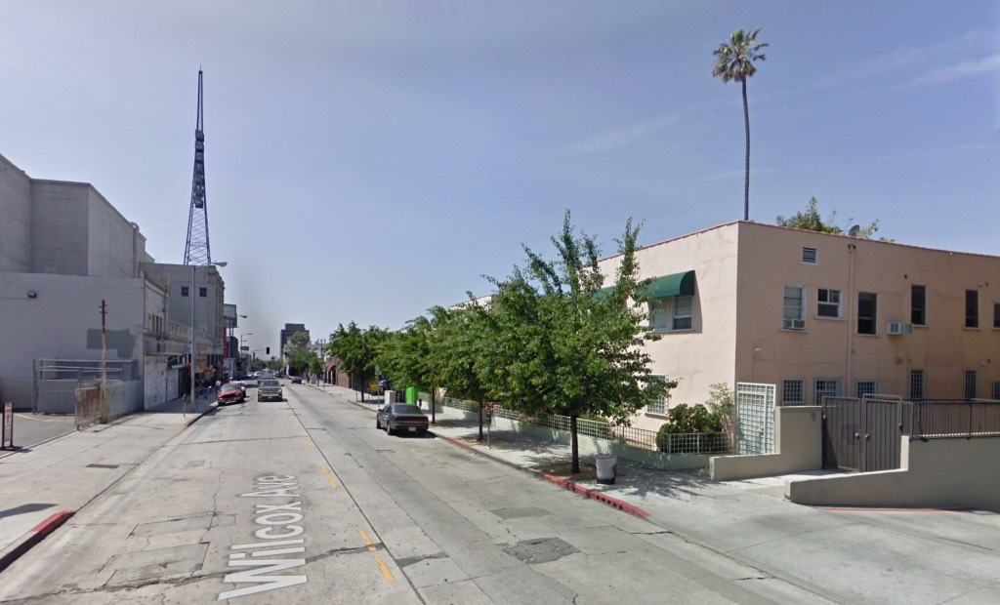
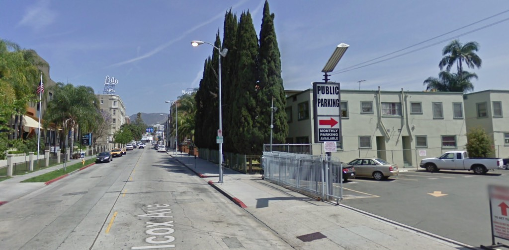
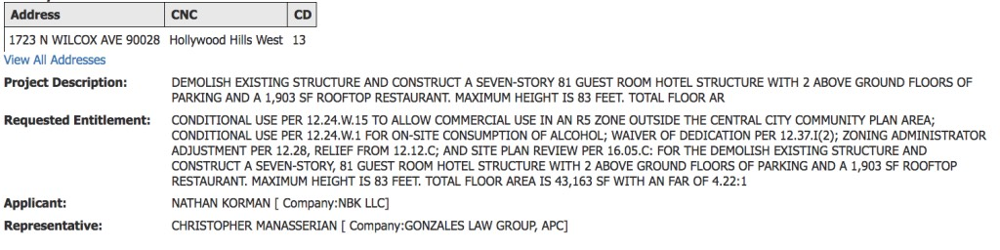
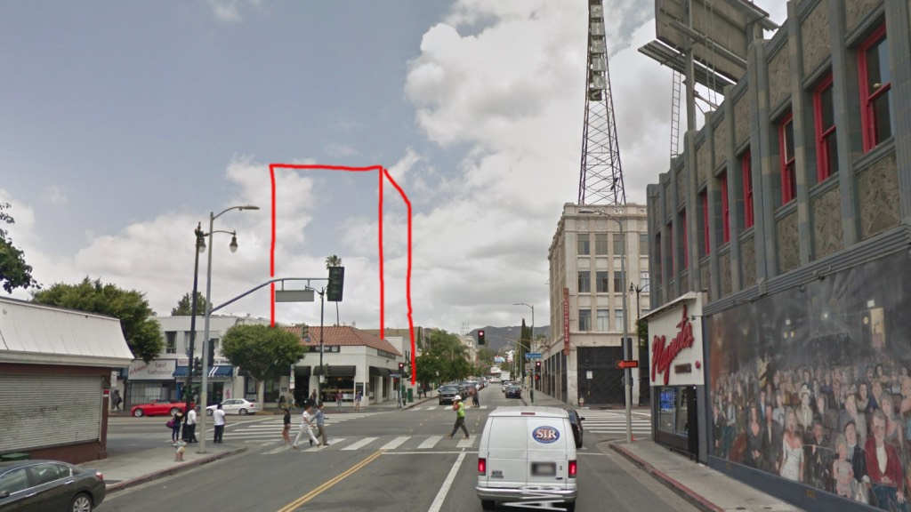

People sure hate courtyard living in Hollywood. Or they love it; that is, at least, they love tearing it down.

In October 1922, Eloise A. Williams pulled permits to build five two-story flats arranged around a central courtyard. The architect was William L. Williams, her husband.

Granted, 1723 isn't going to make the cover of _Bungalow Court Monthly_. I prefer 'em one-story with scalloped parapets and covered in red tile and filled with accordion-playing divorcées as long as we're on the subject. You know, the kind of bungalow courts that Conservancy [justifiably frets over](https://www.laconservancy.org/locations/hollywood-bungalow-courts), and are on the [endangered species list](https://la.curbed.com/2018/1/31/15860310/bungalow-courts-los-angeles-history-endangered). But still, these evoke the nice old low-density Hollywood in which we've come to feel comfortable.

Let's take a look up and down the avenue.

Easy livin', right up the block from the [Warner Pacific](http://www.hollywoodheritage.com/preservation/exterior%20warner.jpg).

Looking the other way up toward the [Lido](https://la.curbed.com/2010/4/12/10516618/lido-apartments-building-hollywoods-hotel-california-has-sold) ([F. A. Brown](https://www.flickr.com/photos/michael_locke/28326582455), 1927) a bit of the [Mayfair neon](http://www.you-are-here.com/hollywood/mayfair.html) poking out, and another courtyard apartment complex of two-story structures at right, from 1916, this one with all its original windows and great privacy given the towering cedars.

So, our little pink friend on Wilcox has been owned by Nathan Korman for some time. Mr. Korman owns all sorts of properties, [to various effect](https://live.staticflickr.com/65535/48752623666_13f6a647da_o.jpg). Seems it's easier to build big shiny new hotels on them.

The way he's decided to go in this particular case is with an 80-foot tower.

Given my years of training with Hugh Ferriss, my renderings are superlative, and as such the tower will, I assure you, look exactly like this:

But if not, that's what an 80-foot structure should basically look like on the site.

Enjoy your new Hollywood, everyone!

- [North Wilcox Avenue](https://www.google.com/maps/search/?api=1&query=34.102459,-118.331421)
