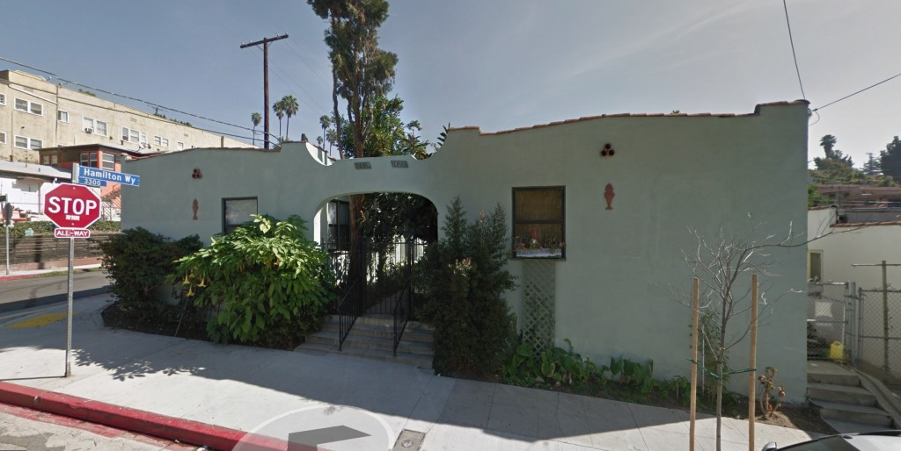
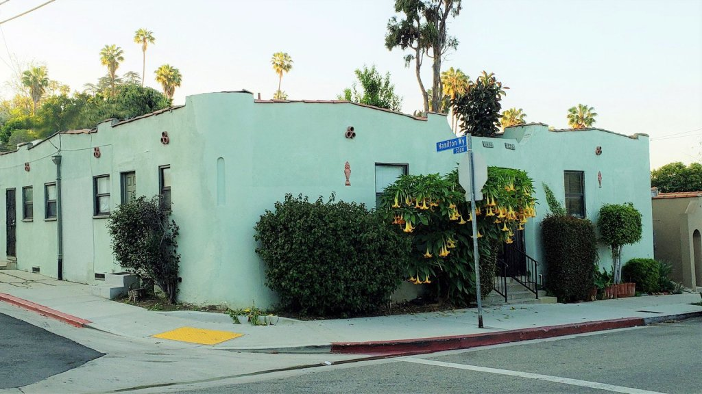
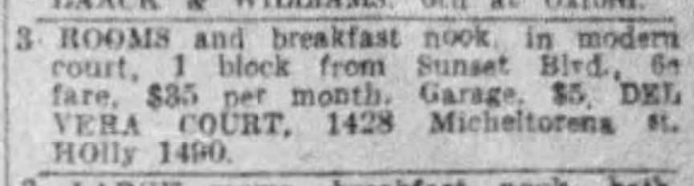
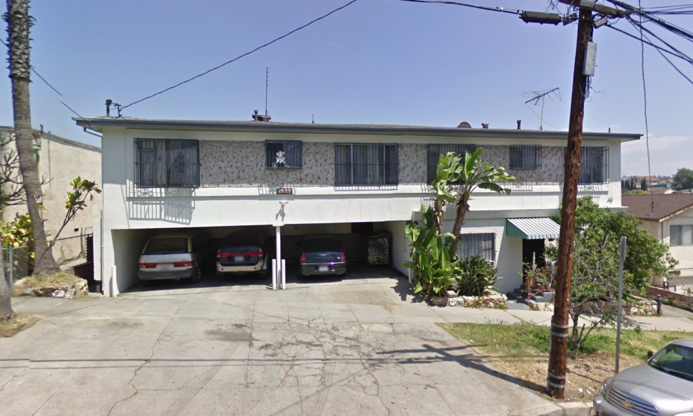
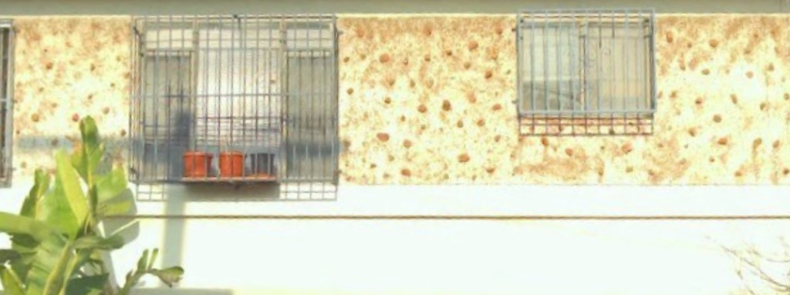
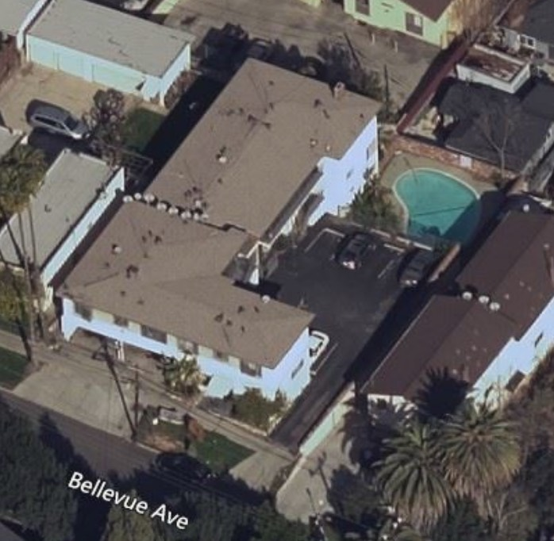
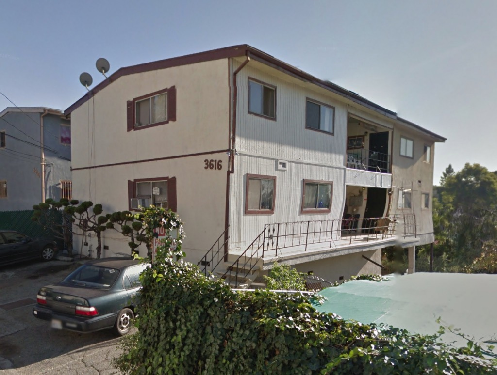
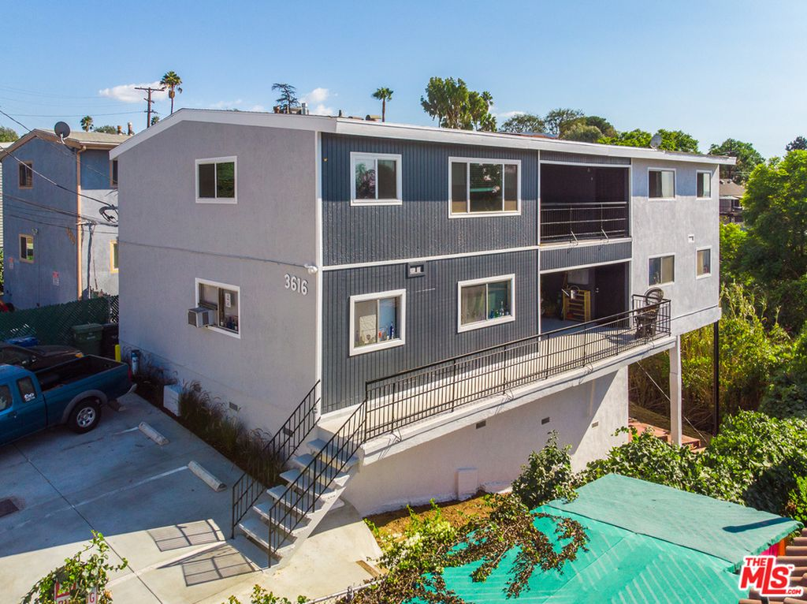
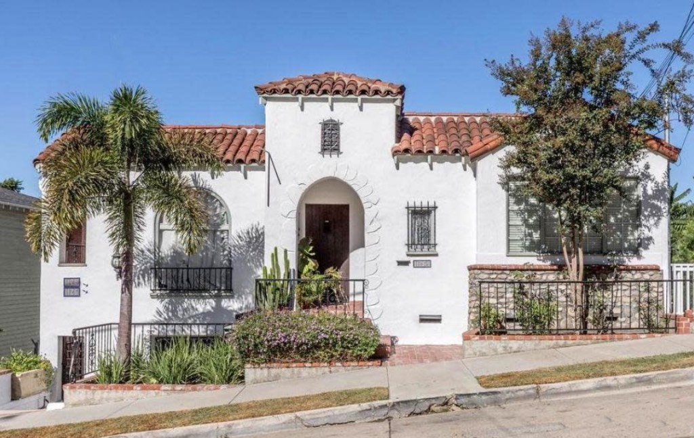
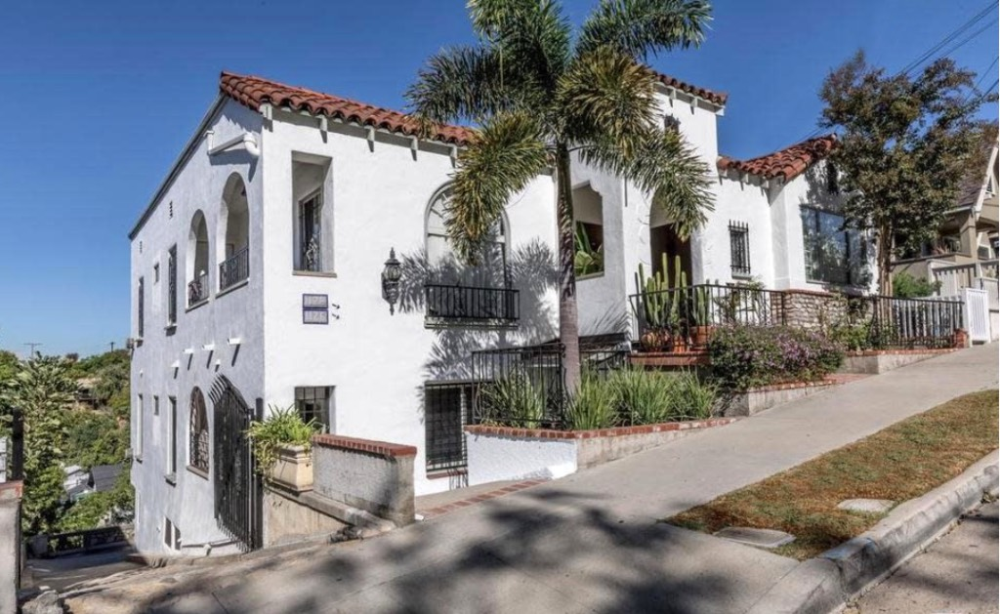

Ah, you thought you were going to see the faces of those souls cast into the streets by the Ellis Act. Well this isn't that kind of blog. I show you pictures of threatened buildings, not threatened people. But this is Los Angeles, and the lines blur. You can't talk about buildings without making mention of their Angelenos. Or the developers who buy and sell them. The buildings, I mean. Not the people.

Of developers, specifically, I'm interested in [TriWest](http://triwestdevelopment.com/). They came to my attention in that they purchased four complexes (I'm told more like a dozen, but these are the ones I was hipped to) from which they are evicting tenants under the Ellis Act; this resulted in a brouhaha where activists marched on Councilmember O'Farrell's office, and (by all accounts) O'Farrell ran and hid; State Rep Wendy Carillo, though, agreed to meet activists "in two weeks." You can read about it [here](http://www.losfelizledger.com/activists-call-for-ellis-act-repeal-at-echo-park-protest/).

Here are the structures:

**1428 N. Micheltorena Street**, four standalone buildings each with two units, and a six-bay garage in the back, built in 1923.

_Now_ that's _bungalow court living._

_Nice brugmansia._

_The Del Vera Court, per a May 1925 ad in the_ Times

**2135 West Bellevue**, a twelve-unit apartment building with four-car garage below, designed by J. H. Lehman in 1959.

[_Dingbat_](https://en.wikipedia.org/wiki/Dingbat_(building)) _anna half, or would you call it half-dingbat?_

_What's the surface of this thing? Moon rock? Lava? Moon lava?_

_Kidney-shaped pool? Sign me up!_

**3616 W. Marcia Drive**, a four-unit apartment house designed by Herman Goodman in 1962.

_I dig the diamond pattern on the railing, and the contra-functional shutters on the windows. Note too the hedges cut like bonsai._

_Here's 3616 after the realtors removed its defining features (although mysteriously, they kept the staggered lettering). Apparently it worked, because they sold it to TriWest. I supposed stripped and painted grey gave it "curb appeal." Every time I hear curb appeal I reach for my revolver._

**1126 W. Edgeware**, twelve-room quadruplex designed in 1931 by architect David Berniker.

_Now here's something I don't get—1126 sold on Dec 7, 2018 for $1,553,500, then sold again in April for $535,000, 198% below its listing price of $1.59—granted, I don't know anything about flipping, but I'm pretty sure that's not how you do it._

The question then, is, what would become of these buildings? Under the Ellis Act, post-eviction, TriWest could either turn them into market rate/luxury units after five years of sitting vacant, or simply demolish and rebuild as luxury condos. Needless to say, we'll be keeping an eye on these. Most developers choose to demolish. Some are [stopped in their tracks](https://www.scpr.org/news/2015/11/25/55882/tenant-fights-ellis-act-eviction-with-historic-bui/). For more on the subject [read this](http://www.rwglaw.com/media/publication/24_ah-25-1-10-midler.authcheckdam.pdf).

As for the people? Some of these folk've been there nigh on forty years, and when they're removed, where will they go to pay $500 a month rent? Sounds like they'll end up homeless. Well at least the billions from Prop 63 and Measure H and Prop HHH will help these folk, right? Right?
