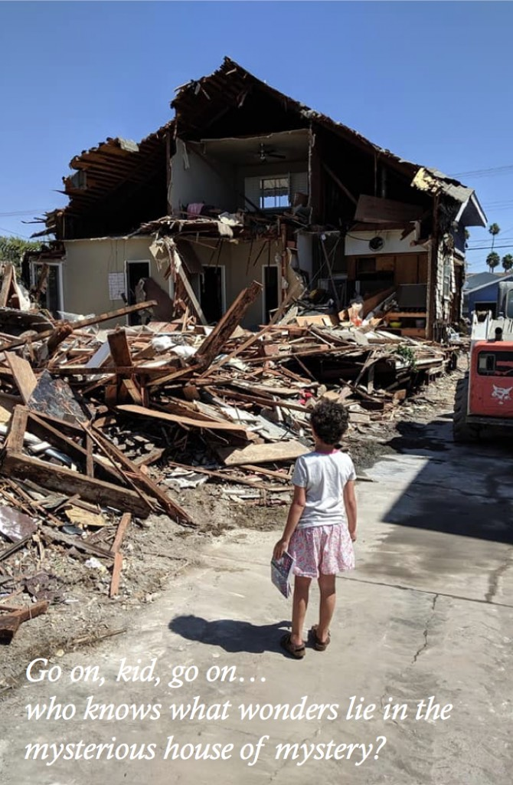

As we've countless impending demolitions, let's take a quick look at how we so nobly _perform_ the activity.

Here's a typical example. Its location is 2642 South Brighton Avenue. That's down in the thick of West Adams, just south of Adams near Normandie.

_Geez, looks like frickin' Mayberry over here_

_The fact that_ [_that amazing chimney_](https://live.staticflickr.com/65535/48784010016_4675d6747c_o.jpg) _made it 114 years deserves an award in and of itself_

2642 was built in 1905. _Yes_, I know it's been stucco'd. There's a special place in hell for those who stucco shingle houses. (But you know what's not rocket science? [Removing stucco](https://www.youtube.com/watch?v=XXYnWvEe_e0). And as someone who's had to replace a whole lot of shingle on his house, neither is replacing shingle.)

But, somehow, despite 2642 being a historic resource in a historic area, the owner got his [demo](https://live.staticflickr.com/65535/48784272602_71d13b60c5_o.jpg) [permit](https://live.staticflickr.com/65535/48784272392_0e27718a43_o.jpg).

They began tearing it down last week. The neighborhood isn't happy, but who's ever cared about a neighborhood? But to add insult to injury, the contractor doesn't believe in demo fencing.

And folk in the neighborhood have spoken to everyone they can think of, to no avail. That's how I became aware of the issue, since there's chatter on Facebook:

It's certainly not the first time I've seen this sort of thing, but the first since I began this blog a couple weeks ago, so, grist for the mill. Plus I get to caption photos I snagged offa Facebook:

- [Brighton Avenue](https://www.google.com/maps/search/?api=1&query=34.031341,-118.301331)
