My Lord, who stuccos a house anymore? Seriously, I thought that nonsense disappeared years ago, like kids selling crack or approaching you to replace your pea stone with tar macadam.

So here is 226 North Berendo a few years ago, looking like she needs a paint job, but a lovely little house nonetheless. Nice horizontal board. I especially like the two sets of French doors opening onto the yard.

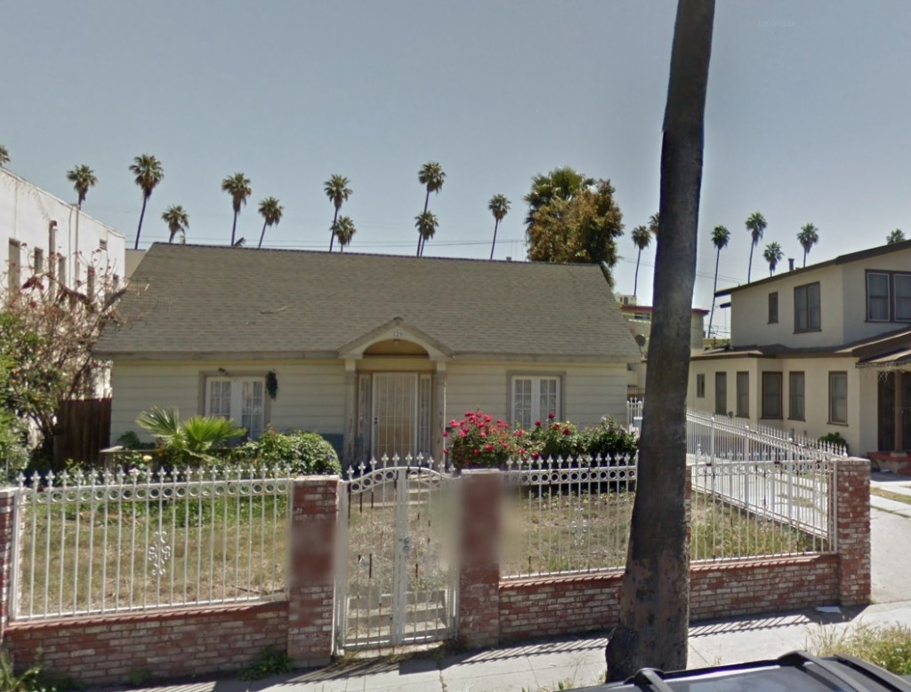

And she _gets_ a paint job!

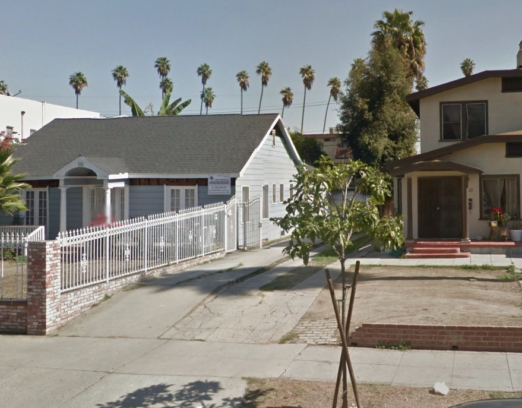

_226 had been built by Dr. M. E. Hutchinson, who acted as his own architect, in 1919._

But then the Stuccoman comes a-callin' and turns those French doors into two vinyl sliders. And suffocates the house in that putty-colored horror.

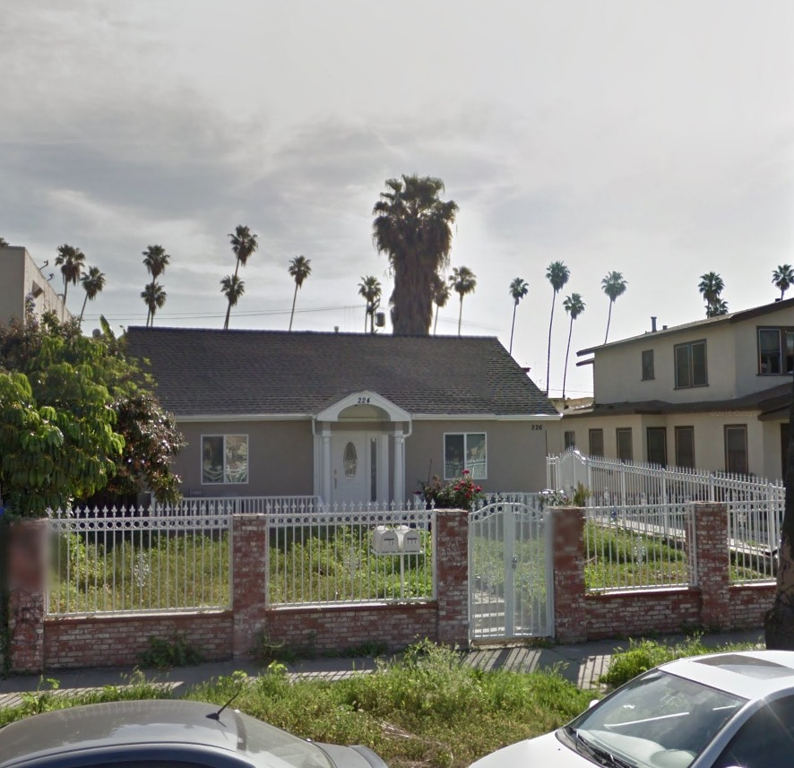

_Hey, they kept the columned entryway and the sidelights!_

Here's my theory. The reason they stuccoed the poor house is so that I'd be less annoyed when they surrounded it in demo fencing. It didn't work. Pro tip: I don't get _less_ annoyed very easily.

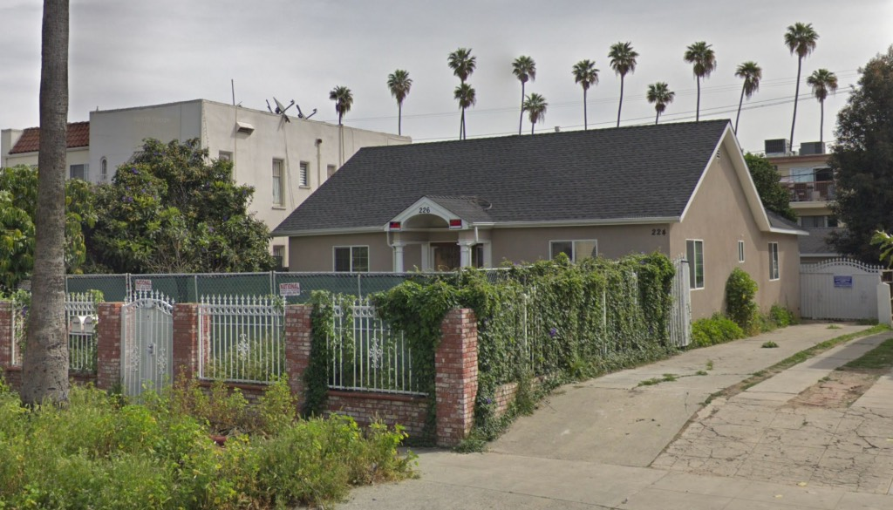

You knew this was coming:

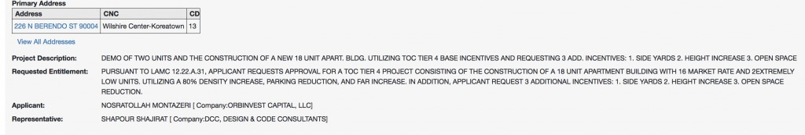

Yep, no open space, built to edges of the lot, taller than it's allowed to be, no parking, with an 80% density bonus and 55% increase in floor area ratio.

Let's take a look at the neighborhood, because I like to give these things some context.

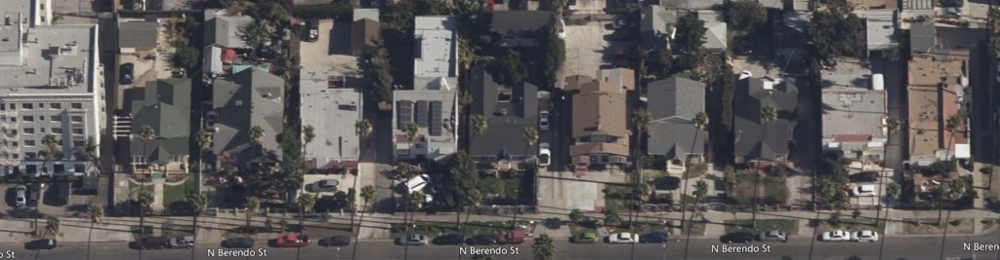

_Beverly at left, Council Street right. Our little house dead center with the dark green lawn._

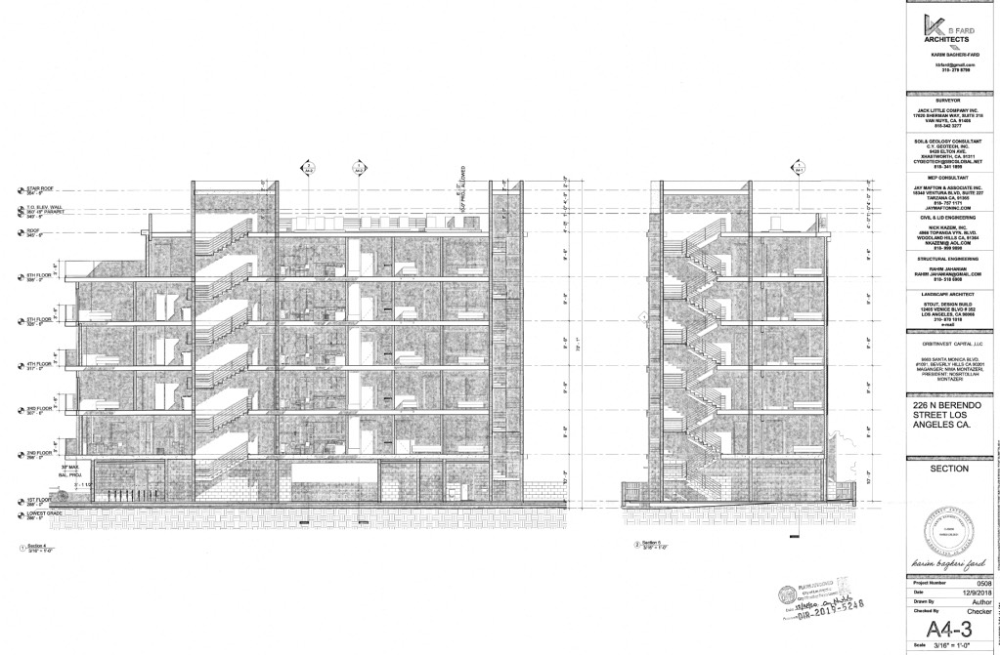

_This is what they're building on that little lot smack in the middle of the block. YIMBYs always say "but we only build wildly overscaled things on corners! On commercial streets!"_

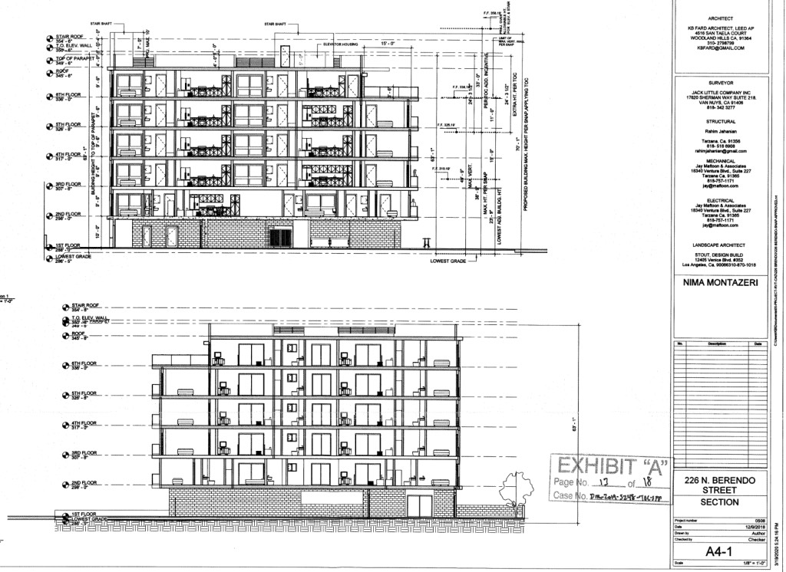

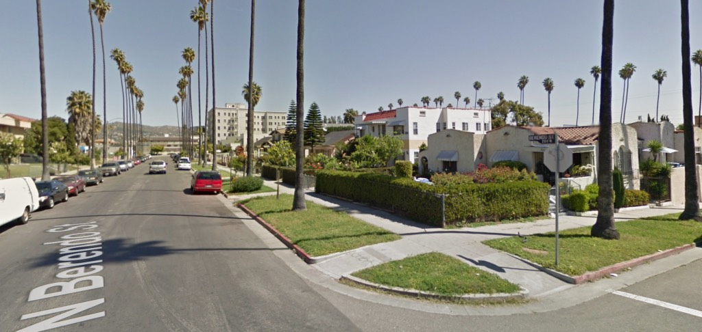

Looking up from Council Street toward Beverly. 226 about dead-center on the block. So all these little houses with their front lawns are going to have a new Imperious Master. Up at the corner at Beverly we have the 1926 Dicksboro Apartments (Richard D. King \[[Villa Riviera](https://en.wikipedia.org/wiki/Villa_Riviera), [Redwine](http://you-are-here.com/hollywood/redwine.html), [Sparkletts](https://live.staticflickr.com/65535/48805329763_b612759bd6_o.jpg), etc. etc.\]) and I love the Dicksboro more than anything, but its size belongs rightly on Beverly, not halfway down the block on Berendo.

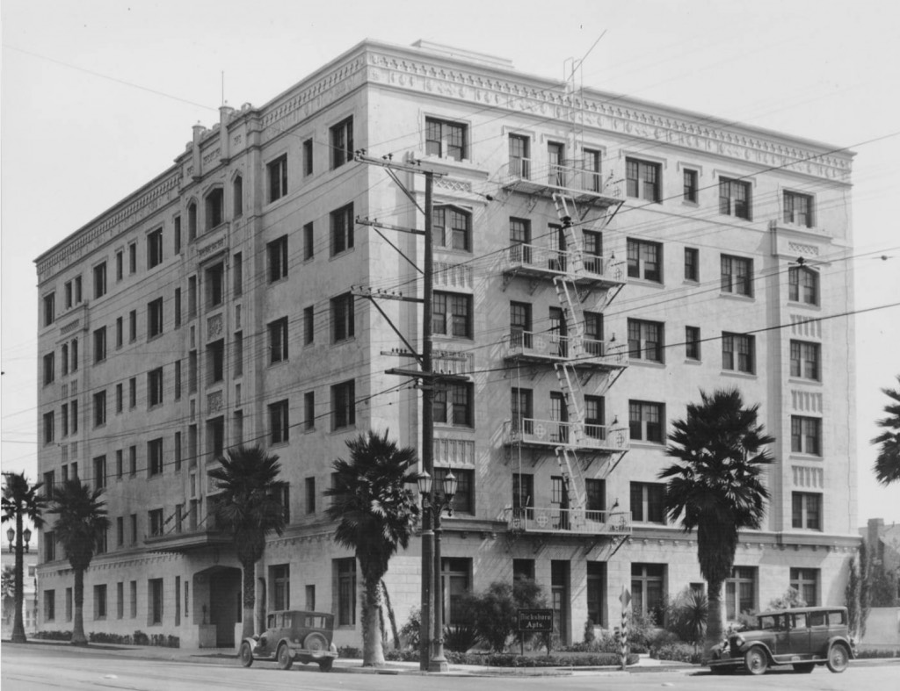

_And yes while I love the Dicksboro I am perhaps_ [_in the minority_](https://www.apartmentratings.com/ca/los-angeles/dicksboro-apartments_800870844090004/)

The plan for 226 is TOC Tier 4 which permits three additional stories, for an extra thirty-three feet in height. Hell, it'll be taller than the mighty Dicksboro on that tiny little lot.

And what will this new addition to the neighborhood look like? Probably something like this. A literal stone's throw away across the intersection at Council, they recently demolished a couple of single family homes:

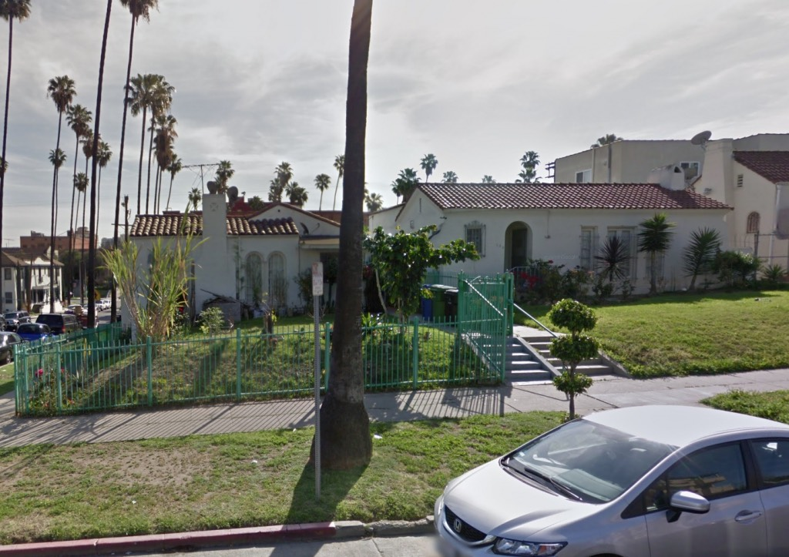

Left, 150 North Berendo, a five-room Spanish number, E. E. Hodgson, 1923; right, at 154, another five-room Spanish home, Carl Munele, 1922.

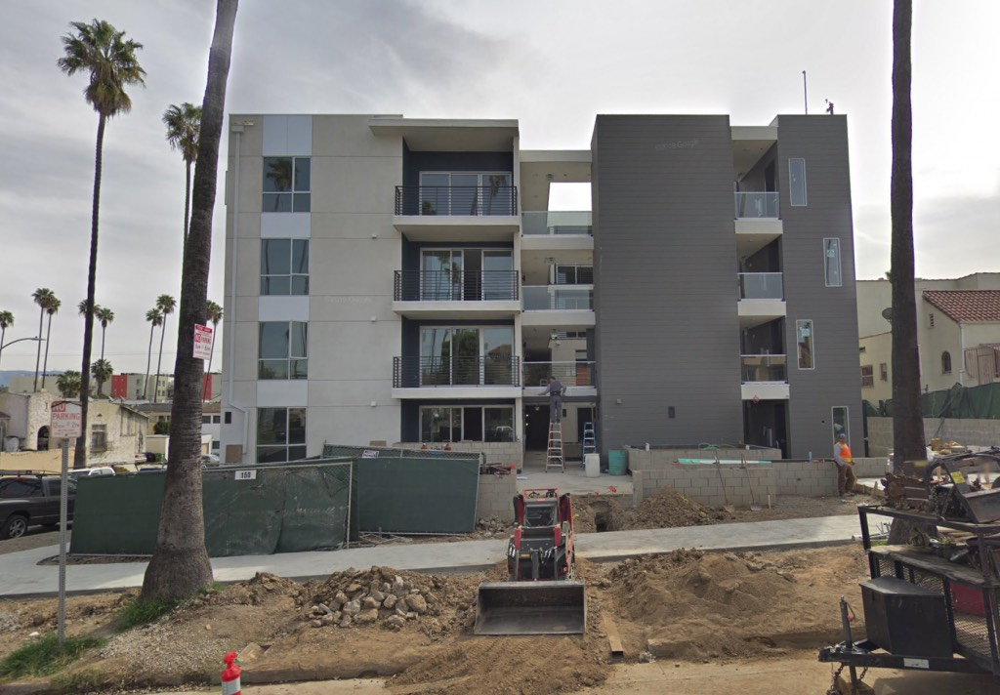

And now, some Khrushchyovka painted in three tones of Alienation Grey™. Through compliance with SNAP—the Station Neighborhood Area Plan—they got a 35% density bonus, parking elimination, reduction in open space, and an eleven foot height increase.

Seriously, I don't think they'll be happy until the last single family home is eradicated. And then _these_ things won't suffice, and we'll be subjected to block-sized filing cabinets, which again, are bettering your quality of life. Because you're told so.

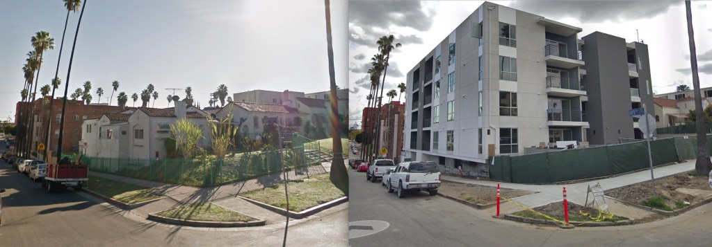

_Look closely, you'll see they tore out a couple of 100-year-old palm trees while they were at it. Good for them!_

- [North Berendo Street](https://www.google.com/maps/search/?api=1&query=34.07534,-118.29403)
