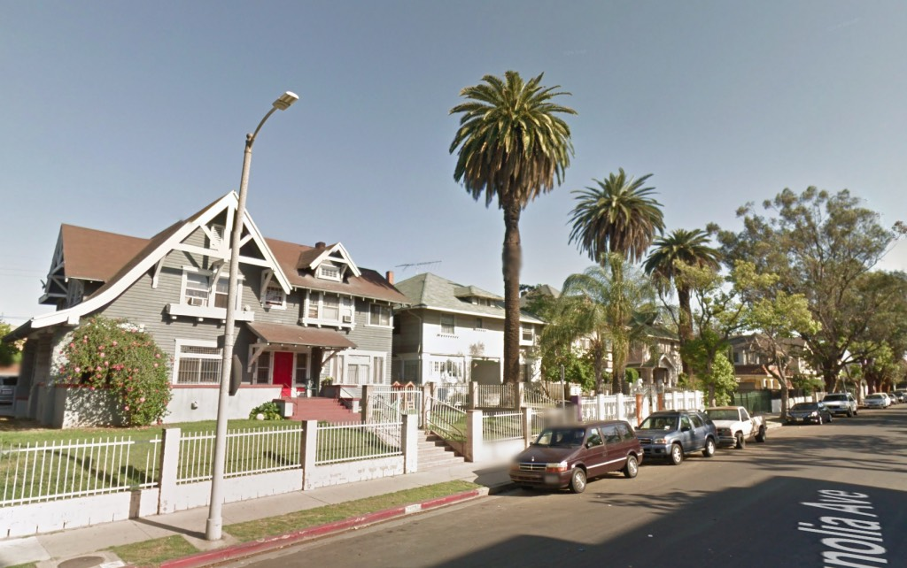

Couple days ago I posted about the forthcoming loss of an unpresuming little stuccoed [side-gabled number](https://www.riplosangeles.com/2019/09/27/226-n-berendo-st/) which nobody's going to shed a tear over. Well, I will, and you should, but that's not the point.

Point is, NOW let's talk about the magnificent street full of magnificent houses where they want to demolish the best ones mid-block to build—what else—a 56-foot five-story building with a 20% reduction in open space.

What if you lived here—

—and you were told they were going to start destroying it? You'd declare "well I don't live there and it serves those rich folk right!" but settle down Bernie, this endearing slice of Old LA is in Pico-Union. Here's some more of this side of the street:

On the opposite side of the street, though there are a couple of sixties apartment buildings, life ain't too shabby either—

Back on the east side of the street, let's take a look at these two houses, specifically, 1238 and 1248 Magnolia Avenue:

_Holy cats look at these houses—the windows are there, the shingle is there, the porches haven't been enclosed, and OMG LOOK AT THAT DECORATIVE TRUSS_

Of course they were sold in March, marketed as "[a development opportunity](https://www.redfin.com/CA/Los-Angeles/1238-Magnolia-Ave-90006/home/6908619)." Ergo—

_Where it says Magnolia Ave on the right? The two houses directly above that._

_The idyllic charm beloved by all_

_Oh yeah, so much better. Wow they even tore out the hundred-year-old Canary Island Date Palm — God, YIMBYs hate trees_

The smaller house, center, 1248, was built in 1902. Not sure who the architect was. The large white house on the left, 1238, built in 1905, was designed by Garrett and Bixby.

Who are Garrett & Bixby? William Stanley Garrett was older, established, arrived during the boom—he'd partnered with [Fred Dorn](https://en.wikipedia.org/wiki/John_B._Kane_Residence) for a time in the early nineties—and partnered with young crackerjack draftsman-architect Burton Boardsman Bixby in 1900 and remained so until 1912.

Garrett & Bixby are well-known and well-respected in the world of turn-of-the-century architectural partnerships, among the likes of, say, [Hudson & Munsell](https://www.oldhouseonline.com/house-tours/picture-perfect-hollywood-craftsman) and [Dennis & Farwell](https://silverlakelosangelesurbanvillage.blogspot.com/2013/02/charles-cl-leslie-residence-oliver-p.html) and [Train & Williams](https://332avenue66.pacunion.la/#/). They built a lot of homes, apartment houses and hotels, commercial buildings and whatnot like fire stations and hospitals, etc. Their work is maddeningly rare, as so much has been demolished, like their structures on Bunker Hill—e.g., the 1904 [Marcella](https://farm1.staticflickr.com/802/39209672330_4344232b76_o.jpg) and 1911 [Van Fleet](https://live.staticflickr.com/65535/48819430452_0ef9930cf3_h.jpg), once both on Flower Street.

_Los Angeles Herald, 3 September 1905_

Here's one you might know—a survivor, though unlike 1238 S. Magnolia, it's been stuccoed, has crap windows, and goofy neighbors:

_[1515 South Hoover Street](https://www.google.com/maps/place/1515+S+Hoover+St,+Los+Angeles,+CA+90006/@34.0448233,-118.2865973,17z/data=!3m1!4b1!4m5!3m4!1s0x80c2c79101bb293d:0x8b24cfb90a70ad9c!8m2!3d34.0448233!4d-118.2844086)_

_Note the use of sandstone at the lower level, just like our friend at 1238 Magnolia_

_Los Angeles Herald, 17 April 1901_

Here's a wonderful Garrett & Bixby survivor, well-maintained, though with an unfortunate neighbor (which serves to underscore the wonder and virtue of Magnolia Avenue), [2917 Brighton Avenue](https://www.google.com/maps/place/2917+Brighton+Ave,+Los+Angeles,+CA+90018/@34.0285483,-118.3039864,17z/data=!3m1!4b1!4m5!3m4!1s0x80c2b80a3035d5ef:0xe6272693641990a8!8m2!3d34.0285483!4d-118.3017977), built for Mrs. Mary L. Bonnell in the spring of 1903:

Hey look, I just found this Garrett & Bixby at [1544 Pleasant Avenue](https://www.google.com/maps/place/1544+Pleasant+Ave,+Los+Angeles,+CA+90033/@34.0483902,-118.2233956,17z/data=!3m1!4b1!4m5!3m4!1s0x80c2c613d08a3529:0x60688a33191d10ca!8m2!3d34.0483902!4d-118.2212069). It's the green house on the right, built for John M. Baker in 1903.

See its neighbor on the left? They just tore it down and there's a Tier 3 TOC with three additional incentives in the works for the lot. That's right, a sixty-foot grey box coming to Boyle Heights! Because housing! Progressive!

Many Garrett & Bixbys that _do_ survive end up like so—witness these flats just down the street from our threatened house:

_1438 South Magnolia. I can guarantee you, they didn't look like_ that _when built in 1903._

So, bit of a history lesson on Garrett & Bixby (trust me, it wasn't as involved as it could or should have been) but the import being YOU DON'T GET TO TEAR DOWN A GARRETT & BIXBY. _You don't get to tear down great unmolested turn-of-the-century houses in general and you don't get to tear down Garrett & Bixbys in particular._

Shame on you Sherri Rigor! Your family has owned that house for almost fifty years and now your name is on the [demolition permit](https://live.staticflickr.com/65535/48817706901_300b01a980_o.jpg). And you, Lance K. Zuckerbraun, acting as demolition applicant. I get it, you're trying to cash in, take the money and run, but you're doing a disservice to the neighborhood and Los Angeles. Sure, when you can't sleep at night you'll try to tell yourself you're adding units to the housing market. Of course according to a recent census, there are [100,000 homes sitting empty](https://www.lamag.com/citythinkblog/vacancy-tax/) as it is. As has been pointed out by my colleagues, we don't have a housing crisis as much as we have a [housing](https://esotouric.com/2019/07/26/mariposa/) _[use](https://esotouric.com/2019/07/26/mariposa/)_ [crisis](https://esotouric.com/2019/07/26/mariposa/).

Ultimately you persist in making the city less warm, less human, less historic, less fascinating. You gaily engage in abhorrent activity but beware, you are loathe to make disingenuous statements feigning innocence because you acted singularly nor can you abjure responsibility because you acted along with the collective.

Because, of course, it doesn't end here.

On the _same block_, on the _same side of the street_, 1200 South Magnolia, put up by builder Charles P. Lyman in 1906-7, also lovingly retained and maintained:

[Zuckerbraun](http://magnifyworld.com/lance-k-zuckerbraun/) is on the march!

And _here_ is 1218 South Magnolia. It's a single family dwelling from 1905, all original windows and shingle... in the middle of the block of similar dwellings. The YIMBYs have spoken! IT MUST BE DESTROYED!!!

So as you demolish early Los Angeles, one wonders if you are in fact just doing it just for the money. It would seem you and your brethren have a morbid drive to erase the identity of Los Angeles and its people. It's no longer enough to ask _cui bono?_ for that implies financial gain, rather, we must read your drive to destroy as a pathological, ideological push to expunge the families that built our city, obliterate their homes, rip out their gardens, and eradicate all the elbow room that people came to Los Angeles for.

Cultural terrorism is an ugly thing. May I make a suggestion? Don't do it.

- [Magnolia Avenue](https://www.google.com/maps/search/?api=1&query=34.047995,-118.286352)
