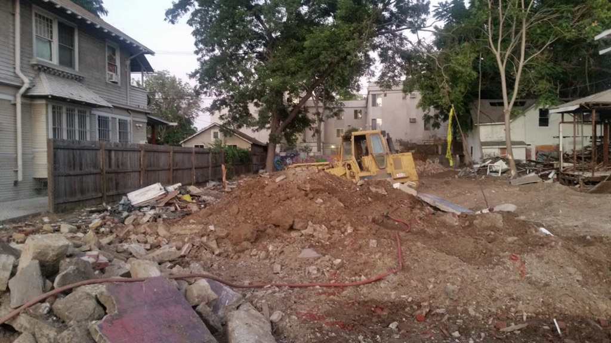
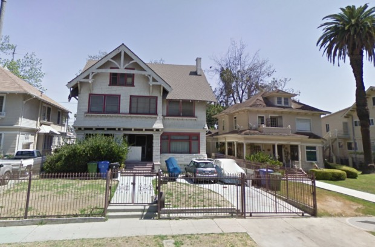
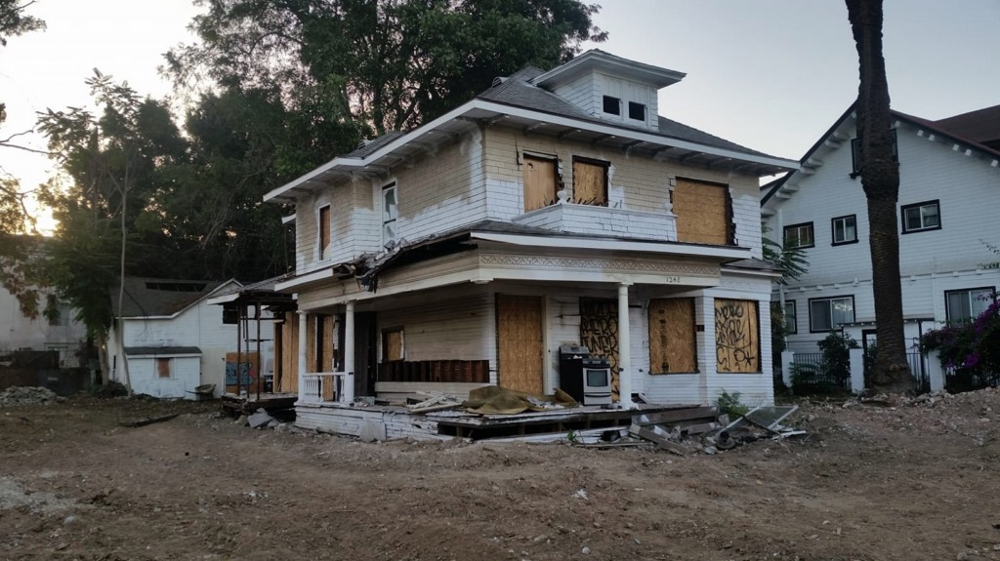
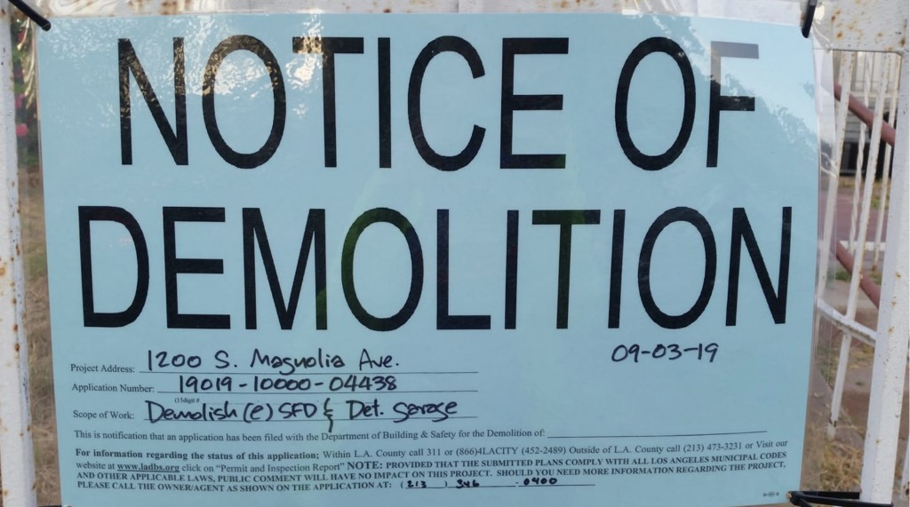

I had based my tale of 1238 on the application at Planning for the 36-unit that was being plopped on the site; the demo permit I linked to in the text was issued back in July. Was contacted by an area resident to inform me the house was already gone.

_The black box replacing these two will be taller than that Canary Island Date Palm_

And its wonderful neighbor reduced to this. Because _density über alles_.

And of this one up at the corner—

I will say this, though, in defense of their replacements. They will absolutely define our age. In a generation, people will look at their [SimCity/Minecraft](https://www.dmagazine.com/frontburner/2018/12/were-still-trying-to-understand-why-new-apartments-are-so-ugly/) architectonic form and say _yep, that's 2020 in a nutshell_.

And then tear them the hell down.
