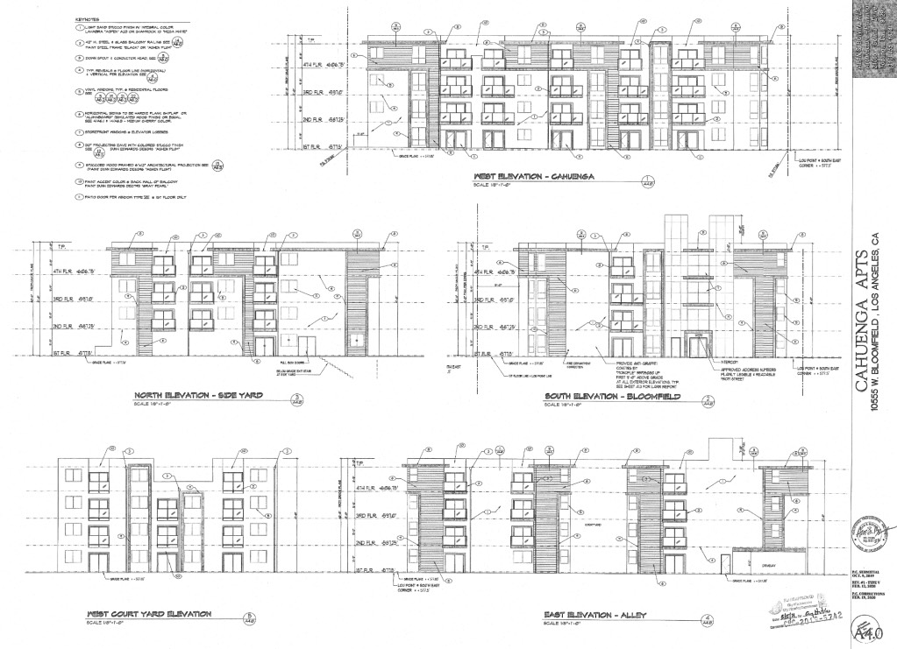

Raise a glass to classic Valley living—low slung, two story, lots of trees, predominantly Postwar, i.e., the vaunted, vilified suburban dream.

For example: the homes, top, other side of the alley, are from 1936 and 1940; along Cahuenga, hiding under the foliage, the houses are 1949, 1949 and 1946, and then at bottom right, is 10555 Bloomfield, built in 1941.

She's a little hard to see from the street, what with all the trees and bougainvillea.

Still, with a little maneuvering of the Googlemobile, we can peek in:

The house was designed for engineer Floyd Martin Boes by architect [A. Godfrey Bailey](https://www.laconservancy.org/locations/clark-building), who designed [these](http://cinematreasures.org/architects/972?status=all) and [all of this](http://www.fluidr.com/photos/michael_locke/sets/72157631566649522/random).

You knew where this was going:

Of course, all of that air-cleaning flora will be torn out and dumpster'd too, especially since the fifty-seven-unit structure gets to reduce its open space considerably and build to the edges of the lot. But, somewhere in the subterranean garage the developer is adding room for bicycles! This project is _green_!

_Update, 2021: since being demo-fenced, the foliage has been cut back enough to reveal 4372 Cahuenga, built in 1946, also going bye-bye_

The social engineers insist it's green because, despite the fact that with this density comes, say, overburdened resources, emissions from outflow stacks, the Urban Heat Island, cars sitting in traffic, and so forth (and no, those sixty-nine parking spaces filled with Tolucan EVs [aren't](https://www.thezebra.com/insurance-news/2368/why-electric-cars-can-cause-more-pollution-than-gas-cars/) [fooling](https://live.staticflickr.com/65535/48845814167_b45ac3e1bd_o.jpg) [anyone](https://live.staticflickr.com/65535/48845624576_2cba502ec5_o.jpg)), rather, they'll say it's green because no-one _deserves_ a single-family home. Trust me, I don't follow the logic either, but then also I don't get how they'll put fifty-seven units on the site of a single family home.

I'll give 'em this, though. If we estimate 100 people live in the new complex, that's on average 3,500lbs of trash for the trash trucks to pick up each week. At least they won't have any green bins to empty.

- [Bloomfield Street](https://www.google.com/maps/search/?api=1&query=34.149719,-118.36116)
