I was on the [Facebook GrowLA page](https://www.facebook.com/groups/GrowLA/) last week and came across something that made me ask, _can a developer make a building so ugly even a YIMBY can't love it_? (Roughly analogous to the old test o' faith _can God make a rock so heavy even He can't lift it?_) And the answer, apparently, is yes.

It was on [this post](https://www.facebook.com/groups/GrowLA/permalink/2369103180008356/) I saw a collection of images shot by a Mr. David Schumacher—here's some:

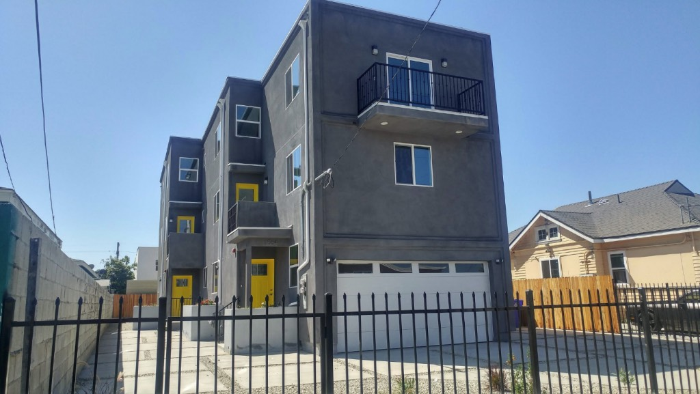

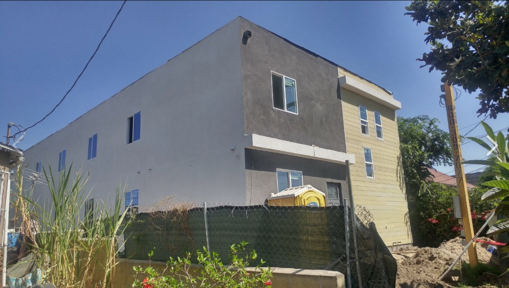

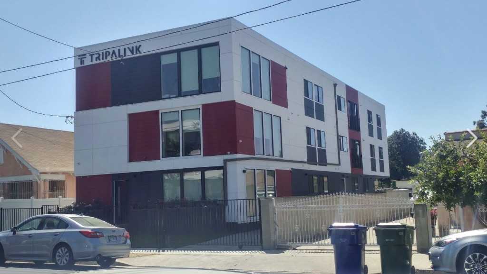

These are all down around USC. Most of Schumacher's shots are of near-identical Tripalink structures. You have to look twice before you realize oh, right, these are in fact different buildings.

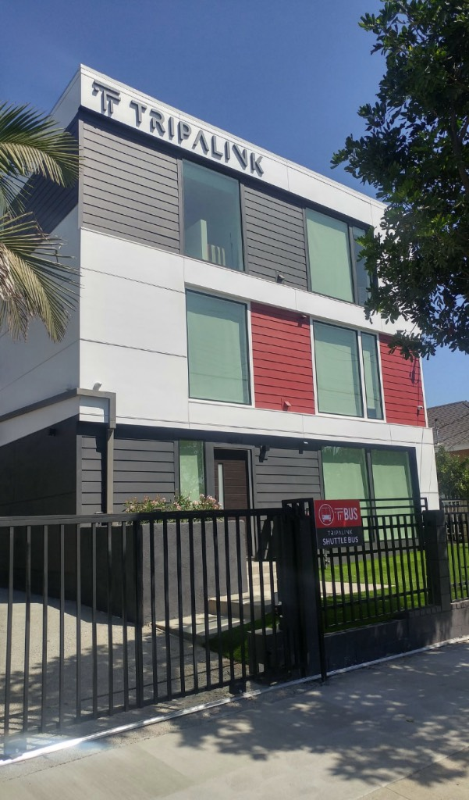

_I'll bet you a Coke that's fake grass_

Unbelievably, the YIMBYs thought their own beloved mid-block ultra-dense max-height econobox cubes were, for once, less than appealing:

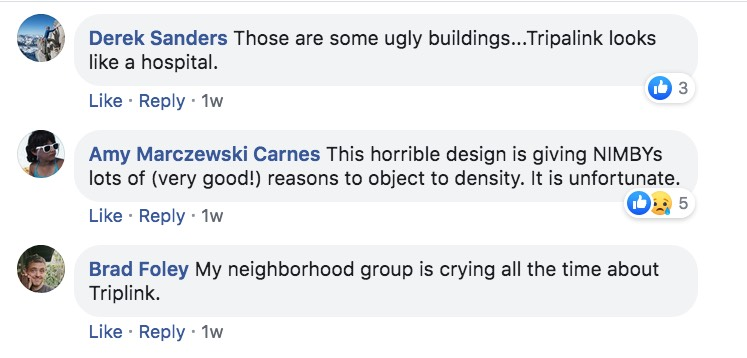

If, at the outset, you're asking _what is a YIMBY?_ that stands for Yes In My Backyard, meaning they are anti-NIMBY, who don't want development in their backyard. YIMBYs want development in _your_ backyard; there's no actual evidence they'll accept it in theirs. They're the sort who pee themselves a little with glee and break into song when, for example, single family zoning is eradicated:

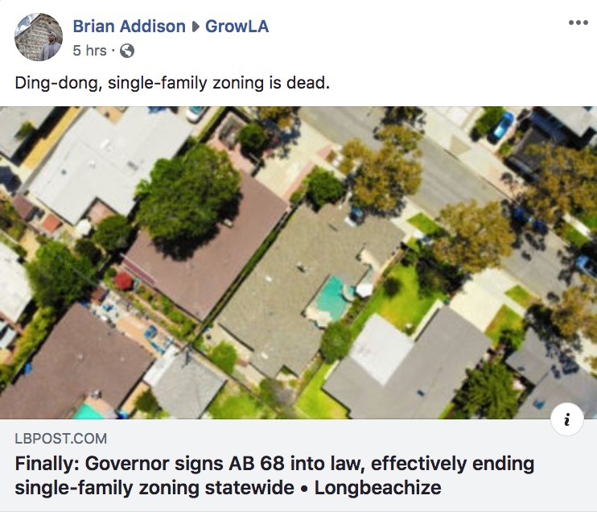

But predictably, enough is never enough:

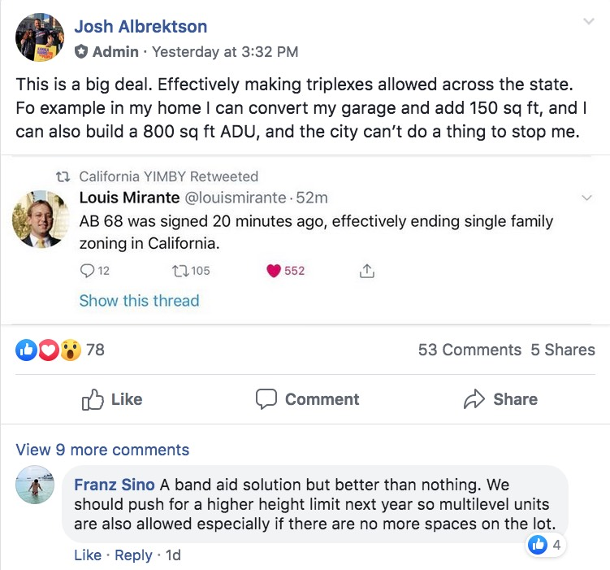

They also invariably refer to NIMBYs as "_boomer_ _NIMBY_s".

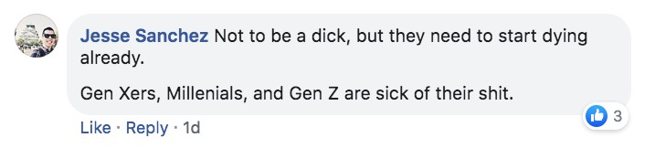

I can assure Mr. Sanchez, there are a lot of his Millenial brethren who are fans of a human-scale Los Angeles. In fact, the NIMBY comes in all forms, and you might read more about them [here](https://www.washingtonpost.com/posteverything/wp/2014/10/23/stop-hating-on-nimbys-theyre-saving-communities/) and [here](https://www.planetizen.com/node/46846/defense-nimby) and [here](https://www.latimes.com/opinion/op-ed/la-oe-spitzer-homelessnes-oc-20180531-story.html).

But what of these bilious buildings which elicited such a response?

As I said, many down by USC are built by Tripalink. Tripalink is based in Los Angeles, building primarily for Chinese USC students. "It is [our mission](https://www.linkedin.com/company/tripalink-corp?trk=public_profile_topcard_current_company) to establish a truly co-living neighborhood, to redefine the experience of living overseas" which they do through building multi-unit co-living set-ups. In [this article](https://www.prnewswire.com/news-releases/tripalink-the-millennials-inspired-co-living-start-up-launches-with-5-million-in-funding-300816834.html), Tripalink CEO Donghao Li uses phrases like "the value of connectivity fostered by Co-living community" and "Co-living is the trendiest lifestyle in recent years" resulting in a "supreme living experience"...and pairs it with this image:

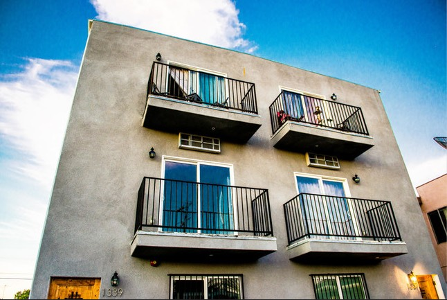

_Totally supreme_

Which may raise the question, what is co-living exactly? Simply put, it's teaching young people to live with less. Instead of having an apartment with a bathroom and kitchenette, say, they have their little bedroom, with a communal kitchen and toilet down the hall. Modern co-living stems primarily from [Dutch communism in the 1960s](http://onesharedhouse.com/thestory/what-is-co-living/), from which springs lots of lofty words about sharing and connection and such. Ultimately it's people getting the Youth of Today accustomed to their Glorious Tomorrow: tighter space, fewer amenities, on the pretext of combatting loneliness, and being cheap. I suppose there should be something charming about a return to Dickensian living but I'm not seeing it. I thought part of the the appeal of Los Angeles was to escape the tenements of the east...though in this case I guess I refer to _[tong lau](https://en.wikipedia.org/wiki/Tong_lau)_, and not the Lower East Side.

But anyway. Let's look at some recent losses. Here at 1224 West 35th was this house, built in 1906, on a block of vintage homes—

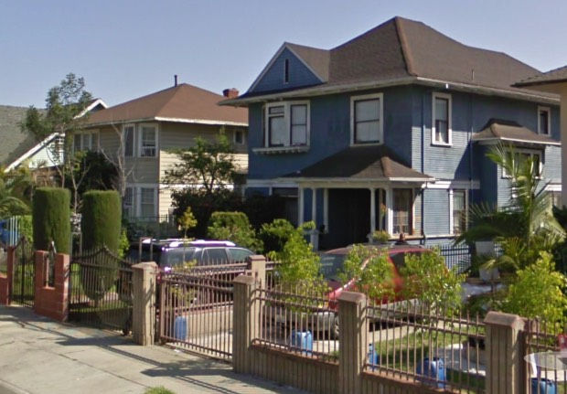

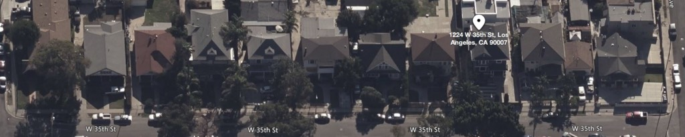

—demolished recently, but you can [live in the Tripalink replacement](https://www.showmetherent.com/1224-W-35Th-St-Los-Angeles-CA-90007):

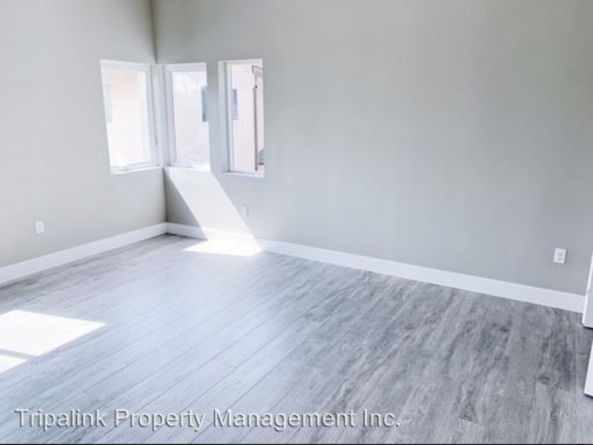

_Don't have an image of the new property but it possibly looks like_ [_this_](https://ocbj.media.clients.ellingtoncms.com/img/photos/2019/03/25/Tripalink_collage_670_t670.jpg?b3f6a5d7692ccc373d56e40cf708e3fa67d9af9d) _(from_ [_here_](https://labusinessjournal.com/photos/2019/mar/25/42356/)_) or maybe_ [_this_](https://prnewswire2-a.akamaihd.net/p/1893751/sp/189375100/thumbnail/entry_id/1_qp07hcsu/def_height/1000/def_width/1545/version/100011/type/1) _(from_ [_here_](https://www.prnewswire.com/news-releases/tripalink-raised-5-million-to-build-the-next-wework-in-housing-industry-300819687.html)_)_

Or here at 1607 West 35th Place, God save us from another one of those dreaded Single Family Homes!

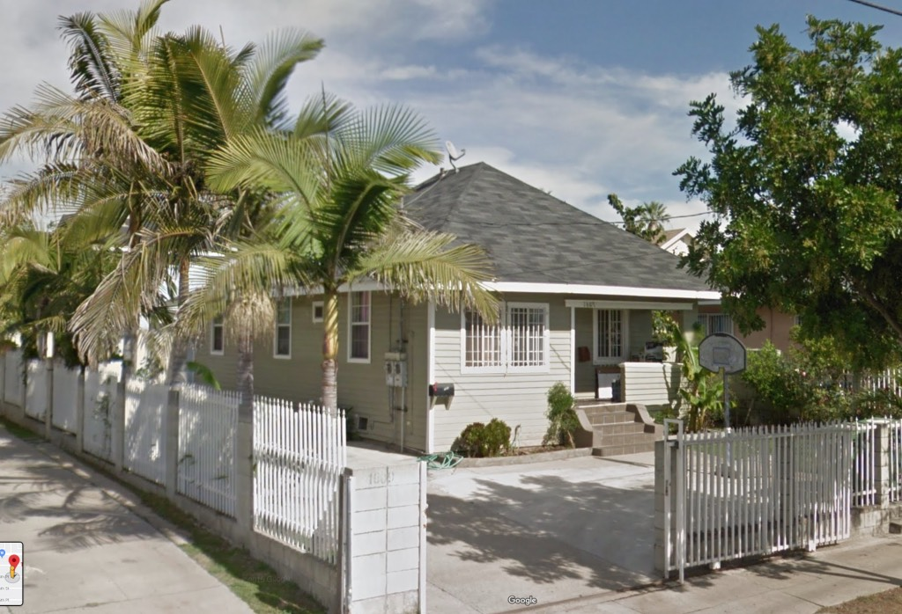

_This one was built in 1910, again, in the middle of a block of similarly scaled homes_

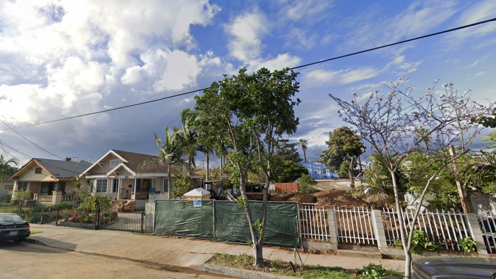

_Gone, being replaced by another sixteen-unit, three-story Tripalink structure_

Of course the disingenuous chuckleheads at _Curbed_ have for years been saying stuff like:

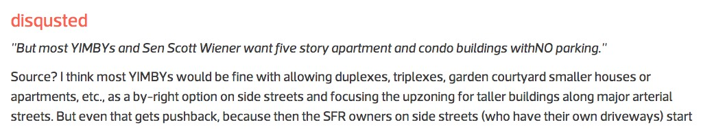

But imagine my shock, YIMBYs are certainly not fine with with allowing that, and as we've seen [again](https://www.riplosangeles.com/2019/09/27/226-n-berendo-st/) and [again](https://www.riplosangeles.com/2019/09/30/what-in-the-actual-hell-los-angeles/) and [again](https://www.riplosangeles.com/2019/09/18/1723-n-wilcox/) and [again](https://www.riplosangeles.com/2019/09/06/371-n-st-andrews-update/) and [again](https://www.riplosangeles.com/2019/09/23/how-we-do-our-demolitions/), it's been by and large five-story buildings with no parking right in the middle of side streets. (But nice thing about Tripalink? Hey, at least they're only three-story buildings.)

To which I might add, in looking at the images shot by Mr. Schumacher, they seem to feature a decided lack of flora. Likely because [the City has bent over backward to allow developers to _not plant trees_](https://www.latimes.com/local/lanow/la-me-ln-fee-removal-tree-20180514-story.html). This, despite the [immense amount we have lost recently](https://news.usc.edu/120872/mass-produced-dwellings-home-expansion-reduce-l-a-areas-residential-green-cover/); I'm sure I don't have to remind you of [their benefits](https://www.bbc.com/news/science-environment-37813709).

Those, then, are my musings on seeing a simple Facebook post from our demo-happy, density-disposed pals over at GrowLA. Cheers!
