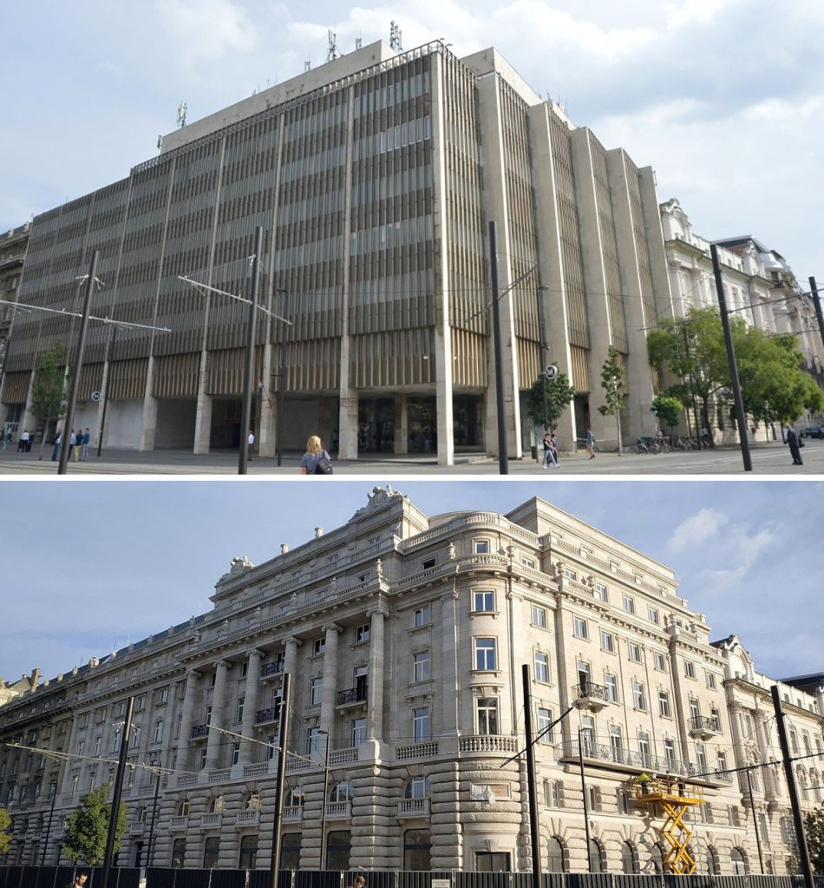
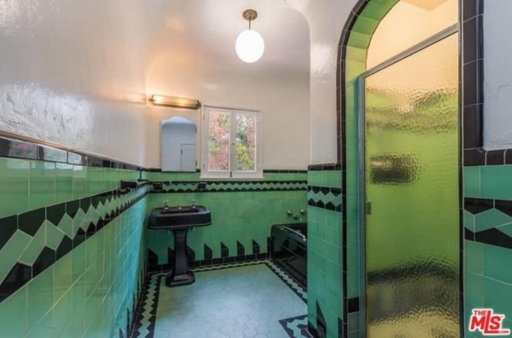

When the people of Budapest have a piece of Soviet-era architecture, like Kossuth Square 4-6 (Béla Pintér, 1972), which they deem..._inappropriate_, especially in a landscape as great as [Kossuth Square](https://en.wikipedia.org/wiki/Kossuth_Square), they remodel it, so it may reflect the regional consciousness.

_Above, a grim reminder of the [MSzMP](https://en.wikipedia.org/wiki/Hungarian_Socialist_Workers%27_Party); below, the remodel, based on 1928 architectural plans of Dezső Hültl_  

When the people of Los Angeles, when presented with something as simple and culture-defining as a green-and-black tiled 1931 bathroom, they too deem it inappropriate, and remodel it so it may reflect...what, exactly?

_Leo DiCaprio's bathroom—one of them, anyway—for the past twenty years, at_ [_1675 Angelus Avenue_](https://la.curbed.com/2018/10/16/17984030/leonardo-dicaprio-silver-lake-house-spanish)

_God bless flippers, saving us from Art Deco so we may shower in the ubiquitous hotel bathroom of Everytown, USA_
