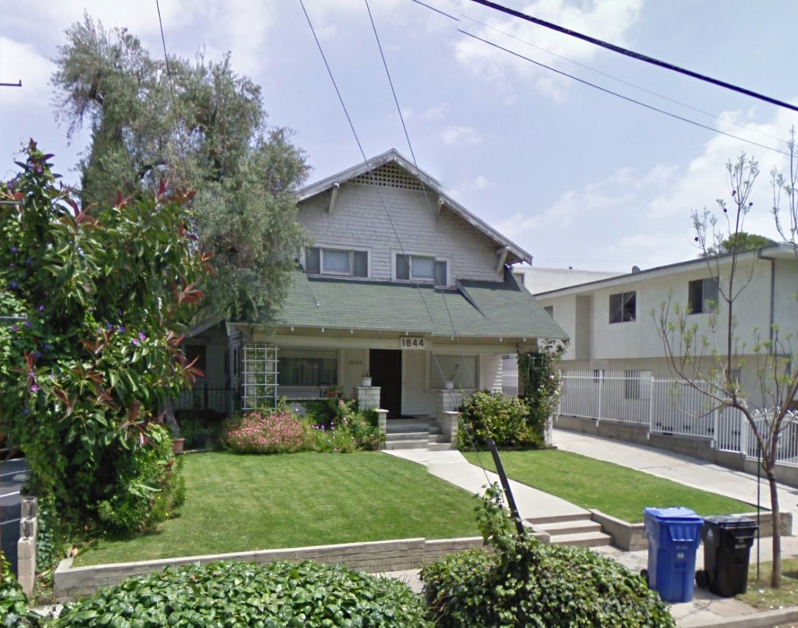
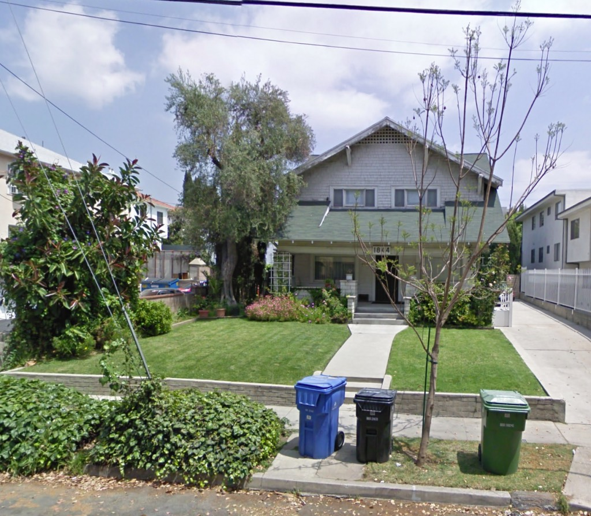
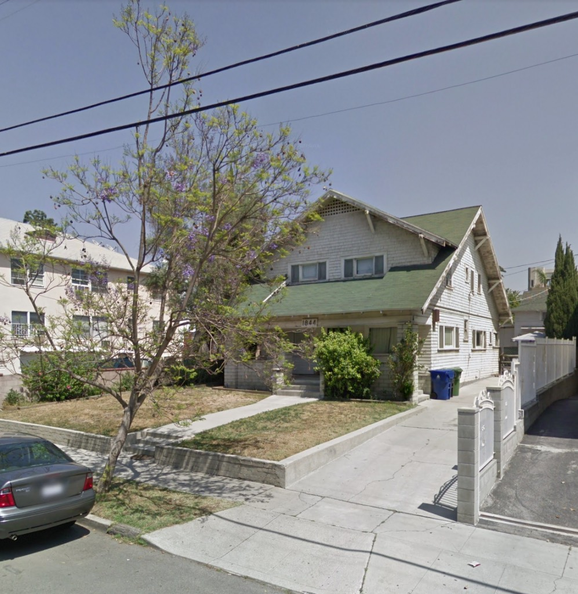
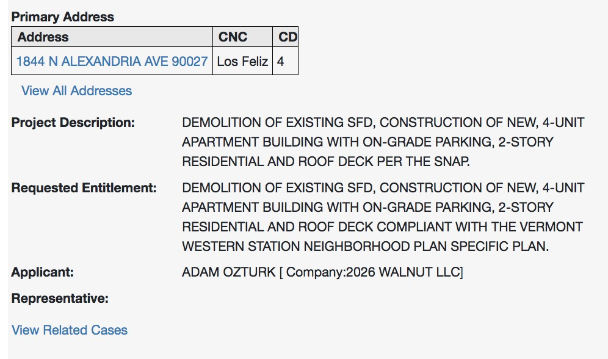
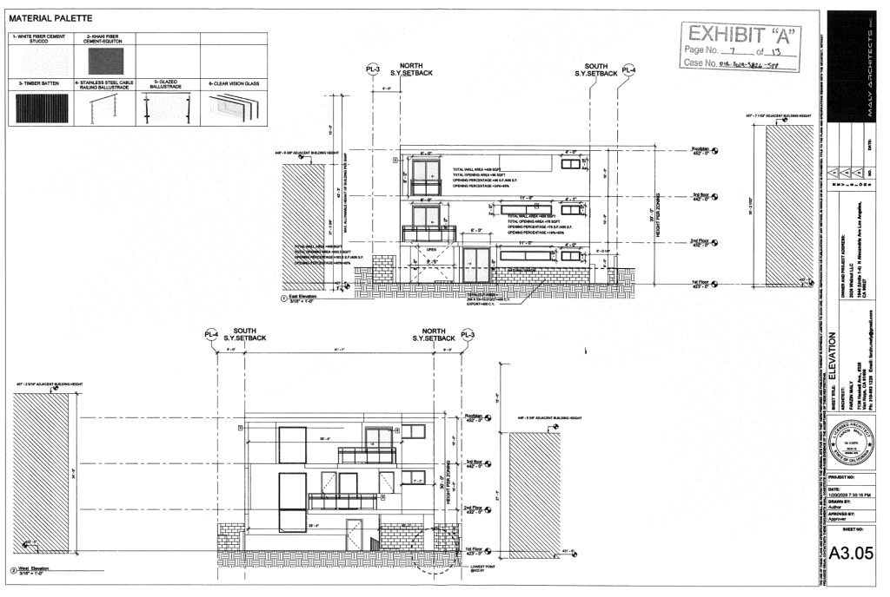
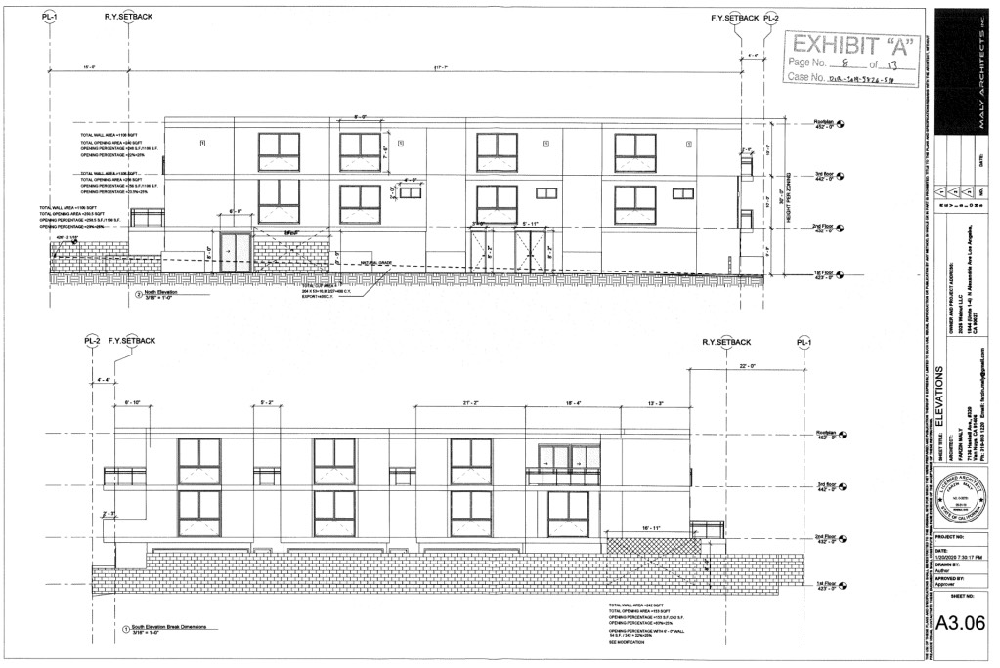
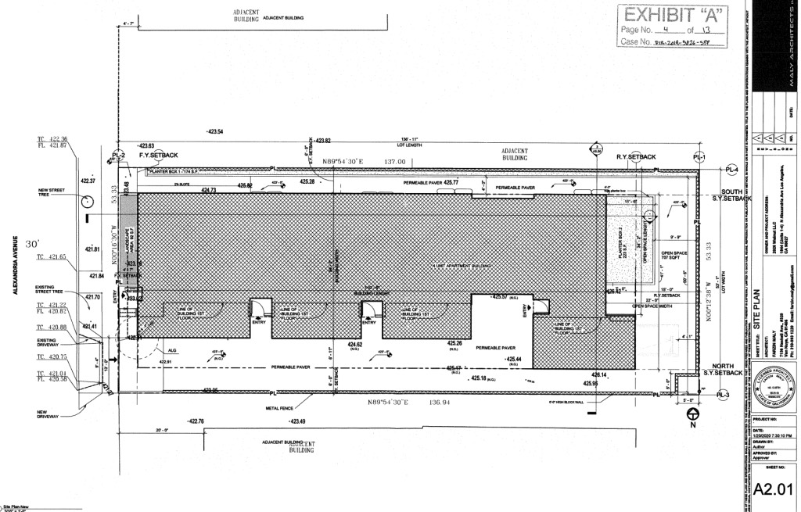

This handsome Los Feliz house was built in 1912.

She needs a little love, but don't we all? Like my aunt Gladys, nothing a coat of paint can't fix. Plus she hasn't been stuccoed, the windows are original, and the porch hasn't been enclosed. And dig those dramatic gables. Bonus factoid: First Lieutenant Dale C. Tipton, when released from a Nazi POW camp in June of '45, well, this is the house he came home to.

Though she's to be torn down for an apartment building, remarkably, the developers are _not_ going TOC with a five-story, forty-some unit structure.

Hate to see her go. But the YIYBY (Yes in YOUR Back Yard) says the SFD is evil, and must be replaced by the giant concrete box.

- [North Alexandria Avenue](https://www.google.com/maps/search/?api=1&query=34.10487,-118.29823)
