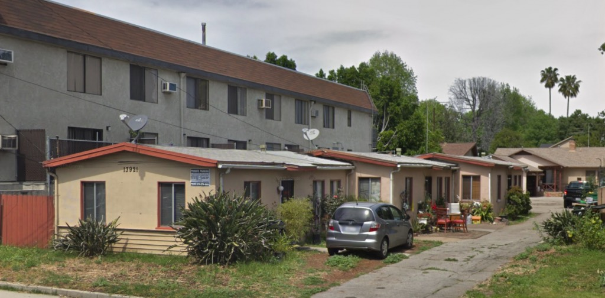
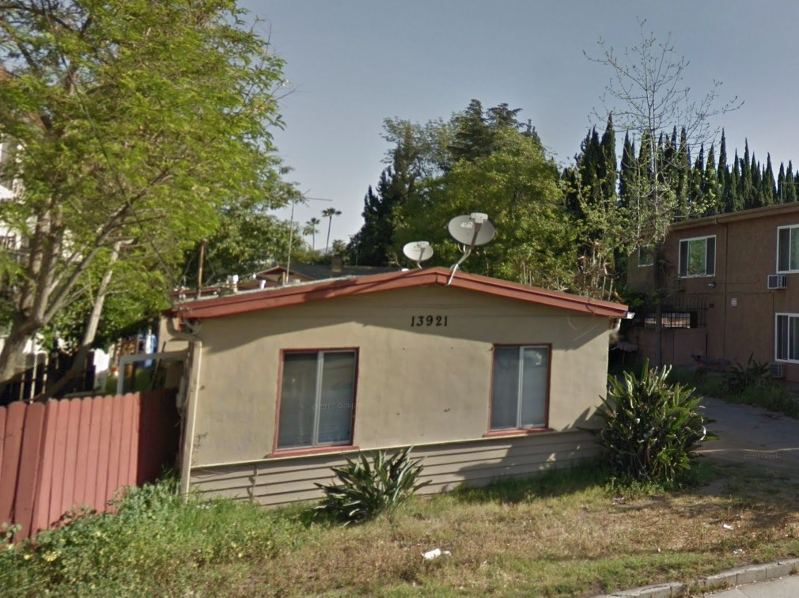
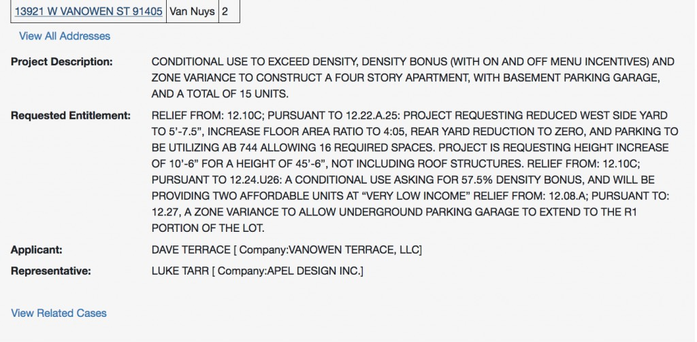
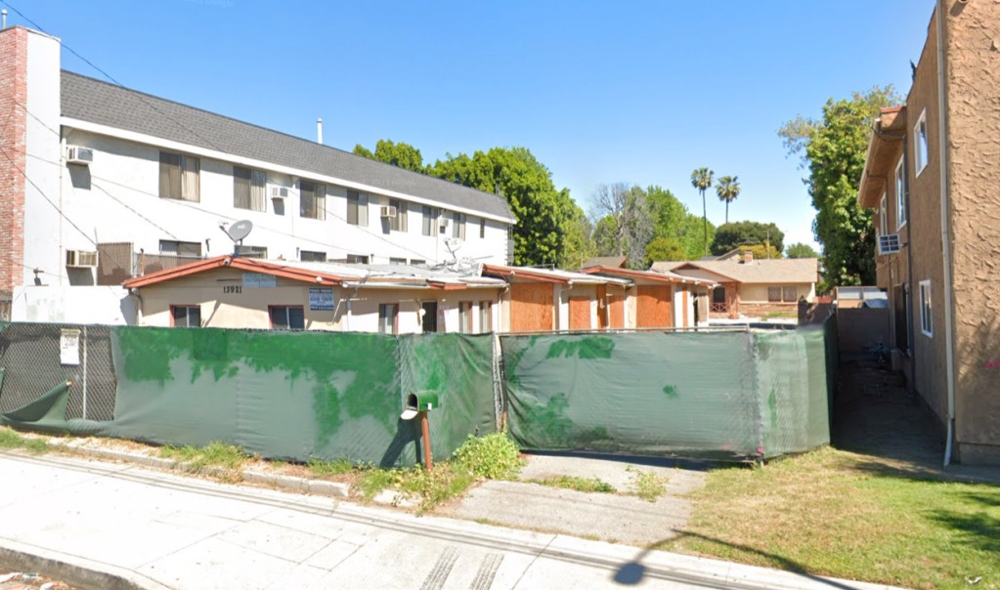
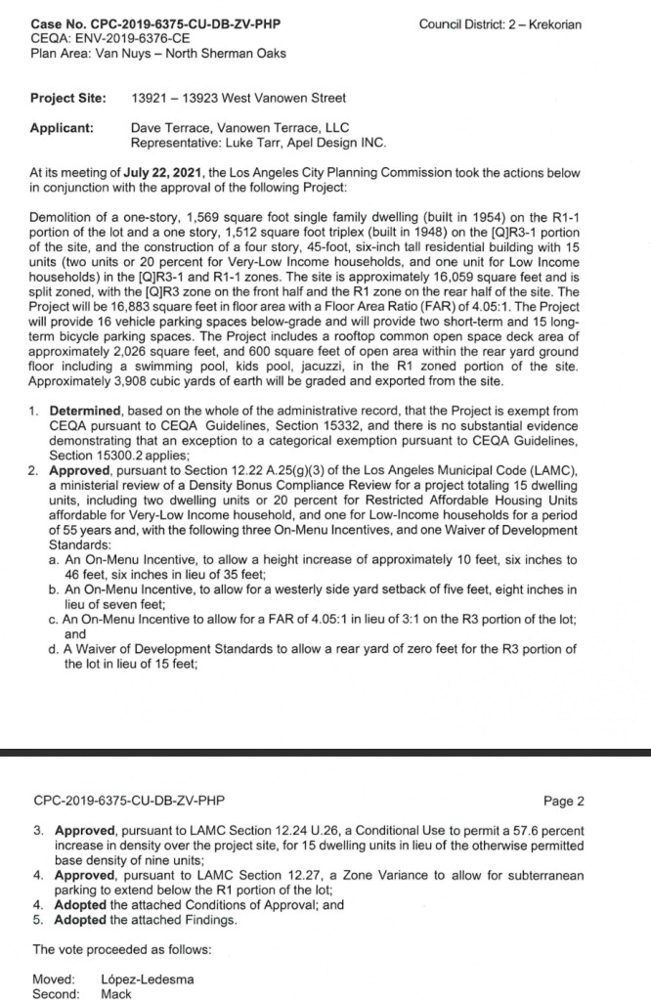

These three little contiguous flats were built by W. P. Short in the fall of '48. The house in back was constructed in 1954.

_Nice [birds of paradise](https://www.lamag.com/askchris/ask-chris-when-did-the-bird-of-paradise-become-the-official-flower-of-l-a/), too_

The continued abhorrence of anything lo-slung and lo-density requires these be replaced with, as you might imagine, vastly increased height and density, and because density proponents will tell you this is "green," there's also a massive reduction in green space.

_And again, not to point out the obvious, but what's being demolished is four units of low-income, to be replaced by three units of low-income. The fact that the four units being demolished are 3,000sf of low income, and the three units replacing them will likely total about 1500sf, well, it's more like a reduction not by 1/3 but by 50% . Hooray!_
