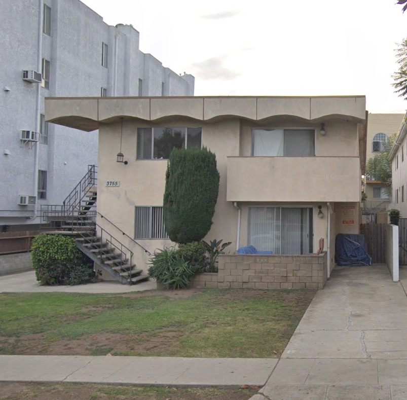
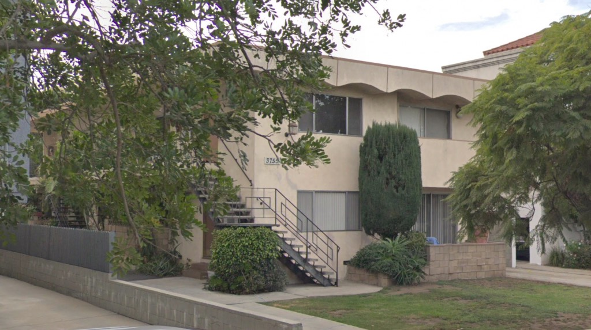
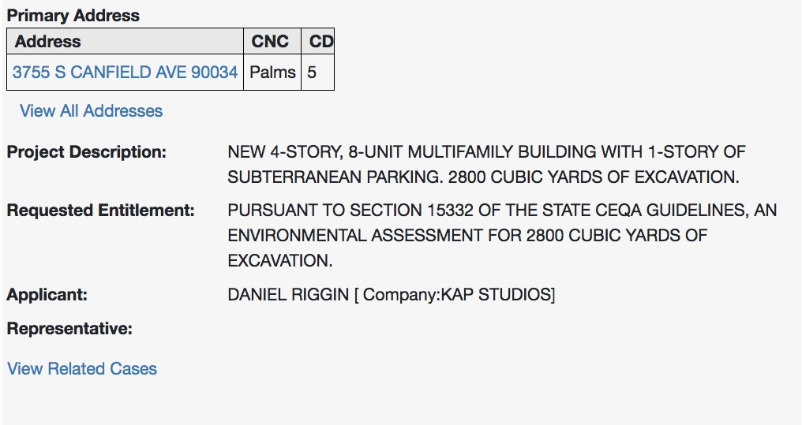

This two-story six-unit apartment building was designed by engineer J. Doherty in the spring of 1962, and will be gone soon, which is a shame, as there aren't a whole lot left in area that reek so of 1962.

They're building four stories but only adding two units? Must be some capacious apartments.
