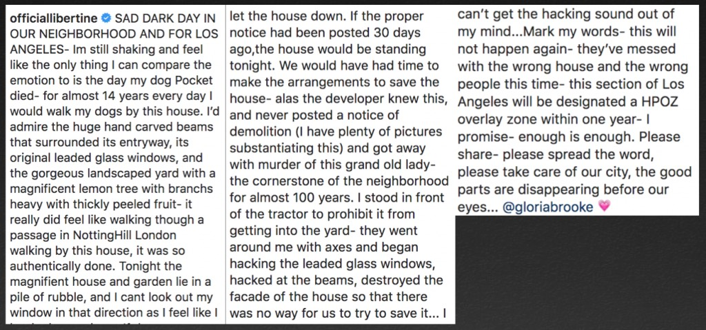

I get it.  We have private property rights.  If I have the money to outbid a museum to buy a Tintoretto or an Edward Hopper, and then go home and toss it in the fireplace, more power to me.  If there's a grove of old-growth trees, some sylvan forest producing shade and oxegyn, where children have froliced in the bucolic glades for generations, I'll buy it and clearcut it and leave the slash piles to rot _because I can_.  I won't, mind you, but I can, for we are endowed by our Creator with all _sorts_ of inalienable rights, codified by the Bill of Rights, among which lives freedom of speech, which I'm going to use here and now to say that Mr. Reuven Gradon is a moral leper.

It’s not so much Gradon bought a great house and tore it down.  Rather, that he deceived the owners to do so.  He procured the house through trickery and deceit for no other reason than to demolish it.  

[361 North Citrus](https://www.youtube.com/watch?v=345jqpLDdwk), by [Henry Knauer](https://www.flickr.com/photos/michael_locke/albums/72157631422198596/) & [Clarence Smale](http://pcad.lib.washington.edu/person/1217/), was built in 1927 as an Architect's Show Home, that is, a design showcase example, at the southwest corner of Citrus and Oakwood in Hancock Park. There she lived peacefully and was purchased about 2010 by the Coles, who restored the girl, up to and including new piping, wiring, and a full seismic retrofit.

After being in the house about a decade, it was time to sell; they listed on July 18th, 2019, and the offers came in. Many were over asking. One came on July 29th, with this letter:

_Boy, Gradon sure likes character—the home is exceptional in character, and they love the character of the home; 1920s character has a special place in his heart, so he loves acquiring buildings with character, especially ones with such incredibly rich character_

Now that just drips with sincerity. They're going to deepen their roots in this, the home of their dreams. They're going to fill it with joy and heart. Hell, even the three-year-old loves the house.

As one Curbed commenter [pointed out](https://live.staticflickr.com/65535/49035755531_fe04e6fd82_o.jpg), Cole may have rejected a higher offer because of this letter, and may also have accepted Gradon’s offer because it was without contingencies, like inspection and repairs—specifically because, unbeknownst to Cole, Gradon intended to demolish the house and didn’t care about such things. (Though most of the Curbed commentariat, of course, went on about how opposing historic demolitions meant you were a loathsome [boomer NIMBY](https://live.staticflickr.com/65535/49035619303_6a58c0db3b_o.jpg)).

In any event, the Coles sold the house to Gradon. This is Reuven Gradon:

[_IconicInvestments_](https://www.iconicinv.com/news-1/tag/Reuven+Gradon)

The house went into escrow on August 5th, 2019 and Gradon closed sale/took ownership September 18th.  He got his demo permit on October 18th only because he stated, via the legal stipulation, that he had physically posted notice on the house about its impending demolition, thirty days prior, on September 18th:

Gradon is awarded his demolition permit on October 18th. Problem is, according to neighborhood residents, Gradon never did, in fact, post any such notice thirty days prior:

Moreover, LADBS would not have issued the demolition permit without approved plans for the new building in hand, further indication Gradon always intended to demolish and rebuild.  (Besides, as a developer, how is it possible he bought a house without realizing it wouldn’t suit his needs?)

Here's another wrinkle—so to recap—Gradon goes into escrow August 5th and supposedly discovers during the ensuing 45-day-period that the house, I dunno, doesn't have enough character, so on the morning he is handed the keys to the front door, September 18th, he heads down to good ol' 201 North Figueroa and files to demolish, thus, he will get his demolition permit issued October 18th. Which he does. The Department of Building and Safety _fails to_ and _does_ _not_, despite _[their](http://clkrep.lacity.org/onlinedocs/2013/13-1104_ord_183312.pdf)_ _[own law](http://clkrep.lacity.org/onlinedocs/2013/13-1104_ord_183312.pdf)_, send written notice "at least thirty days prior" to the three abutting property owners. Again, _nor does Gradon post public notice per the law_. Rather, after thirty days of quiet ownership of 361 it's October 18th and DBS issues him his demolition permit. Conveniently, it's a Friday, and shocked residents find out bulldozers are firing up and their calls to the City ring off the wall. Some say Gradon _did_ put the demo signage up on October 18th (though neighbors dispute he did even this)—but behind some shrubbery inside his dining room window_,_ so it's a moot point, as that's both a month too late _and_ in contradiction of LADBS order to post in a "conspicuous place."

One way or another the neighborhood gets wind of his plan and Saturday morning, social media is doing its thing:

But it's too late, the work week begins Monday and by lunchtime Wednesday the house is gone. Everything, all the hand-carved woodwork, the vintage tile, the antique fixtures, even the mature fruit trees, nothing is salvaged: it's all torn asunder and dumpstered as a great big _extra_ fuck you.

Allow me then to collect (via the [Redfin listing](https://www.redfin.com/CA/Los-Angeles/361-N-Citrus-Ave-90036/home/7101575)) and display some images—

_Truly magnificent 1927 gated corner lot architectural showplace designed by Henry Knauer & Clarence Smale AIA as one of the original design showcase homes of this prominent Hancock Park neighborhood. Unprecedented craftsmanship and detailing featuring custom interior/exterior millwork, wood floors, leaded glass diamond paned windows and more. The home is anchored by a true "Great Room" with approx 15 ft ceiling & massive Batchelder tiled fireplace, transformable into a home theatre with a push of a button. Outfitted with an 11ft wide/2.39 retractable movie screen with adjustable matting for 16.9, it also includes digital projector and built in 7.1 sound system. Formal dining and breakfast rooms, butler's pantry w original wood drain board and classic black and white reimagined chef's kitchen w/ granite counters and Viking stove. Master suite and 2 additional bedrooms 1 en-suite & period tile bath detailing. Walk up attic/office room, basement, and separate laundry room workshop not included in sq ft. Magical gardens include an outdoor living/dining area w fireplace, grassy play area & iron pergola shaded dining patio, front and rear porches and so much more. Step back in time to an era of quality and detail. Minutes to movies, shopping, top restaurants, makes this truly one of the special locations in Los Angeles._

_Look at the inlays in the floors, which I believe are White Oak_

About this Batchelder fireplace.  Any six-year-old can [tell you](https://www.curbed.com/2014/7/9/10080352/century-old-batchelder-tiles-ignite-las-preservationists) that [Batchelder](https://patch.com/california/monrovia/batchelder-tiles-are-the-cats-meow) is [important](https://www.larchmontbuzz.com/larchmont-village-life/so-youve-got-a-batchelder-fireplace-what-does-that-mean/).     

I asked Brian Kaiser, one of the foremost authorities on 1920s Southern California tile, and an expert in tile restoration, preservation and salvage, about this one.   In an email exchange Kaiser said:

_The fireplace is (WAS) quite special. A deluxe, deluxe example.  The Terra Cotta mantel is one of the most elaborate and detailed that he made. I have never seen it before. The mantel was the most expensive part of the fireplace. There were many "Grades" of mantels.  The beautiful, very detailed Pilasters, are rarely seen. They are also very special. The corbels above them are very large and also rare. The spandrels are also very, very nice. The hearth has a "Curb". It helps stop ashes from coming out into the living room. Probably based on an actual English fireplace from the Middle Ages. A very impressive, and classy design. A terrible, terrible, tragedy that it was not saved. I could have had it out in 3-4 days._

Now let’s discuss these bathrooms:

I spoke with Max Solomon, head of the Los Angeles design and restoration firm Augustus Interiors.  He said that given the watercolor style and coloring, the tile work was in all likelihood H & R Johnson, an English manufacturer favored during the interbellum years in the most high-end homes.  The use of the tony, trend-setting maker stands to reason further, Solomon asserts, since "they wouldn’t skimp on a showcase house, plus the H & R Johnson showroom was located nearby; moreover the house was Tudor, so an English tile maker would be all the more appropriate."

_That low, long vanity on the left, though, is modern, and of course so are the toilets_

_This, and the next four photos, from the_ [_Los Angeles Conservancy Facebook Page_](https://www.facebook.com/laconservancy/)

[_colbyartsandarchs_](https://www.instagram.com/p/B4LNMrOnsyJ/)

_There's a Batchelder fireplace somewhere in there_  
[_raylbarnhart_](https://www.instagram.com/p/B4Adup_JHv4/)

And so the house and all its charm and memories are gone. All that's left is this letter to the editor from the Coles:

_[Larchmont Chronicle](https://larchmontchronicle.com/wp-content/uploads/2019/10/Citrus-Gradon-letter-for-web.pdf)_

...and a lesson to the people of Los Angeles. Perhaps, if there is a silver lining, it's that this lesson may enrage and engage some folk, and call them to action; posts like this one

use terms like _mark my words—this will not happen again—enough is enough_.

- [North Citrus Avenue](https://www.google.com/maps/search/?api=1&query=34.07804,-118.33987)

_Postscript_—but gosh, maybe I'm being too hard on Mr. Gradon. According to [this](https://live.staticflickr.com/65535/49039100007_7490a04727_o.jpg), Reuven and wife Shevy "are going to build something much more beautiful." I'd be happy to look over the plans you had in hand weeks ago at DBS and critique them sir, and if I'm wrong about all this, I'll eat my words. Of course you'll be spending thrice what you paid to match that level of materials and craftsmanship, but I certainly respect that choice. Here's to the new 361!
