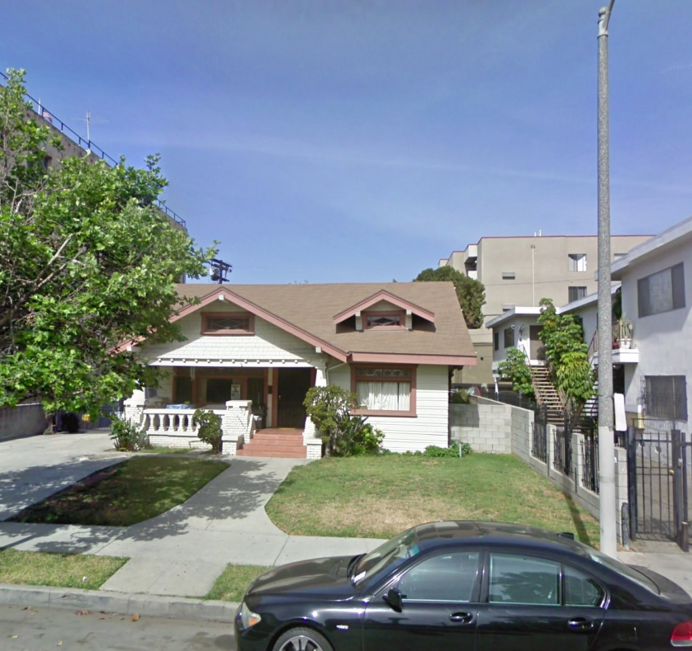
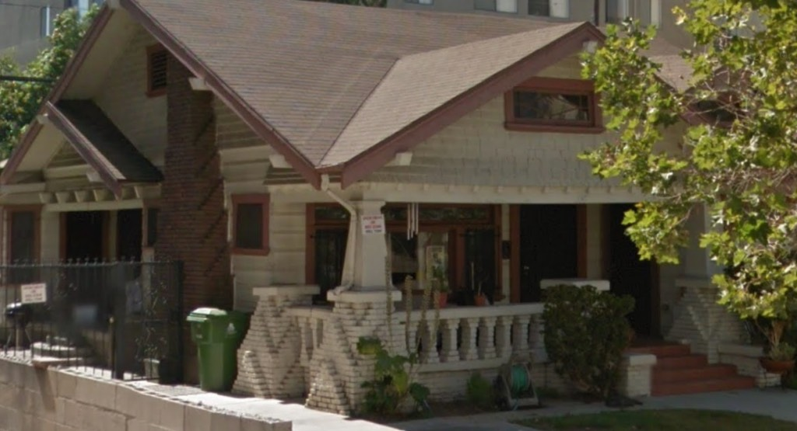
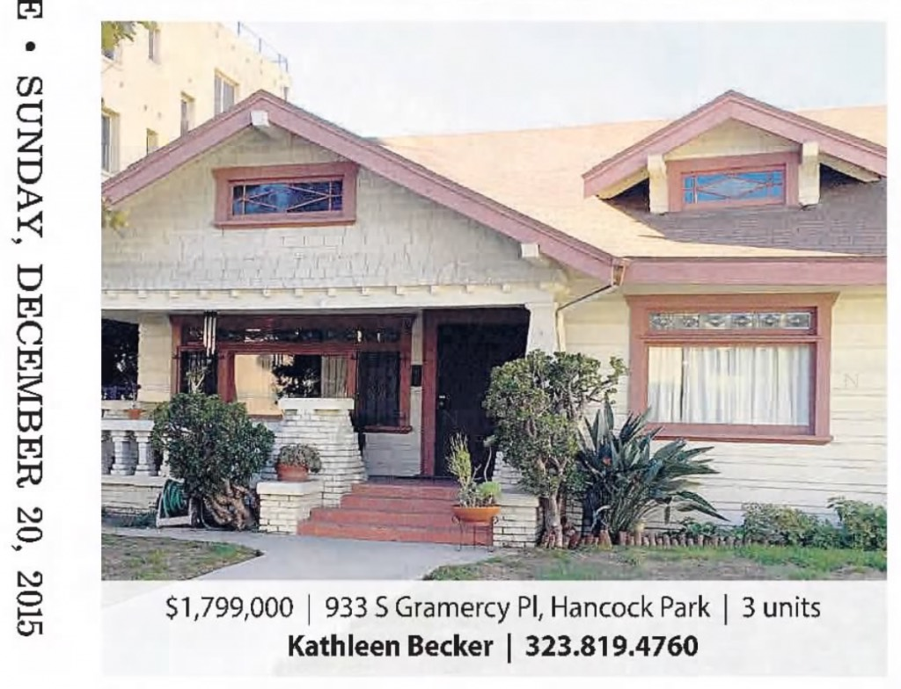
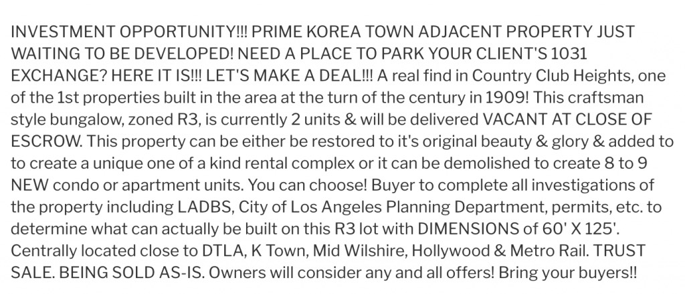
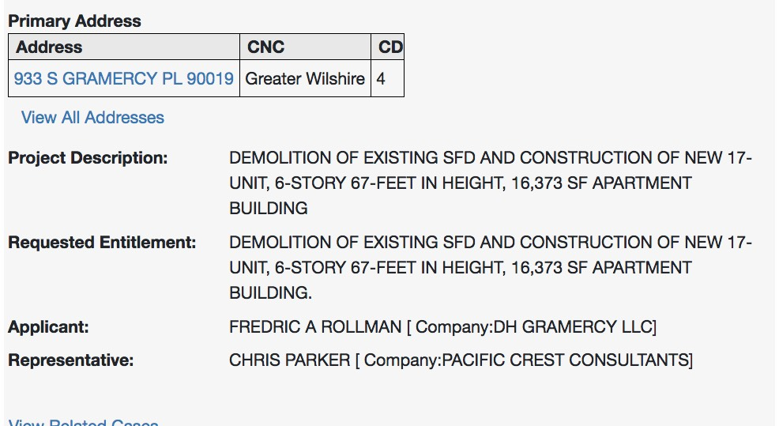
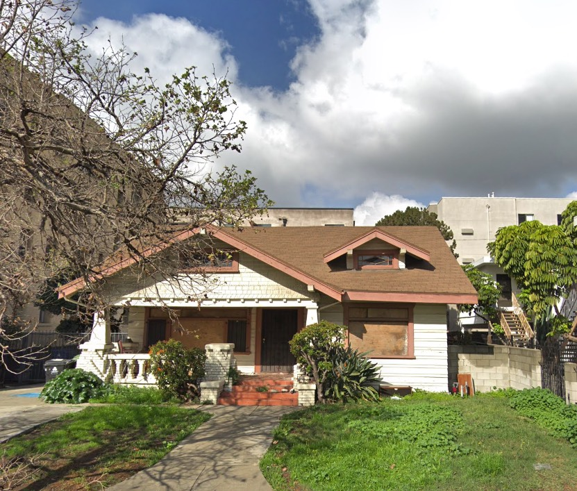

This seven-room, 1,840sf Craftsman [bungalow](https://laist.com/2016/04/15/bungalow_history.php) was built in the spring of 1912, in the Country Club Park tract, by the contracting team of Peter J. Schulte & William J. Wisler. Wisler was the owner.

There are precious few Craftsmans left in this part of the world; they've been nearly exterminated east of Wilton. It is especially noteworthy to find one that has not been stuccoed, windows changed out, porches enclosed, etc.

Look closely at the expressive use of brick in on the chimney and porch.

Then, one day, she is put up for sale:

_Sold in November of '17 for $1,390,000_

Interestingly, when 933 was [listed](https://www.redfin.com/CA/Los-Angeles/933-S-Gramercy-Pl-90019/home/6917805), they stated "it can be demolished to create 8 to 9 new condo or apartment units"—

It should surprise no-one here that they intend to build twice that:

Sixty-seven feet? Nearest thing _that_ tall is a half-mile north on Wilshire.

One last look. This time with boarded-up windows.

This is why we can't have nice things.

- [South Gramercy Place](https://www.google.com/maps/search/?api=1&query=34.05476,-118.31333)
