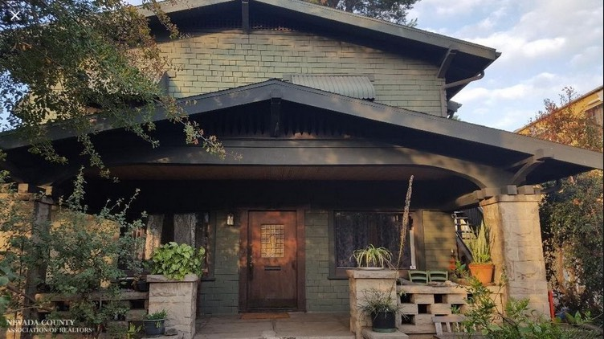
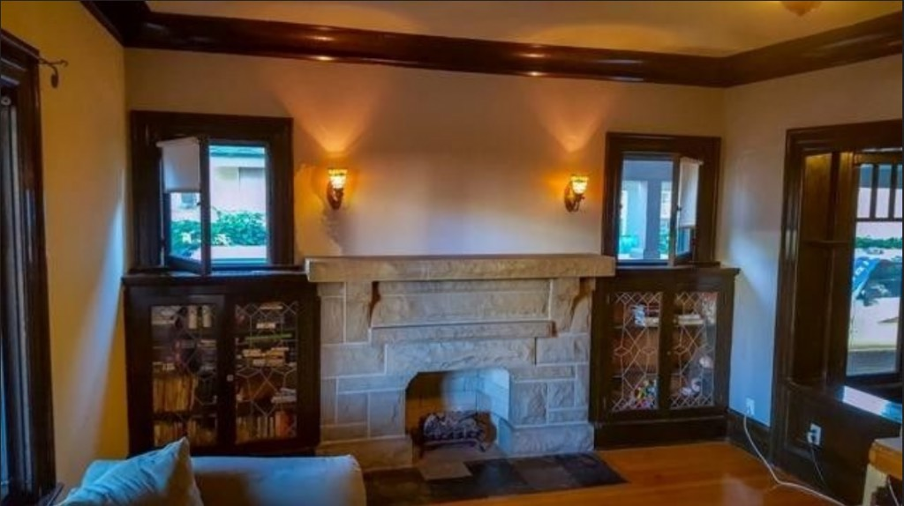
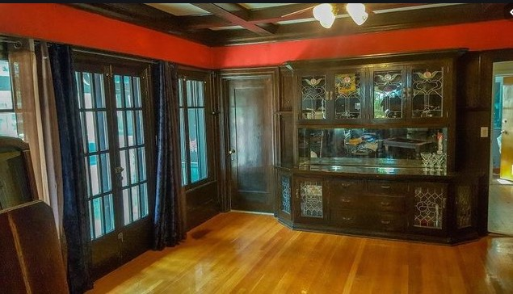
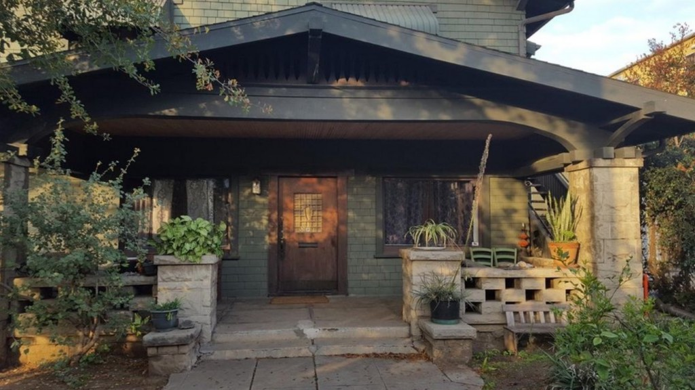
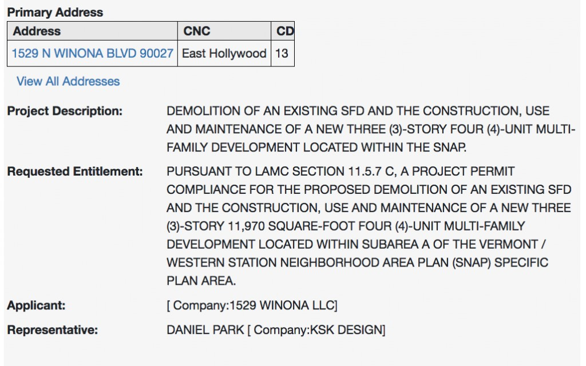
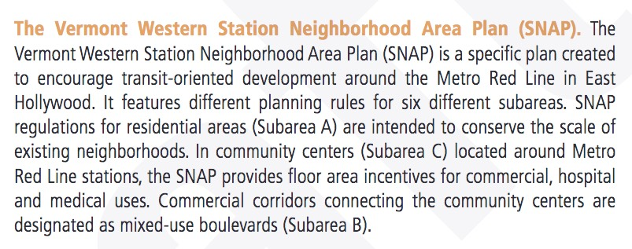
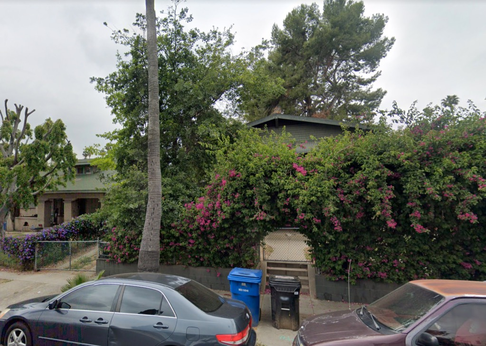
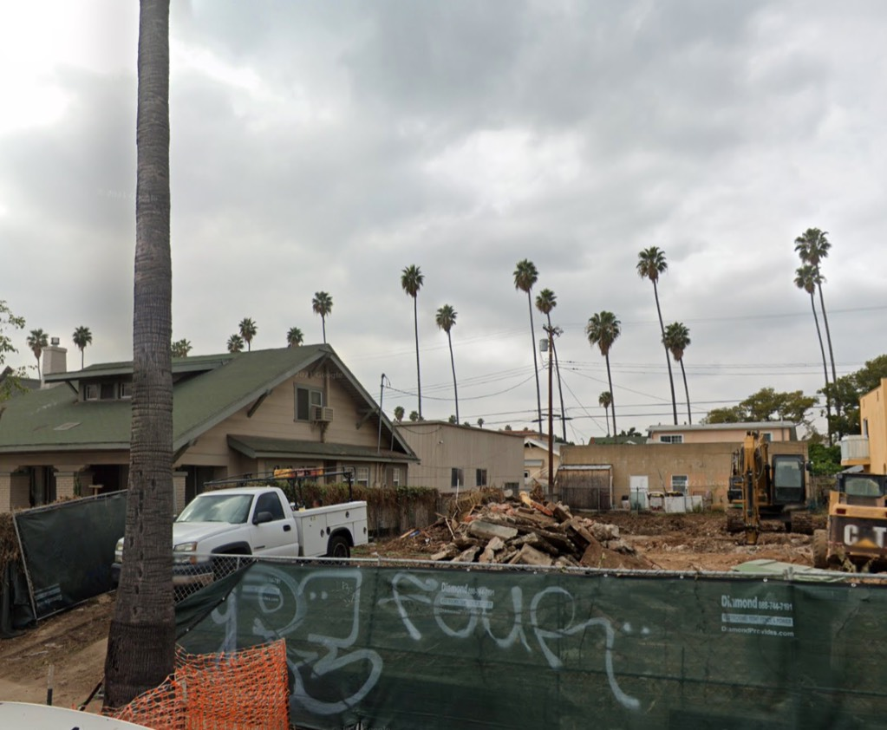
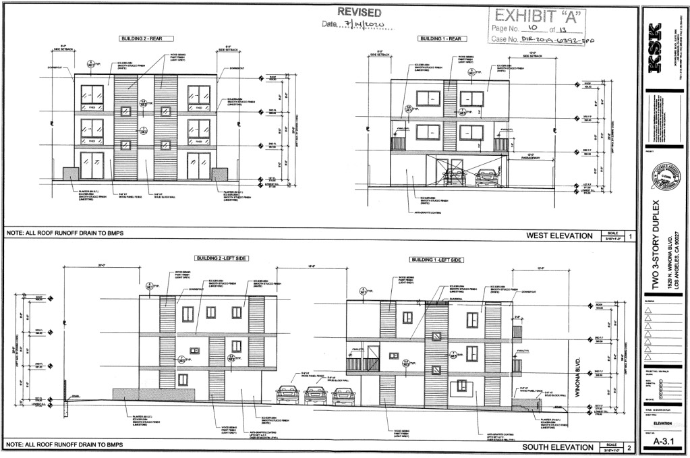
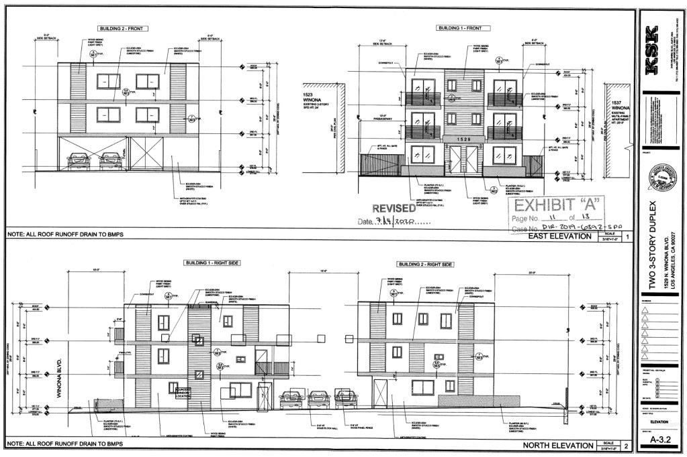

Just a quick post, didn't want this gorgeous 1913 G. L. Synder-designed Hollywood home to fly under the radar.

Tearing this down and building a three story building is, _literally_, _**intended to conserve the scale of the existing neighborhood**_:

_And you thought I was kidding_

- [Winona Boulevard](https://www.google.com/maps/search/?api=1&query=34.099,-118.30229)

You know what has character? A beautiful old Craftsman lurking behind the foliage deep in Hollywood—

But this makes your overlords the YIMBYs yell DIE DIE DIE!!! And they run out with their pitchforks and axes.

_Thank God! Now we've solved the housing crisis!!!_

_The BOX! They yell. We must build the GREAT FEATURELESS BOX!_

_If you dare to disagree with the Great Featureless Box you are a NIMBY, and therefore Worse Than Hitler._
