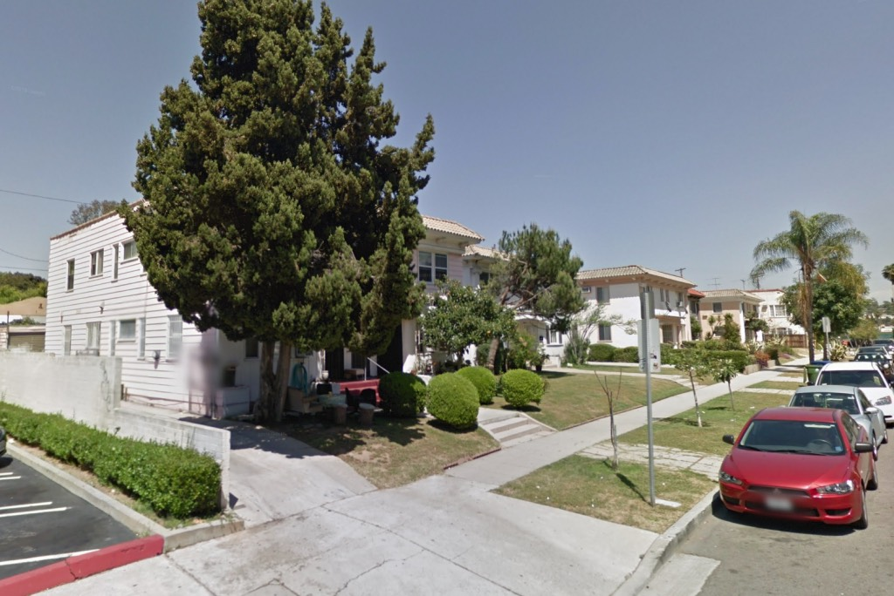
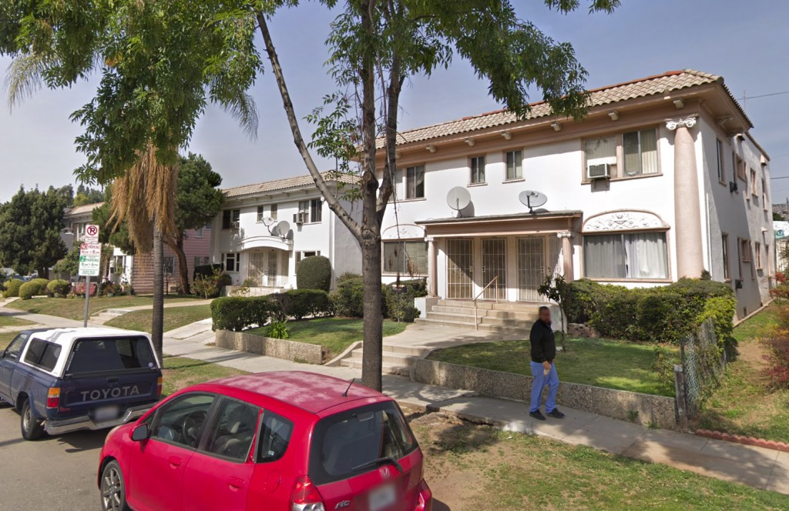
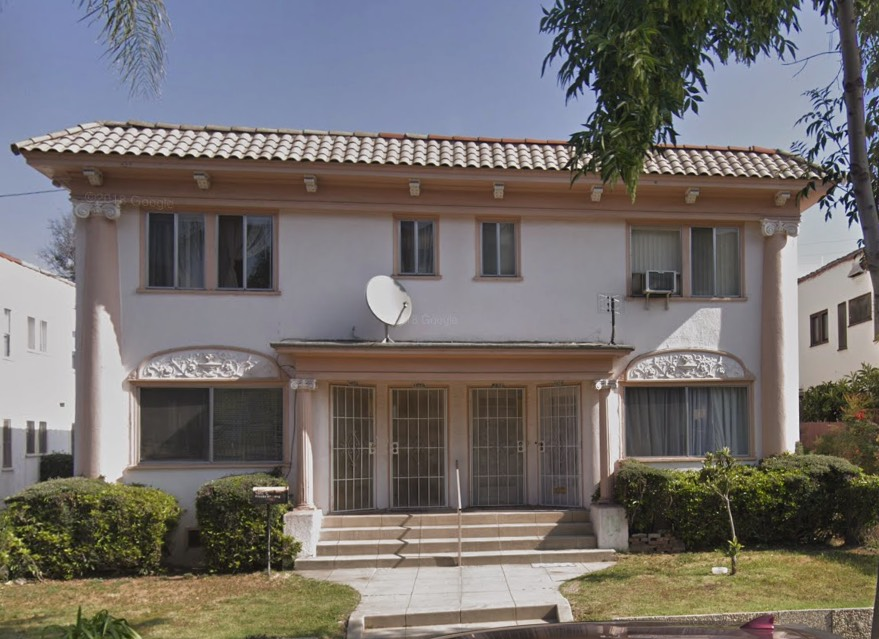
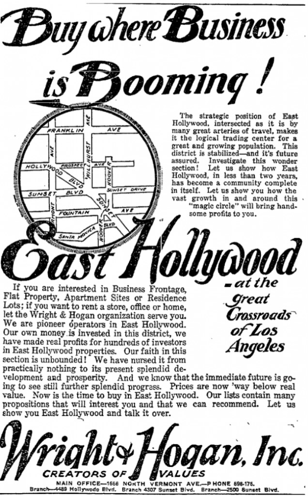
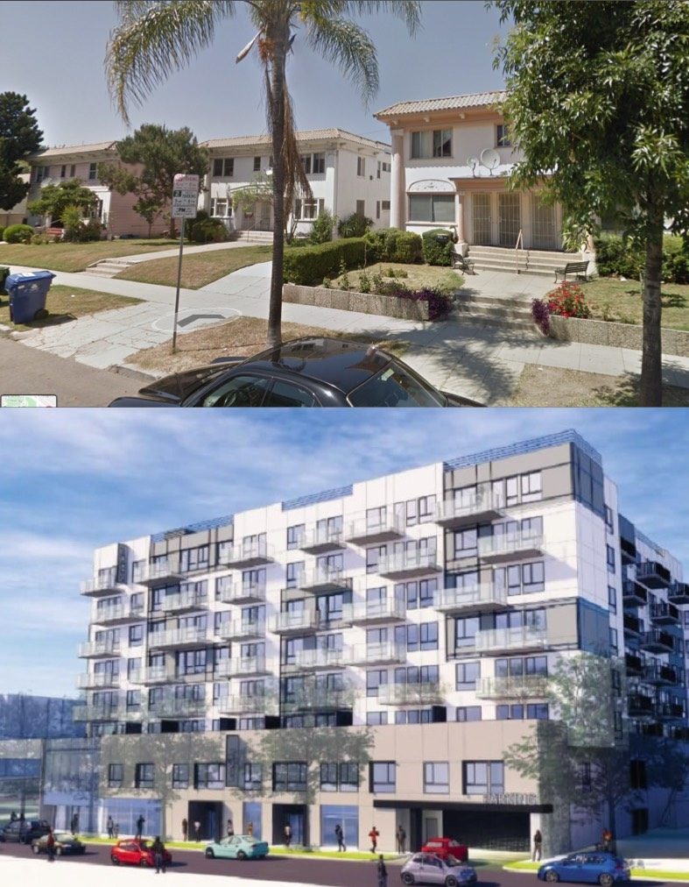
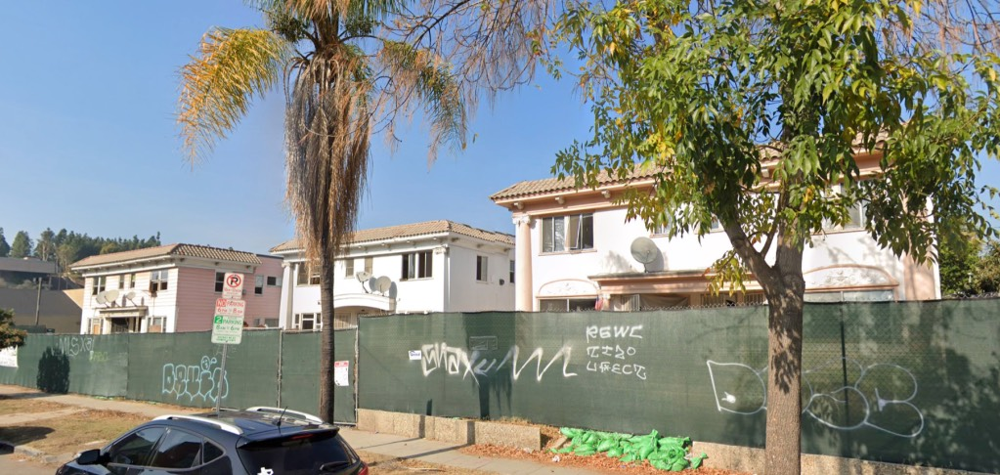
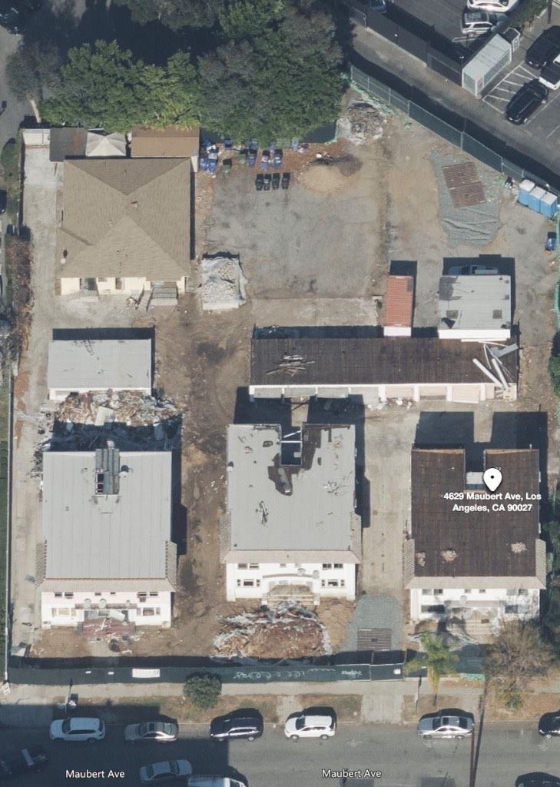

Here's something that came over the transom, not in the form of some Planning Department notice, but via social media. The properties in question are three apartment buildings at 4629-4651 West Maubert Avenue:

_Looking east from 4651Maubert toward Rodney Drive toward_ _4629, center-right_

_Looking west on Maubert, 4629-35, right; 4637-43, center; 4645-51, left_

_A bracketed cornice, corinthian columns, friezes of urn and garlands—why, it has the hallmarks of architecture! No wonder they want to tear it down._

Five matching sets of flats, 4613-4615 W. Maubert, were designed and built in the spring of 1920 by developers Wright & Hogan.

_The great Crossroads of Los Angeles!_

Ben O. L. Wright was a tireless promoter of East Hollywood. In 1920, he was 31 years old, and living with his wife, daughter, mother and brother in the home he designed and built in 1919, a few blocks north at 4626 Melbourne (demolished for a parking lot in 1969).

For example, we all know our beloved [Vista](https://en.wikipedia.org/wiki/Vista_Theatre_(Los_Angeles)) was designed by Lewis A. Smith, and run by Bard (being Lou Bard's Hollywood before its renaming to the Vista in 1928), but do you know whom we actually have to _thank_ for it? Wright & Hogan, that's who.

But back to our Wright & Hogan flats on Maubert. The other day this popped up:

_**STEALTH ATTACK ON LOS FELIZ?**_

_**LAST MINUTE ADDITION OF MAUBERT PROJECT TO COMMITTEE AGENDA RAISES QUESTIONS.**_

_**Late last week an additonal item was placed on the Planning & Land Use Management (PLUM) Committee agenda. The PLUM Committee will review a report related to the project proposed for the 4600 block of Maubert at the southern edge of Los Feliz, near Barnsdall Park. The proposed project is an 8-story residential structure containing 153 dwelling units. The PLUM agenda says that the new building will set aside 17 units for Extremely Low Income Households, but it doesn't mention that demolishing the existing structures will erase 14 rent-stabilized units. In other words, there will only be a net gain of 3 units that will be accessible to Low Income households. The City wants you to believe it's trying to address LA's housing crisis, but the only people City Hall is really interested in housing are the folks who make six figures or more.**_

**_This could be bad news for Los Feliz. As a TOC project, this is already on the fast track, and the fact that PLUM is considering making it a Sustainable Communities (SC) project means they want a quick and superficial environmental review process. Like many of the homes in the Los Feliz area, the buildings to be demolished are nearly 100 years old and potentially historic. The fact that this was slipped onto the PLUM agenda during a holiday week when many people will be out of town could indicate that the City is trying to avoid public scrutiny. Will this be their strategy for other projects in the area?_**

_**With the City's tangled approval process, it's hard to say where this project stands right now, but if you're bothered by all of this, you could send an e-mail to City Hall to let them know you're concerned. Among the areas of concern are....**_

\> **_Net gain of only 3 units accessible to Low Income households._**

\> **_No notification has been sent to the surrounding community or the neighborhood council._**

\> **_Loss of potentially historic buildings._**

**_Please use the following subject line:_**

**_4629-4651 Maubert Ave., Case Nos. DIR-2019-3760-TOC-SPP-SPR, VTT-82654_**

**_Send your e-mail to:_**

**_Kevin Keller, Deputy Director of Planning_**

**_kevin.keller@lacity.org_**

**_And please copy:_**

**_jenna.monterrosa@lacity.org_**

**_jason.hernandez@lacity.org_**

**_terry.kaufmann-macias@lacity.org_**

And if you're wondering what, exactly, the developer intends to do, it is this:

And from this post came a flurry of shocked responses. But more than that. _Informed_ responses. Good to see the neighborhood folk on social media having, or gaining, a good working knowledge of the forces at work in their neighborhood. The same folk who voted for JJJ out of the goodness of their hearts. They're seeing TOC turn their neighborhood into a developer's paradise not because it will do any good for the poor, but because it ups the tax base for City. Their neighborhoods are marketed as "TOC Development Opportunity!" meaning zoning goes out the window: no green space, no setbacks, no parking, increase the height, increase the units—and to hell with community input, design review, neighborhood councils—and the Planning Commission says their hands are tied because of JJJ.

And of course, people are writing emails, and reporting that they're being bounced back with notices that their reps are out out of town/out of touch for the holidays.

Don't let that stop you. _Make twice the calls, write thrice the emails._

I'm kind of digging this social media thing now. Makes me wonder, had the pensioners of Bunker Hill been so supplied back in 1956, as City Council was considering the redevelopment project, if things could have gone another way.

- [Maubert Avenue](https://www.google.com/maps/search/?api=1&query=34.099216,-118.290603)

Undergoing demolition.
