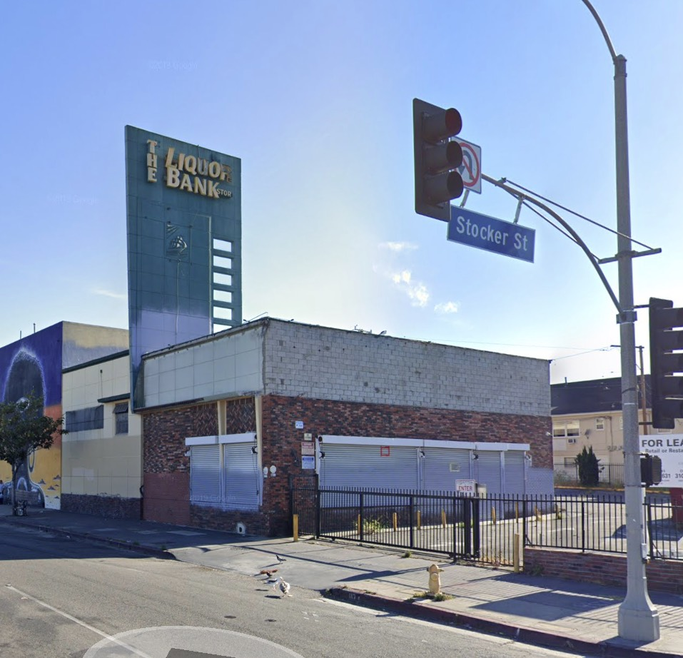

Down on Crenshaw there's The Liquor Bank, which is my kind of place to make a withdrawal. And appropriately named because it is, in fact, an old bank. Look closely, see the ship on the sign pylon?—that's the USS Portsmouth, erstwhile [symbol of Bank of America](https://www.flickr.com/photos/maulleigh/3234214224). (San Francisco B of A founder Amadeo Giannini was enamored of the Portsmouth, as it had secured his city-by-the-bay for America during the Mexican War.)

This Bank of America was built in 1949 and designed by Raymond Raleigh Shaw AIA, with William D. Coffey, Consulting Structural Engineer. Raymond Shaw is best known for his 1920s designs, like the [Pacific Southwest Building](http://www.pacificsouthwestbuilding.com/history/) and [San Joaquin Light & Power](https://en.wikipedia.org/wiki/San_Joaquin_Light_and_Power_Corporation_Building), both in Fresno.

Shaw did some number of Bank of America branches; he altered the exterior of the B of A in Beverly Hills on Wilshire in 1948 (although that was subsequently redesigned _again_ in 1963 in New Formalist/Brutalist style by Sidney Eisenshtat—which after being [deemed eligible](https://media.metro.net/projects_studies/westside/images/ple_habs.pdf) for listing on the National Register, was dutifuly torn down by Metro as part of the subway extension). Here is a 1951 example of a Shaw B of A at 8501 Pico—

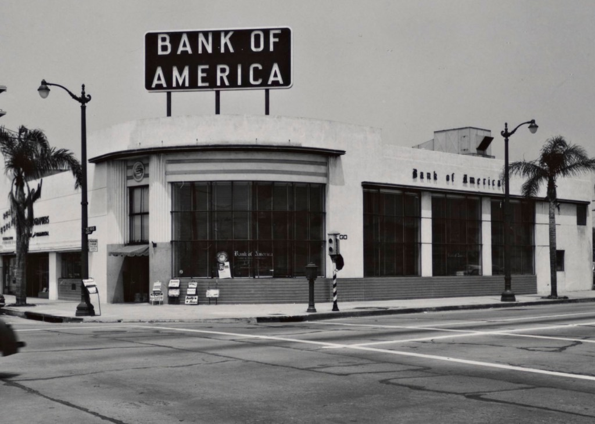

_Still standing, and still a Bank of America, but do yourself a favor and don't go on Google Streetview to see what's become of her  
_[_Getty_](https://rosettaapp.getty.edu/delivery/DeliveryManagerServlet?dps_pid=IE163780)

Shaw designed banks across the southland through the 1950s, but received his largest commission when he was hired, again using Coffey as engineer, to produce the Corporate Modern [Banco Hipotecario in San Salvador](https://i.pinimg.com/originals/28/1e/de/281ede0bfd23996abdec6272782180f5.jpg) in 1958. He retired soon after and died in 1967.

In any event, back to our pal at Crenshaw and Stocker: it's 1949, and 1949 was smack in the thick of the Great Age of the Late Moderne. Late Moderne was born to Southern California and defines Southern California as well as—no, _better than_—any other architectural style. What is this Late Moderne, you ask? The sleekness of Streamline, and the ribbon-window rectangularity of International style, melded in the late 30s, and flowered in the mid-40s, to produce a new vernacular. You know it when you see it: warm materials form large simple volumes locked in asymmetrical sculptural compositions, with irregular angles and curves, punctuated by certain ornamental motifs—egg crate sun shades, grills, bezeled windows, tapered and punctured fins, canopies, and of course large sign pylons with bold neon. Well, _that's_ a lot of words; it's those buildings [what look like this](https://live.staticflickr.com/65535/49125253593_b3dd56a3a9_o.jpg).

The style was short-lived, though, as Modernism went another way and the likes of Lautner and Eames and Armét & Davis began to explore the structural expressionism of trusses and cantilevers. Thus every Late Moderne is a treasure, and some are preserved, like Wayne McAllister's [Bob's Big Boy](https://www.eichlernetwork.com/article/dine-its-59?page=0,1), while some just hang on, like Stiles Clements's [Windsor Hills Shopping Center](http://www.you-are-here.com/building/storage.html), yet some are criminally demolished, like Clements's [Mullen & Bluett](https://miraclemilela.com/the-miracle-mile/historical-photos/mullen-bluett/).

In any event, Shaw's bank is not long for this world. Or at least what's left of it; in all honesty, half of it has already been removed. As you can see, the structure once ran all the way to the corner, but had a chunk of its front removed in September 1976 when it became a liquor store, and Liquor Bank hired Van Nuys architect Andrew F. Gutt to design a new facade.

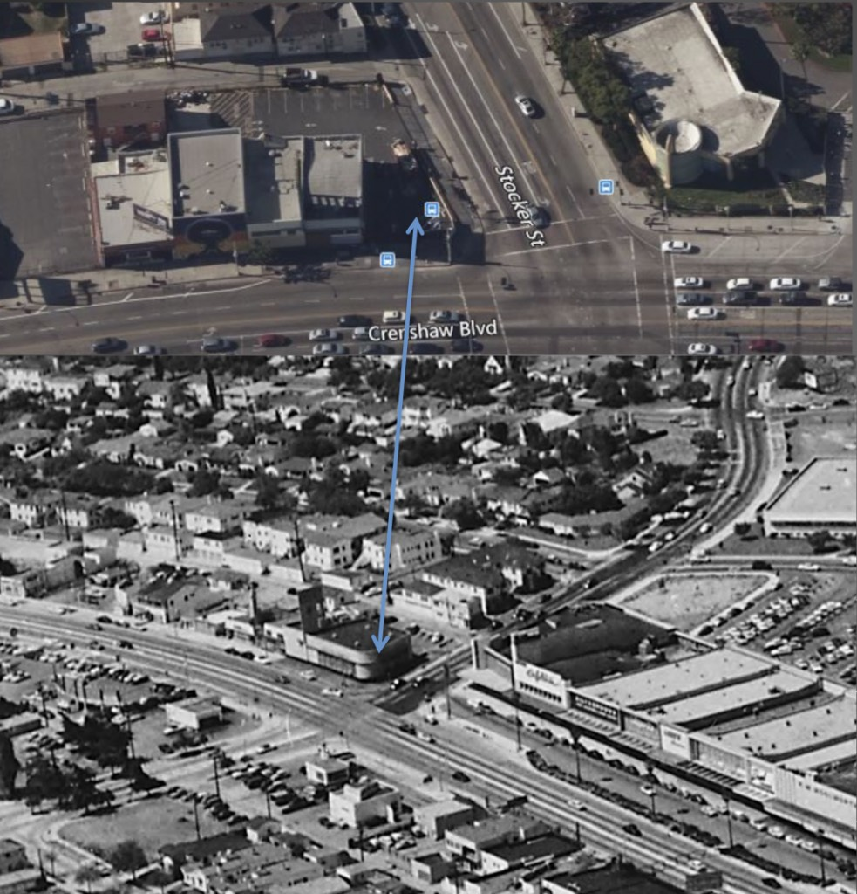

_via_ [_USC Digital Archives_](http://digitallibrary.usc.edu/cdm/singleitem/collection/p15799coll170/id/21761/rec/1)

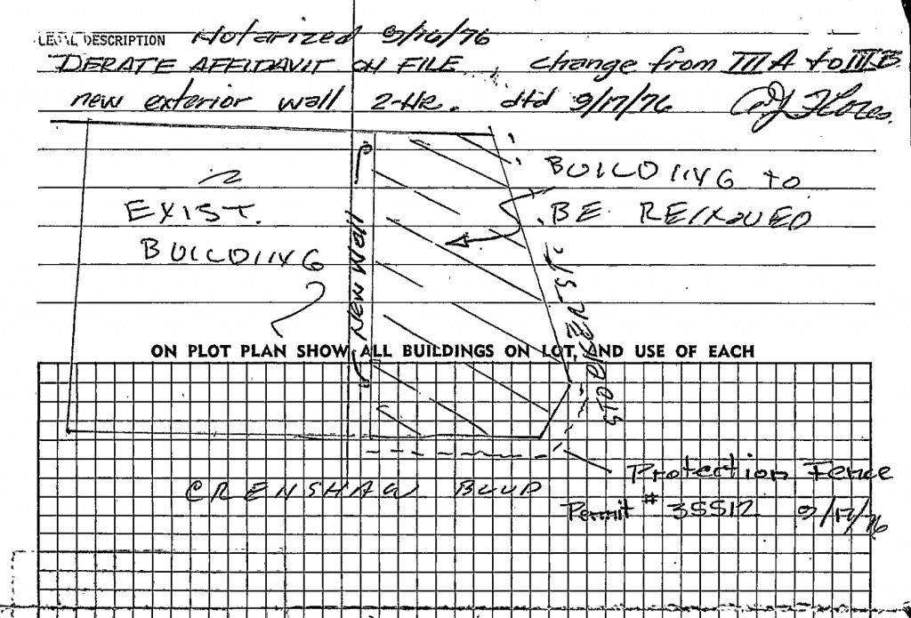

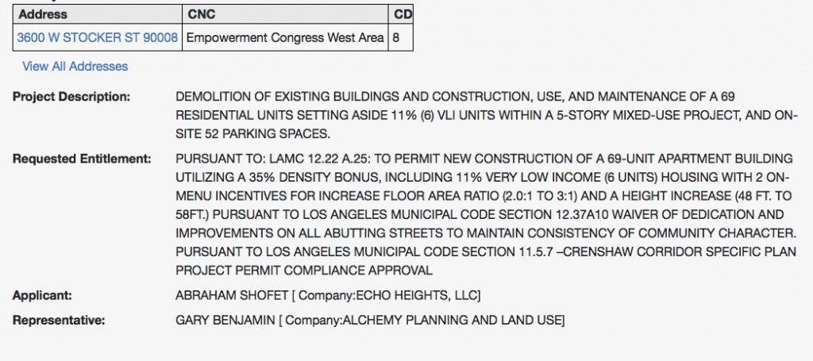

What I find additionally sad about losing this cool pylon-sign is that it's just down the street from one of the great pylon-signs in all Los Angeles, the 1947 Albert B. Gardner/Edward W. Carter-designed [Broadway](https://flic.kr/p/7X9mQr) Department Store, which has the greatest Moderne façade that ever was. Read more about the Crenshaw Broadway [here](http://mall-hall-of-fame.blogspot.com/search/label/Broadway-Crenshaw%20Center) and [here](https://pleasantfamilyshopping.blogspot.com/2012/02/shopping-in-los-angeles-1950s.html). Fortunately, the Broadway and A. C. Martin's [May Company](https://www.flickr.com/photos/65359853@N00/4562161785/) are being worked into the mall's current redevelopment (ten-story office tower; eight-story, 400-room hotel; thousand condos and apartments; the whole bit). If Capri Capital can work those historic buildings into their mall redevelopment, maybe developer Axiom will incorporate the Liquor Bank!

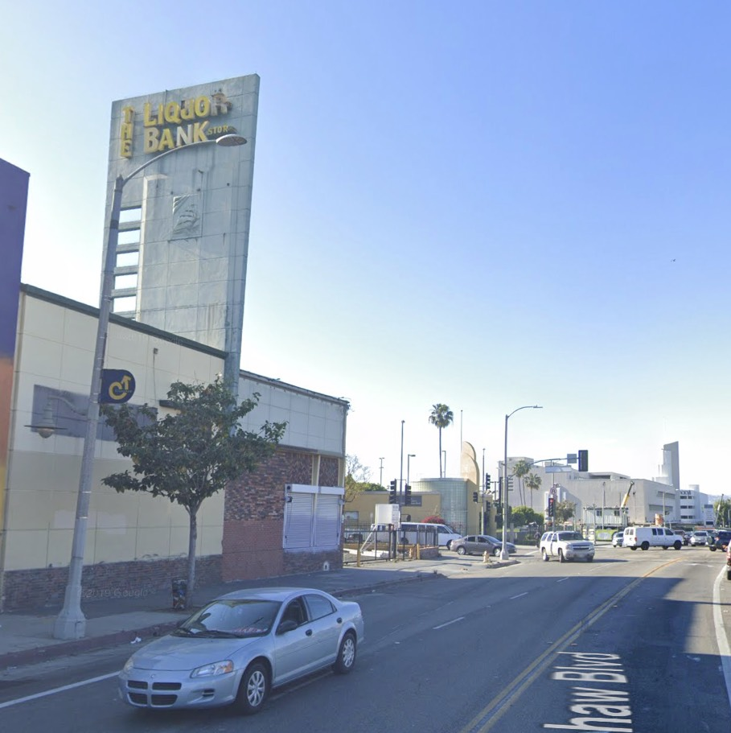

Uh, probably not. Let's take a look at another one of Axiom's projects, just up the road at 3831 Stocker. This was a hospital built by [Lester M. Morrison](https://www.latimes.com/archives/la-xpm-1991-05-28-mn-2586-story.html) in 1953, using architects Riener C. Nielsen and Gene E. Moffatt. Axiom has razed everything and it's to be 127 market rate units (or so says [their website](https://www.axiomrei.com/residential); according to [this](https://planning.lacity.org/StaffRpt/InitialRpts/CPC-2015-779-CU-SPR.PDF), though, they're only allowed 74 units even with the density bonus).

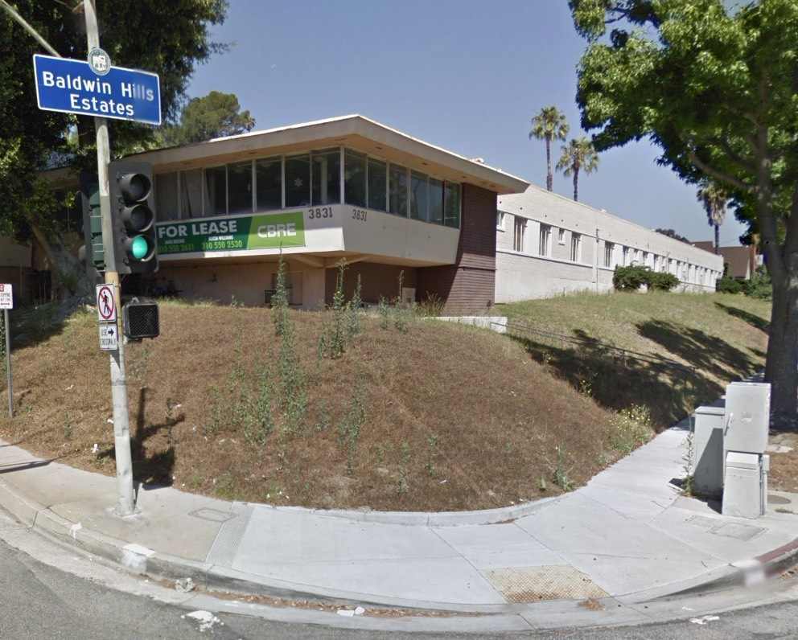

_The firm of Nielsen & Moffatt designed all over the southland and opened an Oakland office in 1959. They specialized in hospitals, medical-clinical buildings, homes for the aged, and similar institutions_

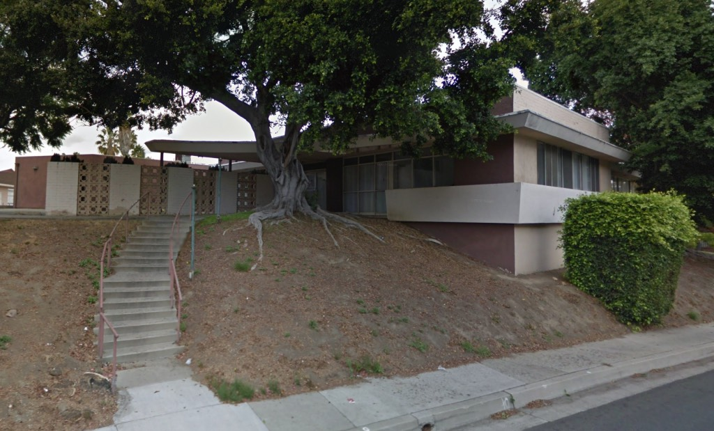

_Ooo, check out the concrete sunscreen_

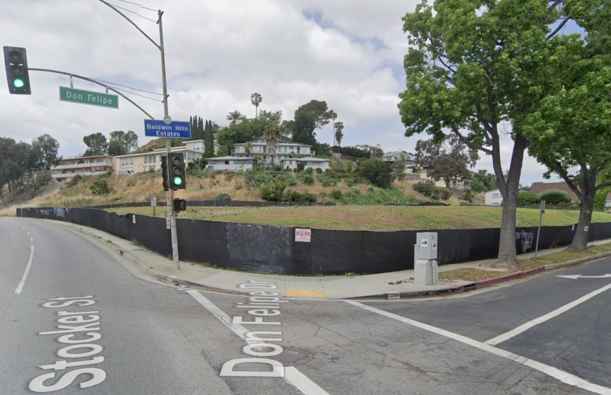

_Gosh, didn't even leave a tree_

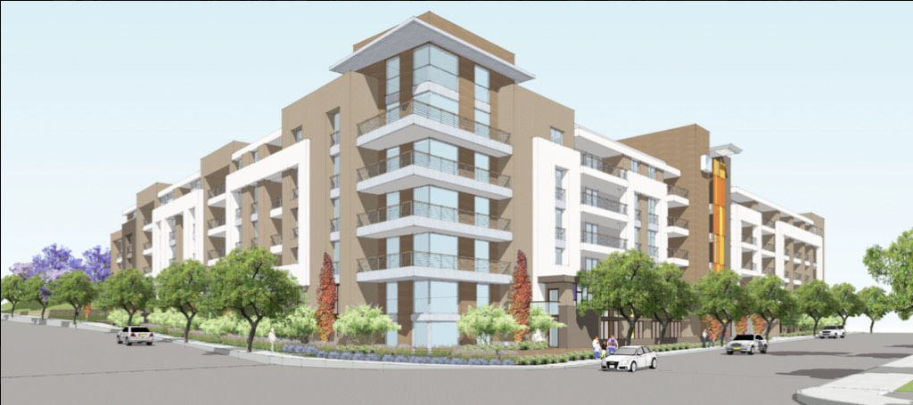

_I suppose we can expect something vaguely like this for the Liquor Bank site_

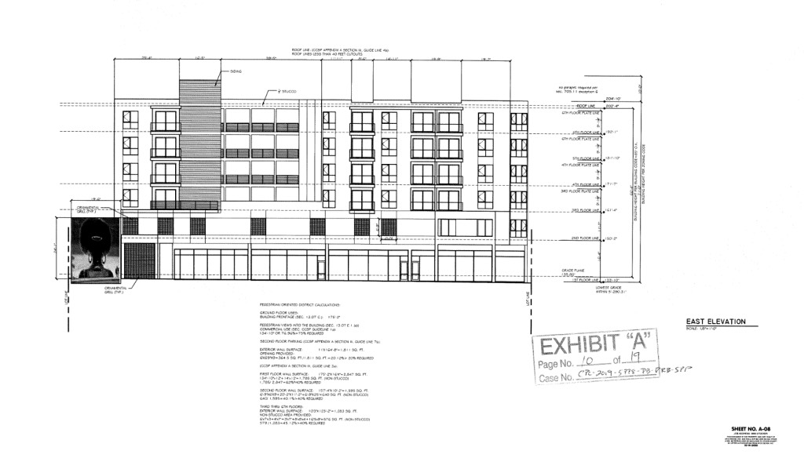

_Aaaaand here's what it will look like, oh, glory be_

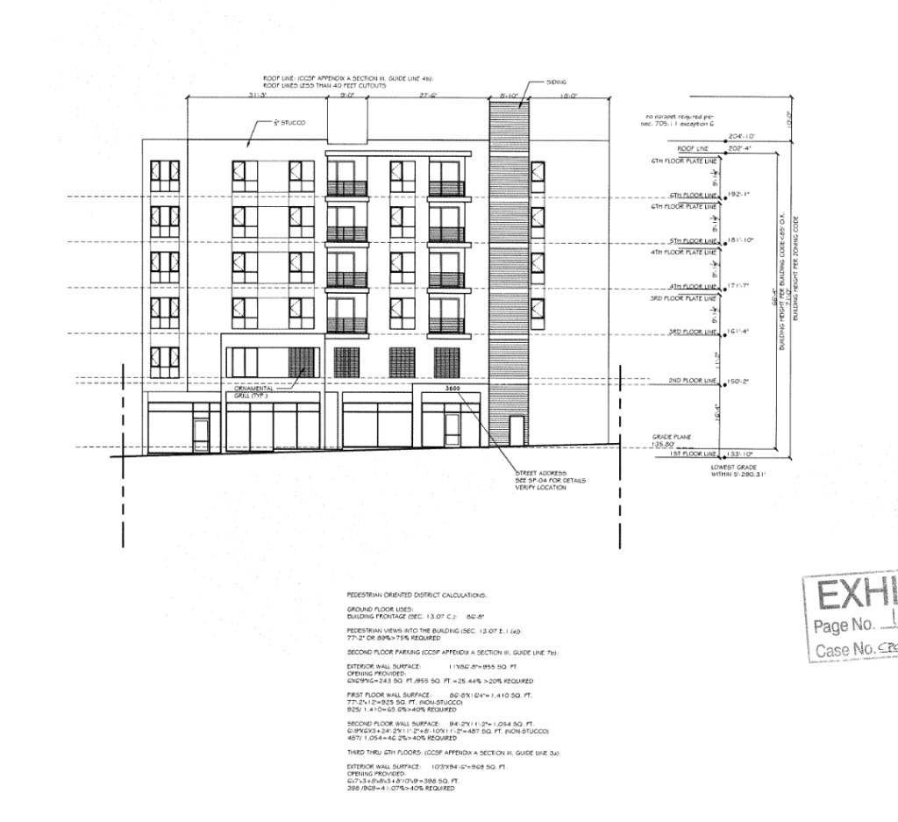

_I saw a grey featureless box just like this once in Greyfeaturelessboxton, Indiana_

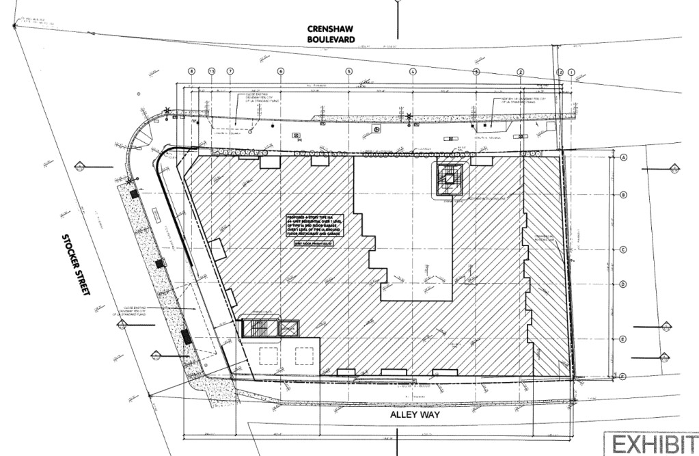

Postscript—if you dig Late Moderne and want to learn more, no, there isn't a book about it, and yes, there should be. Best I can do is point you to [here](https://planning.lacity.org/StaffRpt/CHC/2018/7-19-2018/Item%2009%20CHC-2018-3867-HCM%20(Times%20Mirror%20Square).pdf) where you may read about Late Moderne in general (pp. 36-37) and the great Rowland Crawford in particular (pp. 43-46; see accompanying images on pp. 70-81.) More importantly, there _is_ a book that discusses Late Moderne, and better yet, in relationship to its rarely-studied expression in residential construction. I can't recommend it enough, and you should [buy it now](https://pshistoricalsociety.org/collections/shop/products/the-design-of-herbert-w-burns).

- [Stocker Street](https://www.google.com/maps/search/?api=1&query=34.008188,-118.335294)
