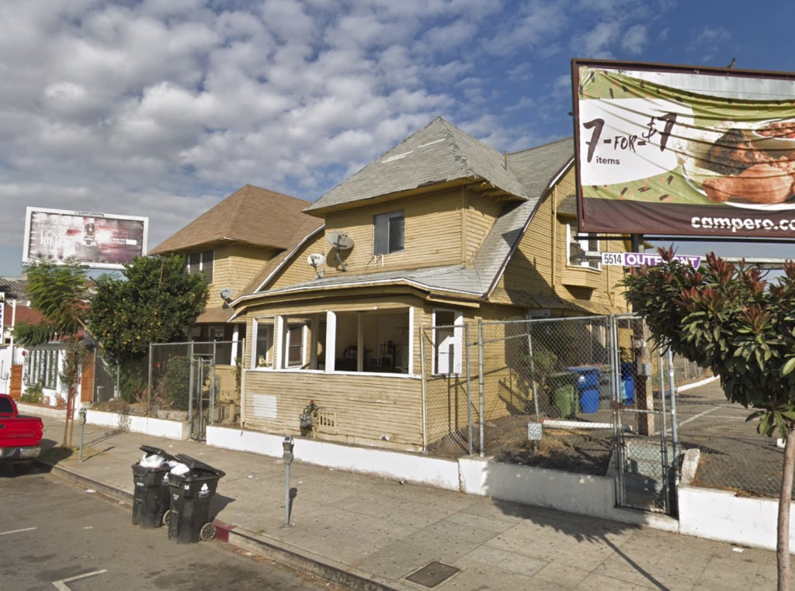
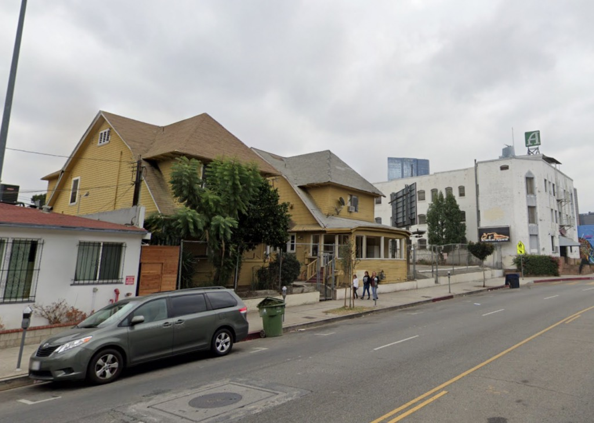
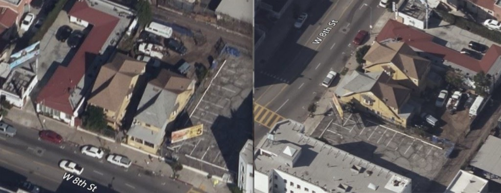
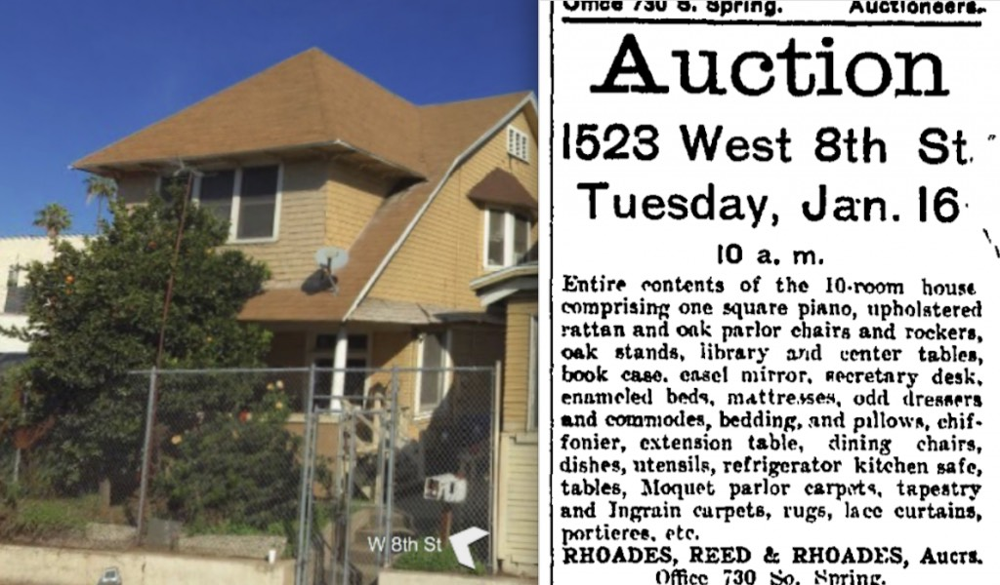
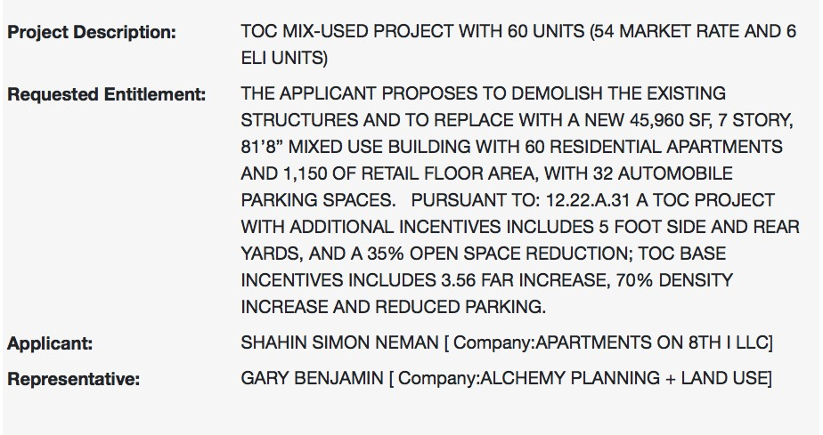

They won't be happy until every shingled building in Los Angeles is gone. I mean, they're kind of obsessed with them. They who? Everybody. Both sides of the political spectrum. Social engineers on their path of well-intentioned apocalypse in concert with the developers who play them for useful idiots, that's who. I honestly don't care who. Just stop tearing down all the wooden houses already.

The surface lot next to the [Adelphia](https://www.flickr.com/search/?sort=date-taken-desc&safe_search=1&tags=theadelphia&user_id=55868231%40N00&view_all=1) ([Leonard A. Cook](https://krisjohnston.evrealestate.com/ListingDetails/246-Canon-Dr-SANTA-BARBARA-CA-93105/19-306), 1913), and two adjoining single family homes, is to be built upon with a TOC project developed by the [Nemans](https://therealdeal.com/la/2018/10/05/despite-guilty-plea-south-park-skyscraper-tied-to-ben-neman-advances/).

_1521; 1523, left, behind the tree_

_Poor [Adelphia](https://66.media.tumblr.com/tumblr_lvigjnWJHC1r3zvezo1_1280.jpg), tallest thing on the block for 107 years, now to have a seven-story building gleefully five-foot side yard all jammed up against your windows_

It's unclear when these two were built; the Assessor doesn't list build dates and they're not on DBS, which places them pre-1905. 1521 West 8th is listed as a fine six-room house for rent "to responsible party with references" in November 1902; it is soon occupied by Edward A. Geissler, Vice President of the George J. Bickel Company, who stays through 1906.

Also in the early years of the century, its neighbor 1523 was taking in boarders, and by 1906 you could go to an auction of all their nifty stuff:

_Same old story: developers replace two large houses with a piddly few low-income units, and're therefore given carte blanche to build tall and dense with no open space_, _and God forbid you have a car_

Some will argue, but these _aren't that good_. Or _important_. But I want you to remember them. Because soon there won't be any of them. There will be nothing but eighty-foot boxes with no open space—just like this project—because that's what y'all voted for with your Measure JJJ, bless your little hearts.

- [West 8th Street](https://www.google.com/maps/search/?api=1&query=34.051977,-118.271064)
