Not that your name _is_ Wiseman, Messrs. Cohanzad, but whoever you are, you have done this for the last time. On behalf of Los Angeles, seriously, enough is enough. As Marsellus Wallace says to Butch, you've lost all your LA privileges.

RIPsters, we speak of Michael and Isaac Cohanzad; architect Isaac established Wiseman Residential in 1985. Wiseman Residential _[put their hearts into designing homes you'll love](https://wisemanresidential.com/)_.

That may be, but they put their _efforts into illegally demolishing homes you already love_.

**Example #1. This was 419 N. Hayworth:**

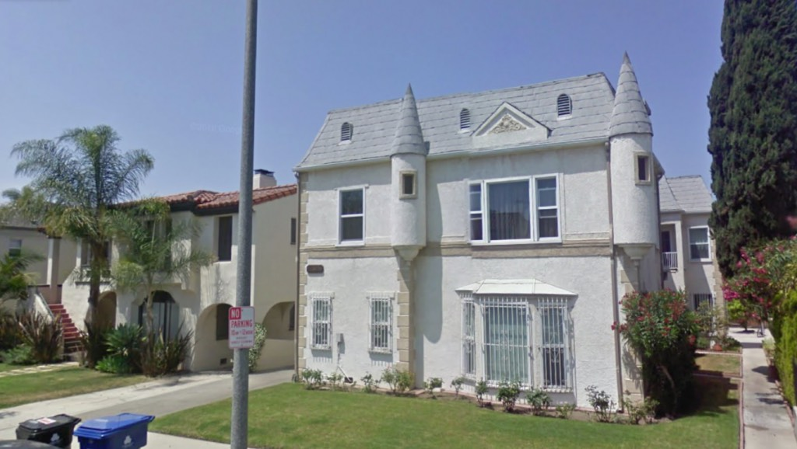

_The Spanish number at left is 413-15 N. Hayworth; designed by the great_ [_Joe Eudemiller_](https://live.staticflickr.com/65535/49480073211_afe4a9eb4c_o.jpg) _in 1931, who gave Los Angeles a lot of Spanish charm in the 1930s. The French Normandy with Chateauesque influence, center, is 419-21 N. Hayworth; it was built in 1936 and designed by David C. Coleman (check out his synagogue at 2521 West View) for the Spinning Wheel Corp._

The Spinning Wheel apartments were twins, in fact, facing a common courtyard, and absolutely pristine: original windows, hardwood floors, high ceilings, all of its moldings and turrets and whatnot. Until one day, this happened:

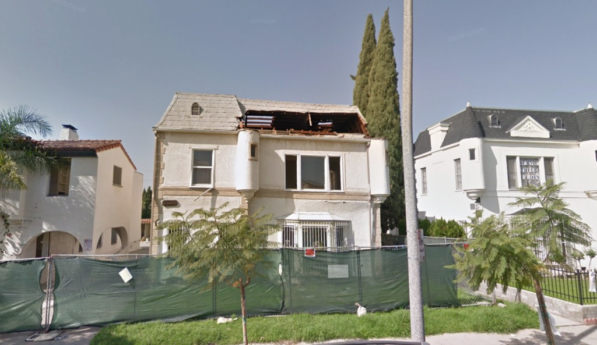

_If you look verrrry closely you'll see it say's "SAVE THIS BUILDING" in the window on the building at far right. Guess how that turns out?_

That day was February 12, 2015. Wiseman began tearing off the turrets, and also demolishing elements of the Spanish next door, without a permit from LADBS. _Without_ green demo fencing. _Without_ a thirty-day notice. _Without_ clearance from HCIDLA. _Without_ turning off gas and electric. There were no repercussions for this and the City gave them a permit to demo on March 13.

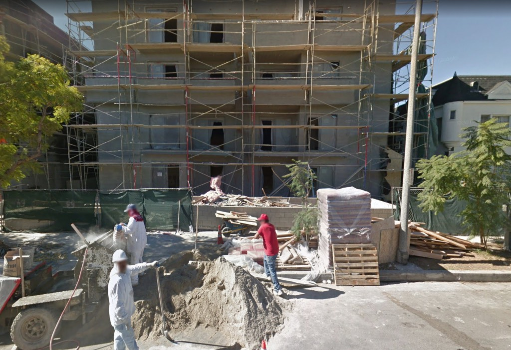

_Building "_[_Hayworth Hyde_](http://properties.wisemanresidential.com/apartments/ca/los-angeles/hayworth-hyde-llc/default.aspx?_yTrackUser=NzEwMzc3ODIyIzQ3MTU4NzgwMA%3d%3d-z9tyl5i7Wns%3d&_yTrackVisit=MTI5NDY4MzA4NyM1NzY4OTM1NDI%3d-IpSpYjmd1hs%3d&_yTrackReqDT=33112320200202)_."_

FYI, the _other_ half of the turreted eight-unit 1936 garden court apartments—well, the renters banded together to get it nominated as a Historic-Cultural Monument, citing that it was a rare intact piece of Normandy Revival, and that it was important culturally as an early piece of Jewish-built and owned property for a neighborhood famously Hebraicising in the 1930s. Michael & Isaac voice their "strong opposition to the proposed designation of the Property on both substantive and procedural grounds" and so forth; the Cultural Heritage Commission nix the nomination and this time Wiseman presumably get a permit:

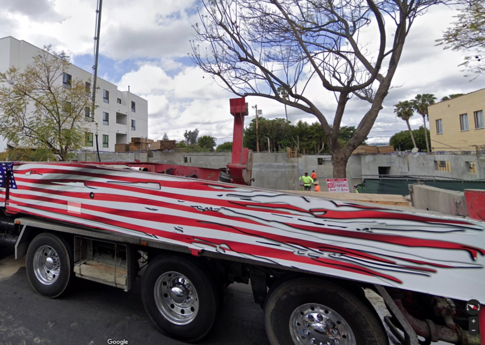

_Wisemanizing the whole block._ _That's Hayworth Hyde at left. A two bedroom is 968sf. They start at $3895._

Let's move on to

**Example #2. This was 1332 N. Formosa Avenue:**

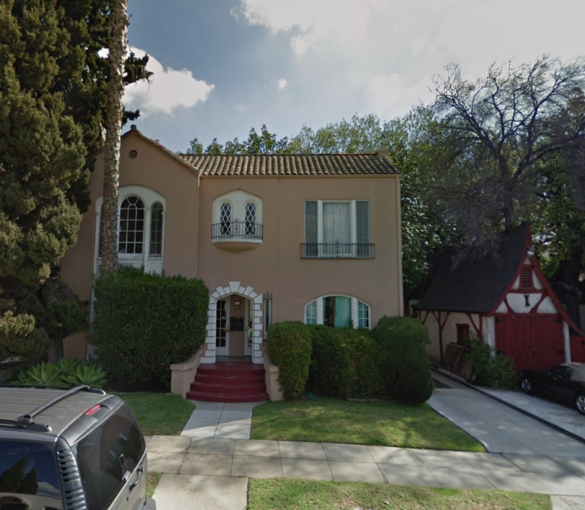

_Built in 1925 and designed by D. F. Hancock; check out Hancock's four-unit at 1145 Gordon St., and 1257 Bronson/5910 Fountain_

In this case, Wiseman tossed everyone out via the Ellis Act. Wiseman would be unable to Airbnb the apartments, because short-term rentals of evictions are decidedly, blatantly against that law (and [reprobate](https://prospect.org/economy/evictions-conversions-dark-side-airbnb/)), so that is therefore _exactly what they did_. HCIDLA told them to stop, and Wiseman responded by beginning demolition work. Again, without a permit. HCIDLA came out multiple times with stop-work orders and so Wiseman finally destroyed the building—with the electricity and gas still on—on January 21, 2017. Read more about it [here](https://www.latimes.com/local/california/la-me-ln-formosa-20170124-story.html) and [here](https://beverlypress.com/2017/01/development-is-wake-up-call-on-formosa-avenue-2/).

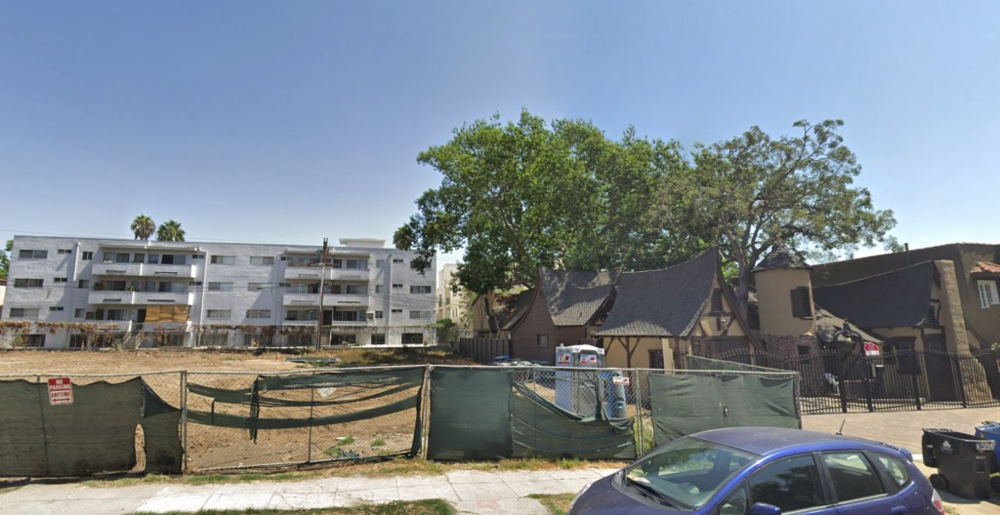

_The cute little Storybook had quite a view to the north there...for a little while..._

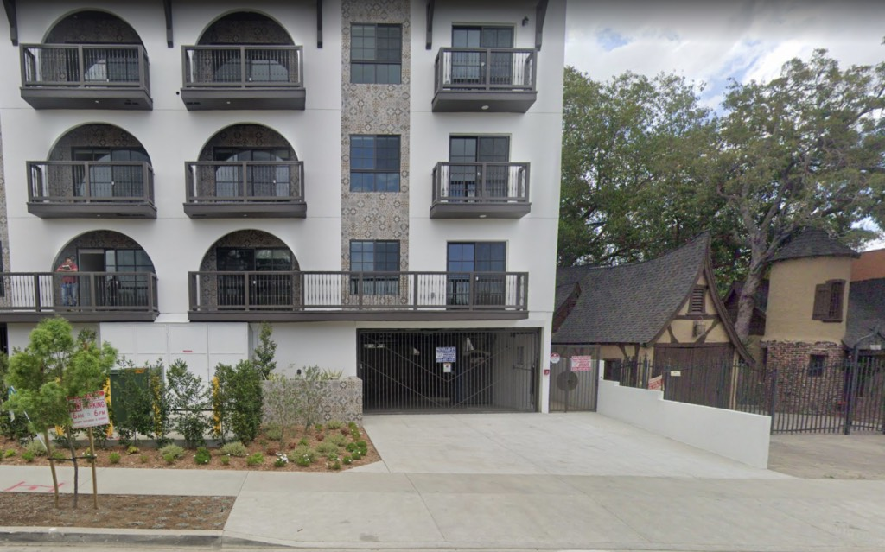

_Hey look at that big thing they built there. Because again, not even a slap on the wrist._

Up next is

**Example #3. This is 7050-60 Hawthorn Ave**:

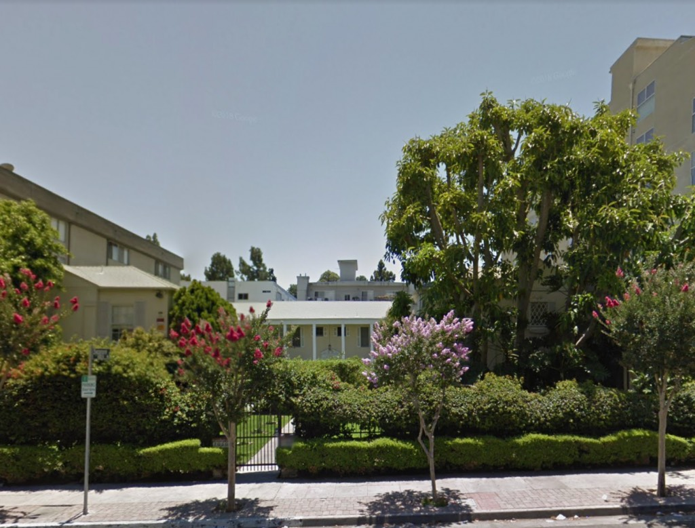

_Yep, you can barely see its Colonial Revival glory behind the foliage. It's a damn tranquil oasis in the middle of Hollywood_  

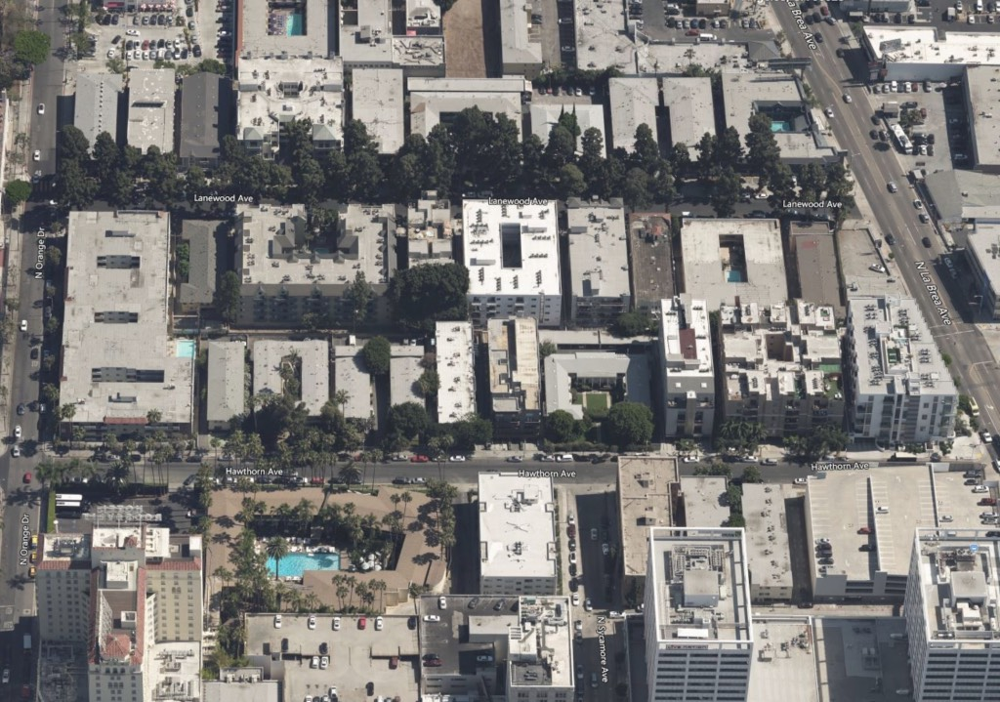

_No, seriously: this is the heart of Hollywood (that's the Hollywood Roosevelt at bottom left) and 7050 Hawthorn, center-right, is the sole, solitary green spot in all of town. **We must do away with that grass!** say the do-gooders, conveniently ignoring that grass traps stormwater runoff, reduces noise pollution, keeps the air cooler, cleans the air, traps CO2, produces oxygen, reduces dust pollution, and filters groundwater..._

7050 Hawthorn was built in early 1941; the architect was [Gene Verge](https://en.wikipedia.org/wiki/Gene_Verge_Sr.). Among his works are [Buster Keaton's pad](https://archive.architecturaldigest.com/article/1927/1/house-of-buster-keaton-beverly-hills-gene-verge-architect); [St. Luke's](https://www.flickr.com/photos/50910702@N04/28001538588) [Hospital](http://eastofallen.blogspot.com/2009/01/proposal-to-develop-st-lukes-hospital.html); and [these rather grand houses](https://www.flickr.com/photos/michael_locke/albums/72157668340417822/).

Well you know where we're going with this. In every survey commissioned by the City, Verge's 7050 complex is identified as a historic resource. Did that worry its owners? AKA Isaac, Benjamin, Michael and Lillian TRS Cohanzad and the Family Trust of Cohanzad? Of course not! They had the place half-rented as an illegal short-term rental hotel, and it was time to get the remainder of those pesky long-term renters out. They began Ellising those folk in October 2019—but that's always a tricky time, 'cuz Ellising indicates a building is likely to be demolished, and that red flag might trigger a monument nomination.

So in the middle of the night, with the gas still on, no permit from LADBS, no thirty-day notice, no notice to neighbors, no HCIDLA clearances, they started demolition. _No no no_, they insisted, this _wasn't demolition_, this was _abatement_.

Uh-huh. This was the abatement of the historic, character-defining features, making it ineligible for landmark designation. (A trick they learned, apparently, from Philip Rahimzadeh—another prolific developer who literally knows everything about LA development law—but when he had recently [illegally demo'd the facade](https://www.lamag.com/citythinkblog/gabor-estate-demolition/) of an effing [Paul Williams](https://www.paulrwilliamsproject.org/about/paul-revere-williams-architect/) he said "gosh, who knew?" and the City said "golly, oh well!")

Let's take a look at what _abatement_ looks like. This is the sort of abatement—_not demolition_, mind you, but _abatement_—that occurred over the course of one night.

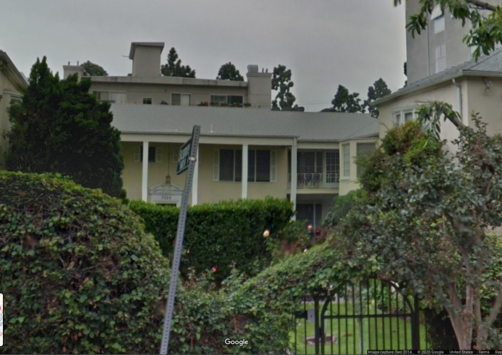

_Before_

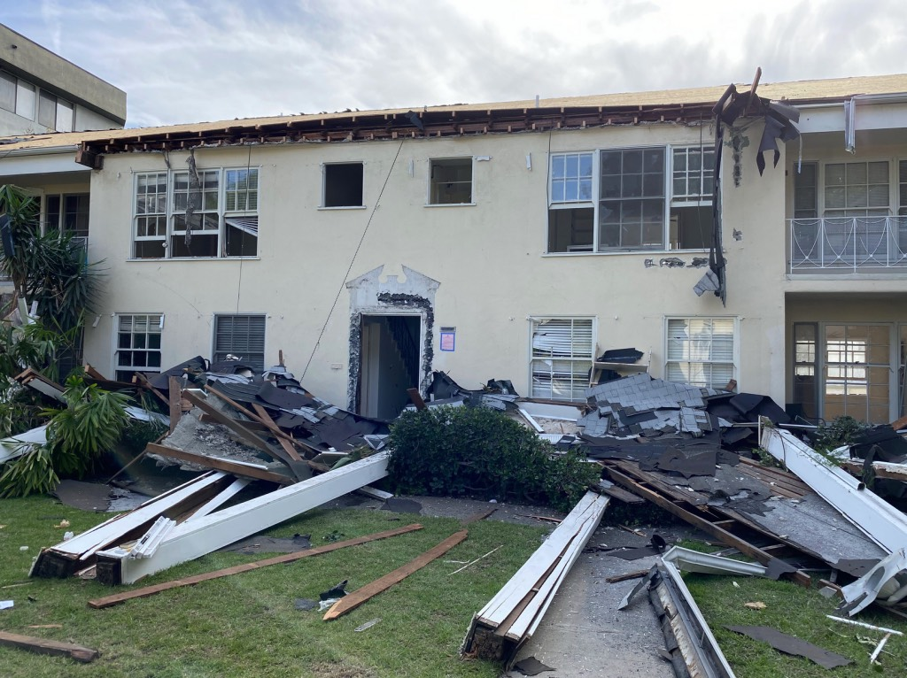

_They were abating what, exactly?_

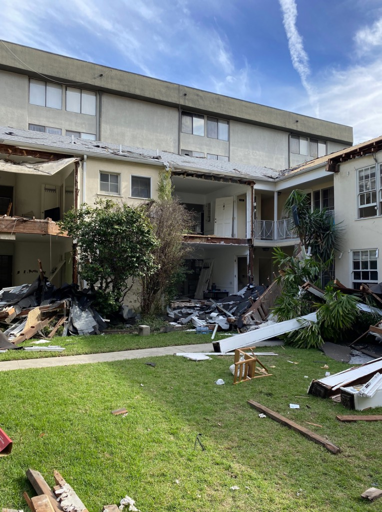

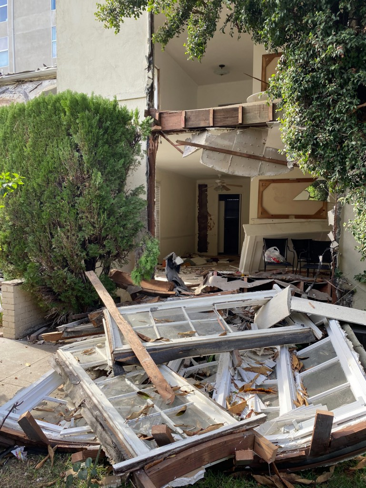

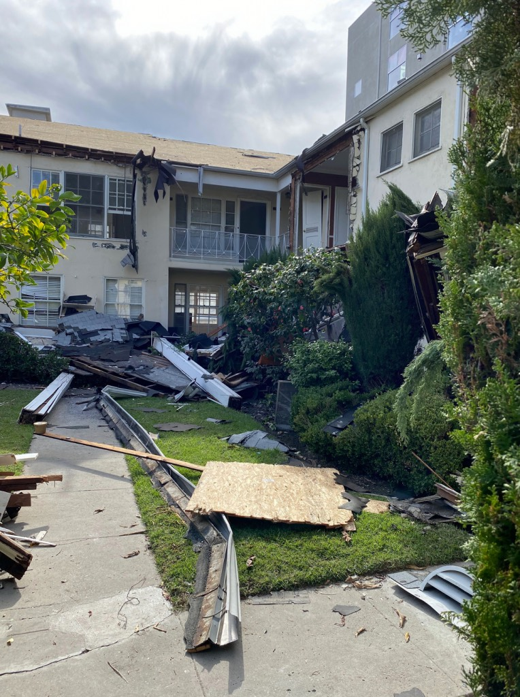

And you know what else? The three I've spoken about above are just the _illegal_ ones. The Cohanzads have this _pathological fetish_ for destroying particularly wonderful Los Angeles structures. I don't have an up-to-date list, but I do know that in just _**2017 alone**_, _**five**_ Historic Cultural Monument applications were filed for buildings owned by Wiseman LLCs. None lived to tell the tale; each met the wrecking ball. Here's one of the best—moved forward with a positive recommendation from the Cultural Heritage Commission, the whole bit:

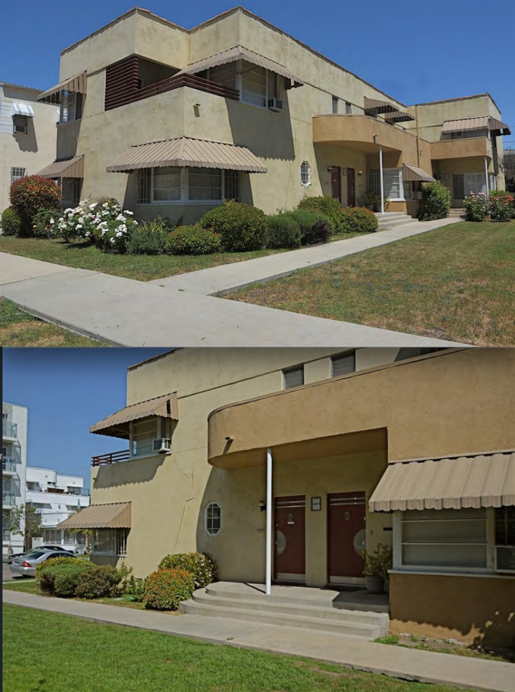

_106 S. Kings Road. Built by Joseph J. Rees for Samuel Aidlin in 1936, it's Streamline Moderne, a fine and iconic early representative of the Beverly Square Development Tract. From 1936-40 it was as well the home of_ [_Rudolph Ising_](https://looneytunes.fandom.com/wiki/Rudolf_Ising)_._

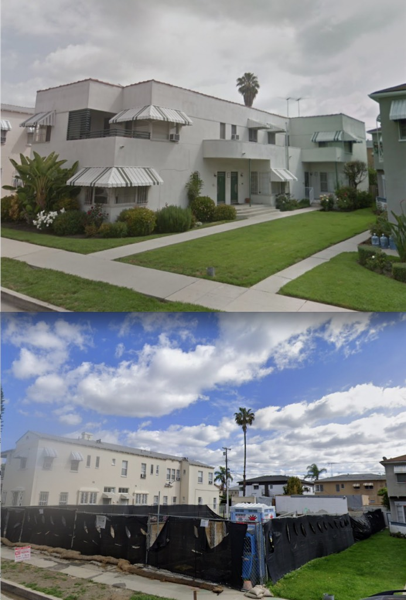

_At the bottom of a landfill now._

So that's my issue. There's three million buildings in the county, and Wiseman's abjuring each empty lot and every strip mall in favor of every Streamline-Colonial-Spanish-Norman interbellum apartment complex they can get their hands on, provided they're pristine and have a surfeit of charm.

And not, you know, the fact that they evict rent-controlled tenants through the Ellis Act and then Airbnb the units, dozens of documented times, which is immoral and illegal. (Which they do because the City will never so much as slap their hand.) They've demolished about forty Rent Stabilized apartment buildings in Los Angeles; something like 300-350 RSO apartments removed from the housing stock—all replaced with million-dollar condominiums and $4000/mo apartments. (Which they do because _we need housing_, says the City.) Hey, remember that piece in _Curbed_, "[Ten of the Worst Landlords in Los Angeles](https://la.curbed.com/2017/5/31/15715266/la-worst-landlords-tenant-law)"—no? Probably not, because _Curbed_ retracted it when they were bullied by said landlords! Well, _[guess what it said](https://live.staticflickr.com/65535/49481544977_52b98afa86_o.jpg)._

So if any or all of this irks you, dear reader, I've got an idea: you might want to show up at the PLUM meeting on Tuesday, February 4th (yes, tomorrow). 2:30pm. [It's number five on the agenda](https://ens.lacity.org/clk/committeeagend/clkcommitteeagend26138242_02042020.html). Mitch O'Farrell has nominated Hawthorn for Historic Cultural Monument status! Hollywood Heritage and the neighborhood are pressuring for Wiseman to rebuild. If not, they need to get the Scorched Earth punishment (no development on the site for five years). (Personally, given their absurd repeated bad faith, they should be barred from developing altogether—go RICO on them, prevent them from fraternizing with the owners of bulldozers. And so forth.)

Wiseman & Co. are going to be there, lawyered up all and smart-talkin', so it's important to have you good folk speak in favor of this nomination at public comment.

Excelsior!

<table class="wp-block-table aligncenter"><tbody><tr><td></td></tr></tbody></table>
