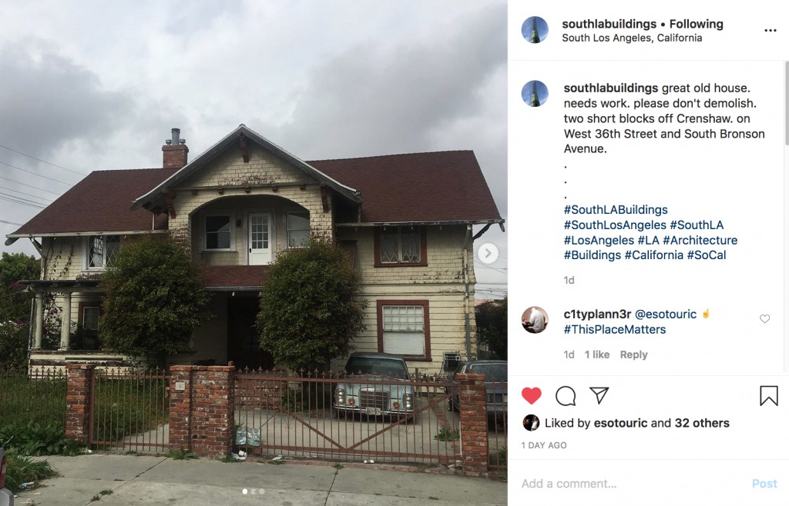
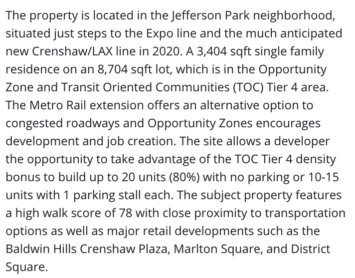
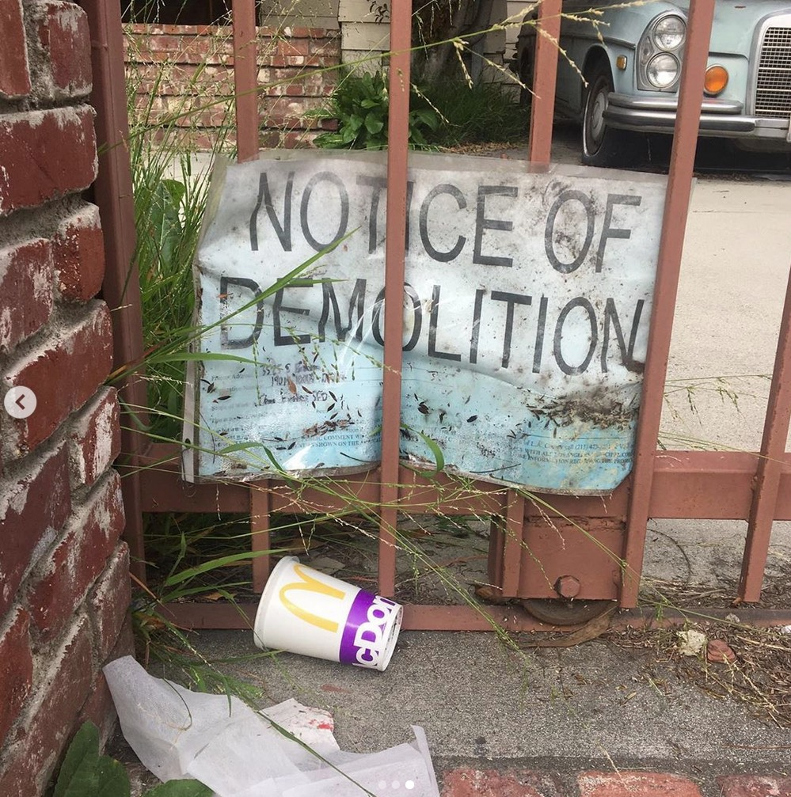
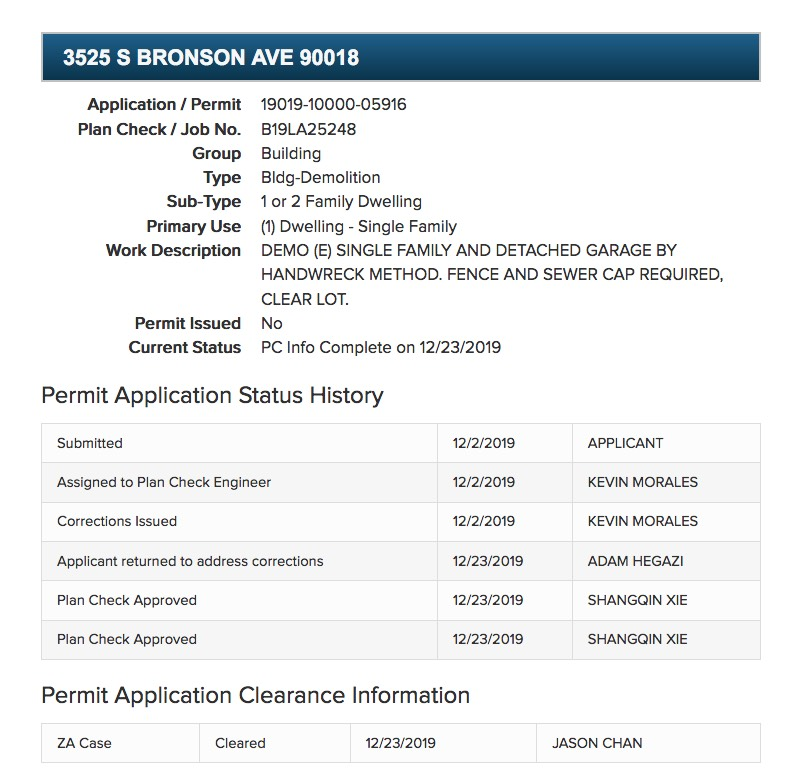
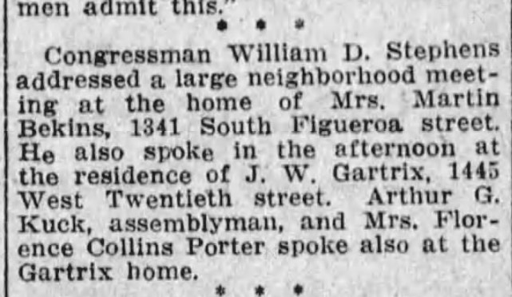
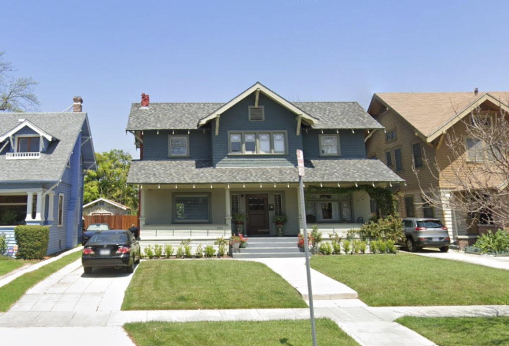
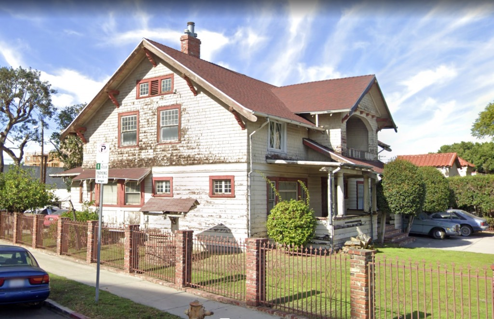

Greetings all! Marsak here. Remember when I used to look at demo permits and blog about the structures? Good times. I'll get back to it, I swear. I've been completely consumed with this book project the last few months. Big thank-you to Kim who's been keeping the flame alive here at RIP!

But I saw this today and just had to toss it out there. There's an Instagram page called southlabuildings, which I love, because I love South Los Angeles so damn much.

_Go add them on your IG_

And I love this house to an absurd degree. It was listed for sale recently. The listing read in part:

_Which reads "tear this down and build a giant-ass box you crazy bastards!"_

The house was listed, relisted and delisted, so who knows what's going on with it. There is/was apparently a demo permit issued, as evidenced by this photo, though there's nothing about the issuance of a demolition permit proper at City Planning or on ZIMAS—

Although at DBS we do have confirmation that they've gone through and have had their Plan Check approved, which does not bode well—

So let's talk a bit about this house. Of course every developer from God-knows-where wants to tear it down—to build a superdense coronavirus hotbox that looks like some preteen's Jenga tower—and, I might add, without a thought of moving it. Moving it, you say? Who does that? Well you know, it _was_ moved here after all.

That's right, it came from somewhere else. Figueroa south of downtown used to be full of grand homes, once upon a time (like, say, [this one](https://en.wikipedia.org/wiki/Stimson_House)). And Martin Bekins's house at 1341 South Figueroa St., built in the spring/summer of 1907, was one of them. Martin Bekins is yes, THAT Bekins. Read more about him [here](https://www.newnetherlandinstitute.org/history-and-heritage/dutch_americans/martin-bekins/) and [here](https://www.latimes.com/archives/la-xpm-1989-03-01-vw-725-story.html). Bekins & family stayed in the house until downtown grew up around them and in the early-mid 1920s built something larger and with more property [out in Eagle Rock](https://www.realtor.com/news/unique-homes/chateau-emanuel-eagle-rock/).

_When you live in a big house on Figueroa, [muckety-mucks](https://en.wikipedia.org/wiki/William_Stephens) come speak in your living room, and then you make them governor_

The architect of 1341 South Figueroa was John A. Mathis. Mathis came to Los Angeles in 1885 and established the Mathis Construction Company. He built all over the southland. Below is another Mathis house; from what I can tell, it and Bronson are the sole remaining two.

_2225 West Twentieth St., J. A. Mathis, 1905. This house just underwent renovation and restoration. Why can't our friend on Bronson? C'mon Jefferson Park! Don't let West Adams make a fool of ya!_

Anyway, after Bekins moved to Eagle Rock in the mid-1920s, the spot at 1341 was needed for something else (Bekins Co. built a commercial structure on the site, which disappeared in the early 1970s, and it's all Convention Center down there now), so the house was picked up and moved by Welte House Moving Co. in the spring of 1929, where she's been ever since.

_And there_'s _a wishing well! Let's all go toss in some coins and envision her restoration_

I mean look at the old girl. Not stucco'd, the chimneys are there, all original windows, the porches haven't been enclosed...incredible. Large corner lot. If ever a home could come back, and be a showplace and a feather in the cap of Los Angeles, it is this one.

So what say ye, Los Angeles?
