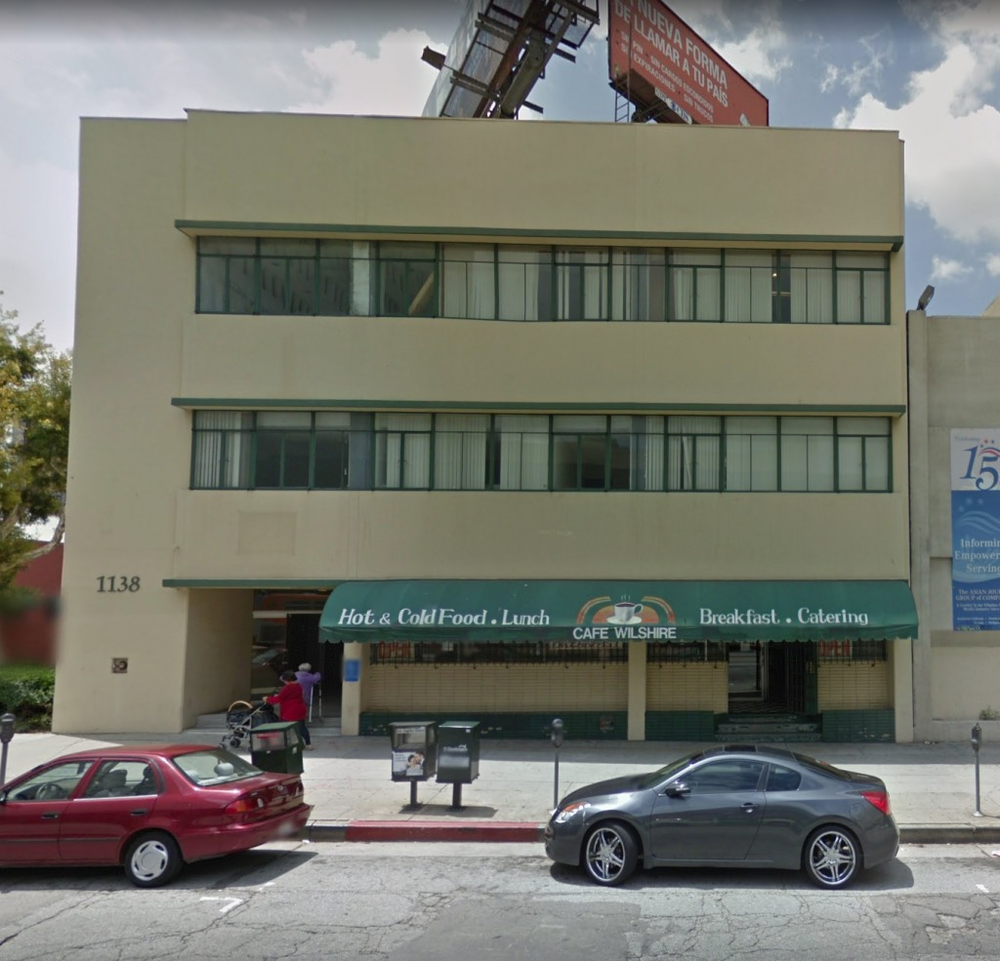
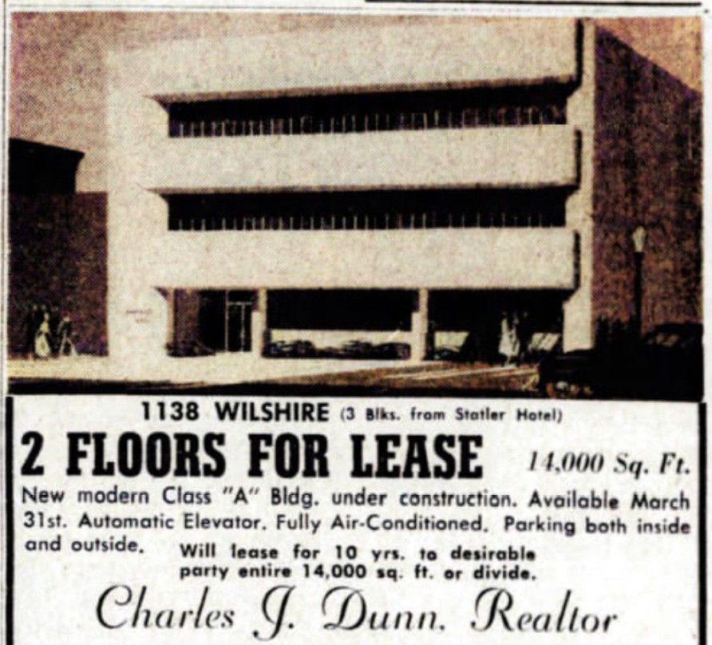
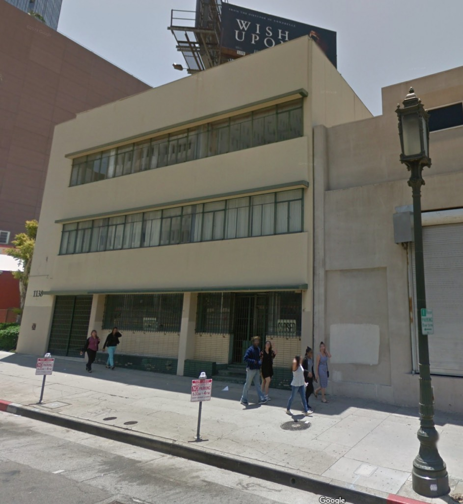
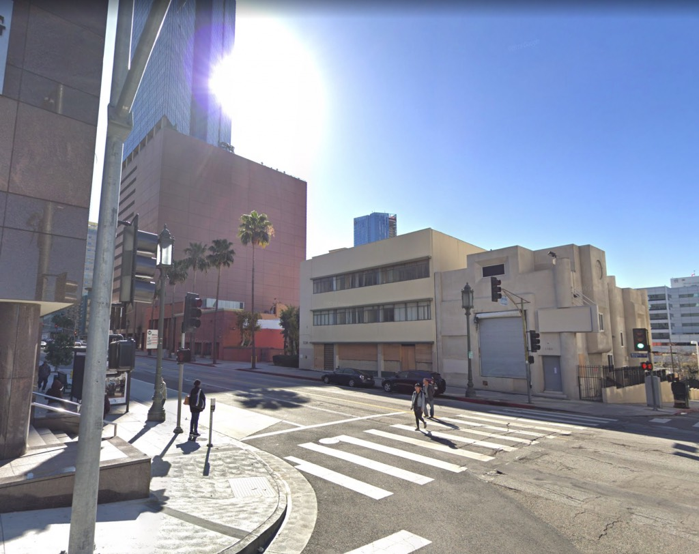
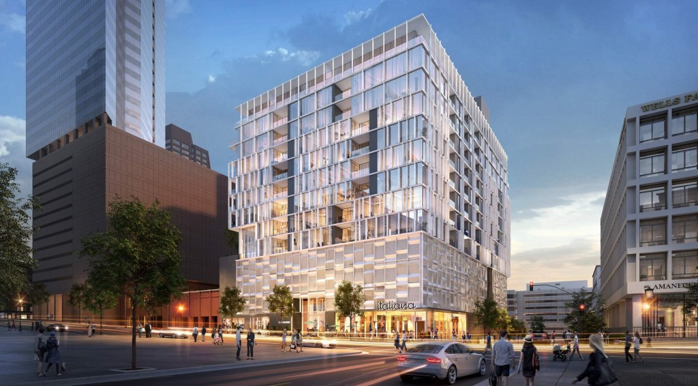
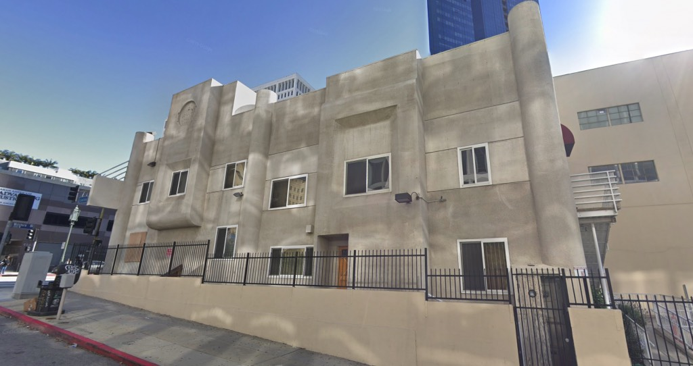
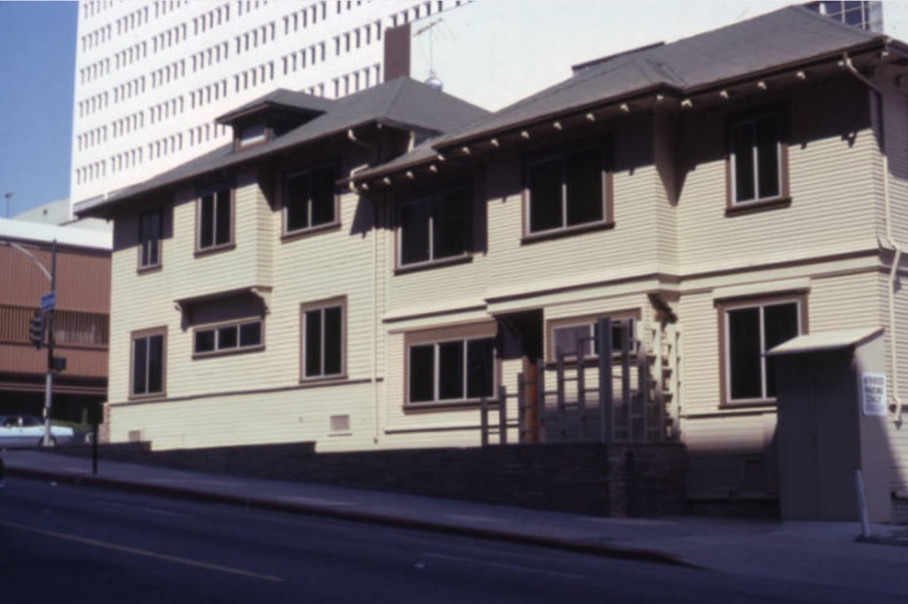

Over in Mid-City, on Wilshire Boulevard near the corner of Lucas Street, there's an unassuming Late Moderne commercial structure. It was built in the fall of 1951, of precast concrete construction, designed by the architectural firm of McClellan, MacDonald & Markwith, its principal designer being Jack H. MacDonald. Construction was by Buttress & McClellan.

So, as you might imagine, it and its corner neighbors are due to be replaced by a Newport Beach development concern called PacTen Partners (so named because its [partners were all athletes at PacTen universities](http://pactenpartners.com/about-us/)) with 140 luxury condominiums. PacTen have secured financing "from an [overseas capital source](https://www.multihousingnews.com/post/la-luxury-development-receives-24m-loan/)," and hired [KTGY](http://ktgy.com/work/type/mixed-use/) to design the TOC-benefitting, 185-foot tower.

_You know_, I hear you say, I don't, like, _get_ this building. Perhaps it's not the easiest building in the world to love. But I bet I know who _does_ love it! That nutburger over on Skyscraperpage who [kept posting about Jack MacDonald](https://skyscraperpage.com/forum/showpost.php?p=7302113&postcount=33152) a while back. Who kept going [on and on and on](https://skyscraperpage.com/forum/showpost.php?p=7303057&postcount=33171) and putting up [picture after picture after picture](https://skyscraperpage.com/forum/showpost.php?p=7303064&postcount=33172) of MacDonald-designed Mid-Century commercial buildings. God, what a weirdo.

_What I find most charming about this rendering is that they—evidently—intend to remove the ["Wilshire Special" streetlamp](https://miraclemilela.com/the-miracle-mile/historical-photos/%22wilshire-special%22-streetlight-circa-1928/)._

Here's something else I find pretty amusing. See 1138's neighbor, the goofy-looking putty-colored 1980s thing? That structure, 1140/50 Wilshire was, in fact, built in 1904. It had a stucco job in 1984:

_1140/50 Wilshire was built back when Wilshire Blvd. was still known as Orange Street. Image from the [Laskey Collection at LAPL](https://tessa.lapl.org/cdm/search/searchterm/00089961)._

- [Wilshire Boulevard](https://www.google.com/maps/search/?api=1&query=34.05276,-118.26473)
