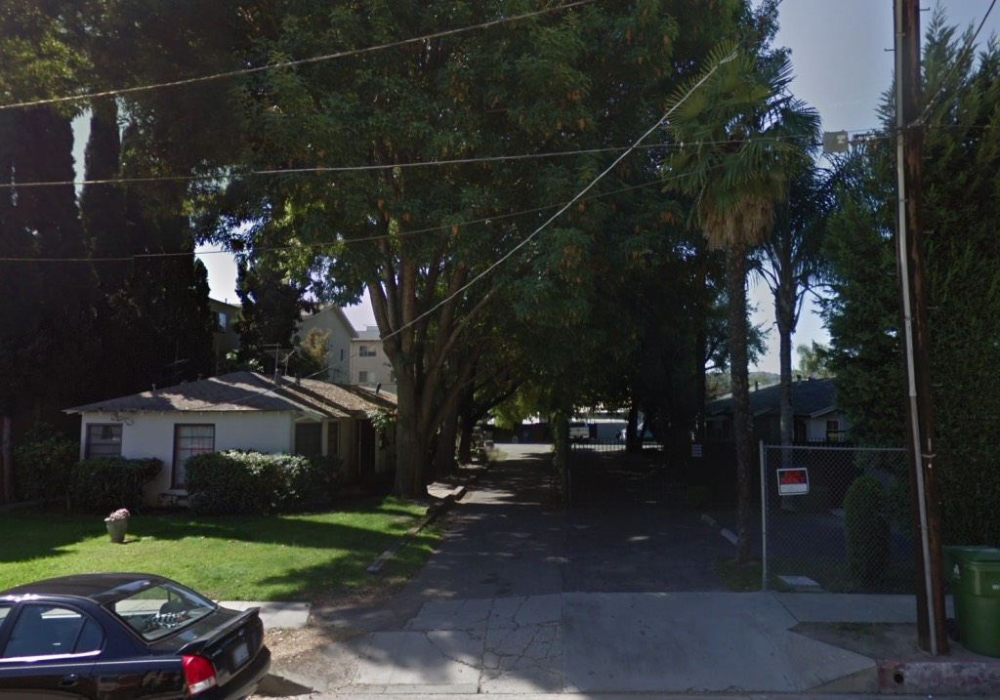
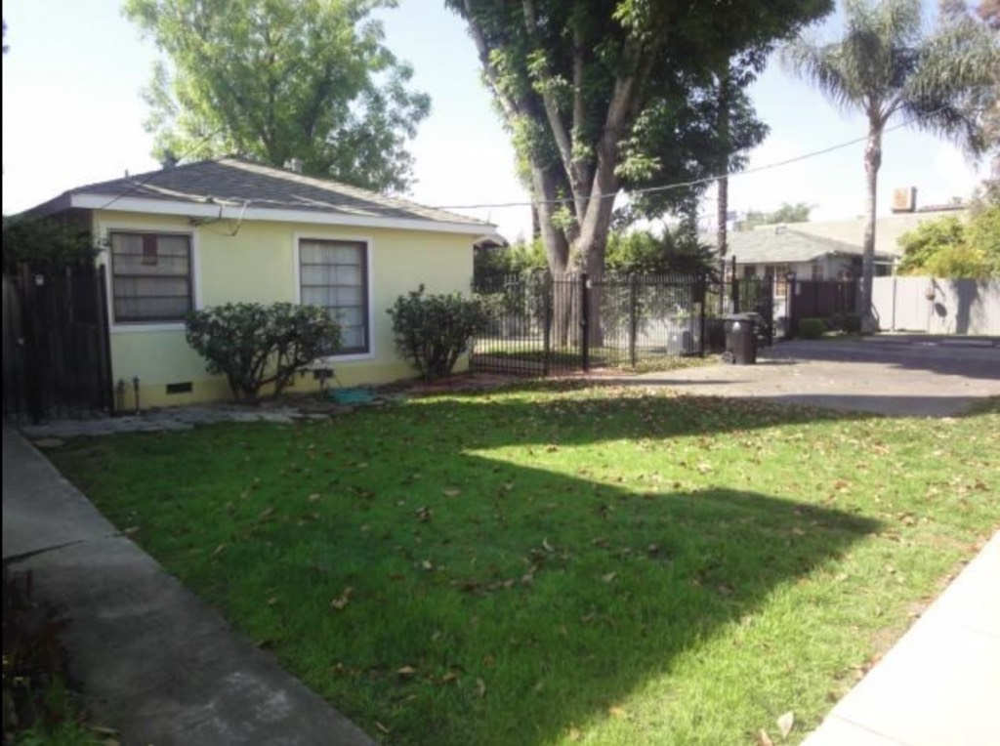
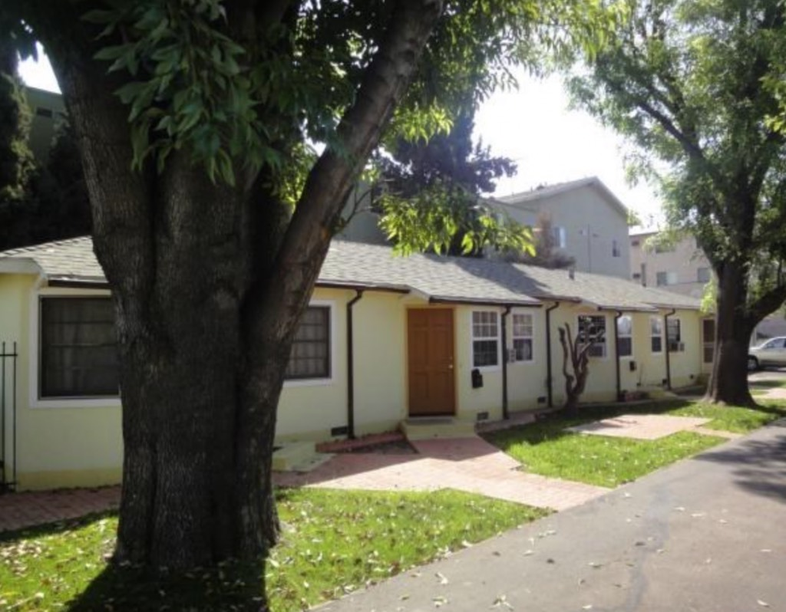
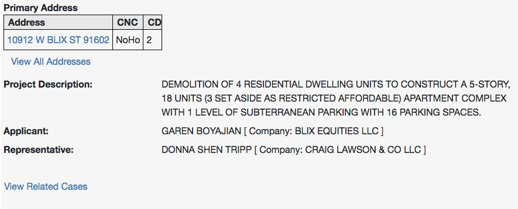
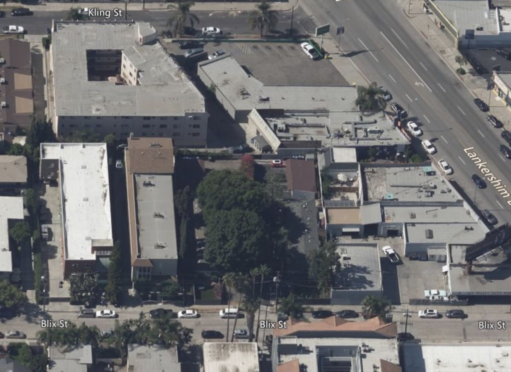
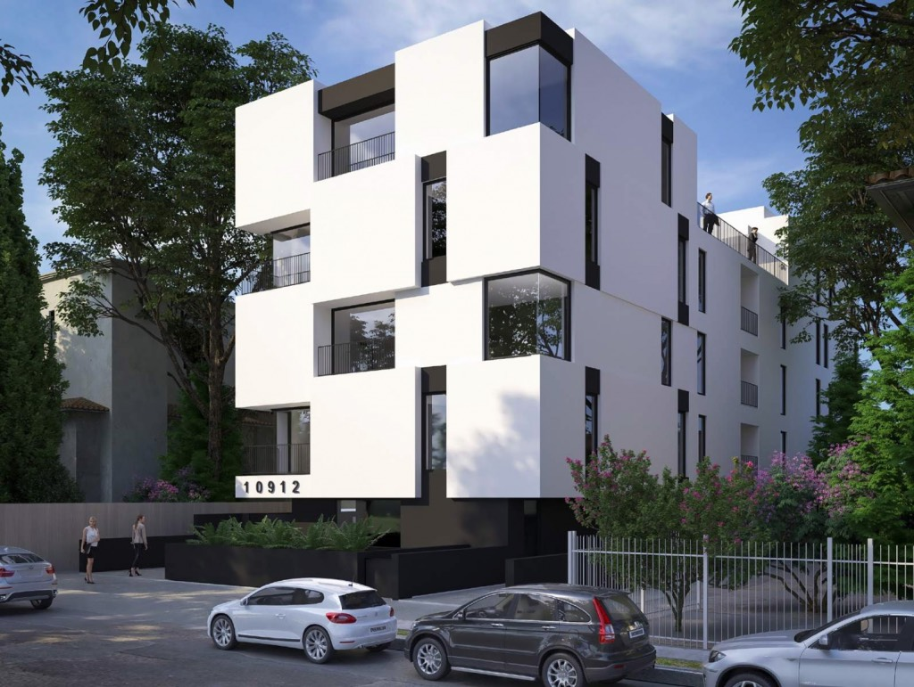

Up in the Valley there's an indication as to how we used to live. Low slung structures, lots of open space. Cool shade from the towering trees. This is, of course, a rare, precious, disappearing commodity.

In the autumn of 1939 a fellow named P. N. Morgan designed and built a twelve-room, four family residential structure just off Lankershim in North Hollywood, at 10912 Blix. Then, a chap named W. Charles Swett saw what Morgan did, and liked it so much that in the spring of 1940 he pulled permits to put up one very much like it on the adjoining property at 10916, hiring engineer/architect Edward Rudolph to design another one-story, twelve-room four-unit.

Look how nicely the two work together. See how they form a sort of allée, passing through a planted boscage.

_10912, left; 10916, right_

Needless to say, 19012 was marketed as a development opportunity:

_Yeah, you market those condos to the [Warner employees](https://www.latimes.com/entertainment-arts/business/story/2020-08-10/warner-bros-layoffs-att-hbo-max-sarnoff)._

And the lot, being 57x170, is going to lose any vestige of open space to absorb a five-story, eighteen-unit structure:

Here's an overhead—that tree canopy is about as dense a green spot as you'll ever find that close to Lankershim.

_Sorry to see them go. But at least we can revel in the irony that it's the people who yell loudest about climate change are also those who yell loudest about building more housing. Sweet, sweet irony._

And yet... The footprint of the four-unit structure now is 41x80. Were Boyajian & Co. to build on that same footprint, with three stories of four units and two stores of three, up five stories, well, there's your eighteen units, with trees left intact, and—

Oh wait nevermind, I just found the rendering for the thing. I was right, it eats up every inch:

_By the way, proving again that architects always...improve...when making their renderings, it should be noted that in some weird attempt to ameliorate the fact their client is ripping out a whole bunch of mature trees, they've invented a bunch of trees for the rendering. Literally none of the trees on the surrounding properties_ actually _exist. Neither does that nice fence, which in reality is chain link, behind which there are no crepe myrtles. They also took out a telephone pole and apparently added an encroaching red tile-roofed structure? I bet those ladies are Warner employees, too._

- [Blix Street](https://www.google.com/maps/search/?api=1&query=34.15656,-118.36854)
