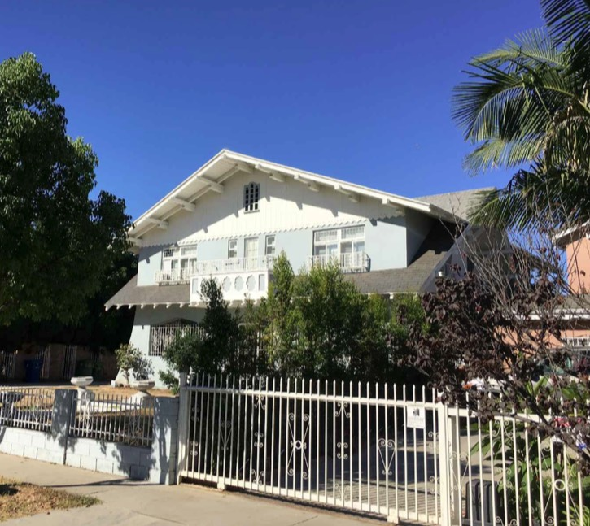

Let's say you're living peacefully in your vintage home on your block of gracious low-slung craftsmans when some developer decides to tear down the house next door to put in something grossly out-of-scale. You're shocked that it will block light and air and views and ruin parking and cause noise and destroy the historic fabric of your neighborhood and the whole magilla. _Surely_ you can lay out your concerns to the Powers That Be in the form of an appeal to which they'll listen thoughtfully and say, My God, You're Right. Maybe in this case we _shouldn't_ worship at the altar of [Scott Wiener](https://californiaglobe.com/section-2/senator-wiener-introduces-sb-50-lite-housing-bill/) and fall in lockstep with the abjuration of zoning ordinances.

Or, the City might tell you to go screw.

Take for example 1537 South Wilton Place. It was built in 1905 and designed by Charles F. Whittlesey. The F is for Effing, because this house was designed by [CHARLES EFFING WHITTLESEY](https://en.wikipedia.org/wiki/Charles_Frederick_Whittlesey).

_That's quite the cross-gable! Dig those rafter tails, the balconette railings, and that Swiss Chalet balcony_. _Check out the flare wingwall!_

_An older Google StreetView shot when it was painted slightly differently. Before the nice new owners who bought the house in mid-2018 let the lawn die._

_Lookit that door. And those stained-glass transom windows will emit a satisfying crunch come the bulldozer._

_The Staff Response to the neighborhood appeal was, and I'm not kidding, that the block does **not** have uniform character in regards to height and scale. Compare the above two images with what the developer is building. Yeeeesss, Director of Planning Vincent P. Bertoni, the block is just FULL of five-story cubes all OVER the damn place._

So, demolish the hell out of the Whittlesey, and in its place, [Gabriel](https://feienterprises.com/gabriel-fedida/) and [Tomer](http://www.fedidaproperties.com/index.php/about) Fedida propose building this five-story, fifty-five-foot, twenty-one unit, 22,313 square foot apartment complex. The City is awarding them a collection of zoning variances, allowing the Fedidas to build eleven feet higher than permitted by law; decreasing the side yard requirement 25%; and giving them a 20% decrease in the open space requirement.

_As rendered Micheal Ko of KSK Design_

So the neighbors approached the City and said, hey, we're filing an _appeal_, in that there's a few problems here. They pointed out that the South Los Angeles Community Plan Design Guidelines/Citywide Residential Design Guidelines require new developments to respect the scale and architecture and identity of the surrounding historic neighborhood, especially as this neighborhood falls under the Character Residential Overlay as implemented by the City Council to protect the historic neighborhoods in South Los Angeles. Plus the developer screwed up the math on the TOC Incentives, getting them all kinds of wrong, as further miscalculated by City staff. And you can't just make the project vested for land use entitlements and CEQA exempt because you feel like it. And so on.

And to all of this the City replied. They replied well, _you_ say your neighborhood has a certain character, but _we_ say your neighborhood has all _sorts_ of weird buildings, so stop worrying about it, and so as to you and your Citywide Design Guidelines, we dismiss your concerns utterly. For example, when you say two stories is the prevailing height on the block, we reply with, basically, _sure_, _true_, but _so what_ (and implying as well, you terrible people, [if we don't hand the developers the extra height then the project won't "pencil out" and then how, oh _how_ can we have those _two whole_ low-income units?](https://live.staticflickr.com/65535/50309100763_43e4835ac0_o.jpg)). Oh, and all that stuff about entitlements and TOC? Well, don't even _try_ to argue TOC. It's TOC, man.

_But_, said the Department of City Planning's City Planning Commission, we _do_ agree that neither the developers nor us gave one _piddling_ _iota_ of thought or care as to whether 1537 might be a potential historic resource, so _tell ya what_, we will hire some _real live architects_, [Kaplan Chen Kaplan](http://kckarchitects.com/about/), to do a Historic Resource Evaluation Report on this here Whittlesey house.

KCK came back and said the Whittlesey house was absolute worthless crap, devoid of all merit in every conceivable way. KCK's report was some 100+ pages and, since they bill on average at $200/hour, I can assure you, was not cheap. _Your tax dollars at work!_ For example, KCK hired an [RPA Certified Archaeologist to check records](https://live.staticflickr.com/65535/50310458167_6e670affb8_o.jpg), which is akin to hunting mosquitos with an elephant gun; it's the kind of work you give to Bob the Unpaid Intern and and he does it on his lunchbreak. Hell, it's the elemental gruntwork I save for when I'm hungover and do it in _half_ my lunchbreak.

KCK's report was written primarily by "historic consultant" Pam O'Connor, whom you specifically hire when you want to [make sure something is described as "unworthy of preservation](https://www.wehoville.com/2020/02/19/in-a-4-1-vote-council-denies-property-owners-appeal-of-historic-designation-for-1251-detroit/)." When Mayor of Santa Monica, she fought to remove [landmark status and tear down landmarks](https://www.surfsantamonica.com/ssm_site/the_lookout/news/News-2005/July-2005/07_14_05_Council_Overturns_Landmark_Status.htm). O'Connor is best known as the only Santa Monica council member to lobby [against Millard Sheets](https://www.smdp.com/wilshire-buildings-gets-landmark-status/160366). Look at [these Late Moderne and Modern buildings on North Central in Glendale](https://www.glendaleca.gov/Home/ShowDocument?id=7340). Does O'Connor understand them _at all_? No, she does not. (Or maybe she secretly does, but still has to recommend their destruction, because that's her damn job.)

In any event, some snorty guffaws and one Very Expensive and Useless Study later, and the City sat down to thoughtfully consider the neighborhood's appeal. Which is precisely why they own a comically oversized rubber DENIED stamp they use to pound upon appeals with an embarrassingly ebullient and theatrical flourish.

_One more shot—check out the neighbor to its immediate south. 1543 was designed by the great Edward Butler Rust, who we discussed [here](https://riplosangeles.com/2019/09/03/371-77-n-st-andrews/)_

_Ok, another one more shot. 1517, two doors north, here in the Crenshaw Heights tract, built by George Crenshaw in 1910 as the home of Loren Crenshaw. Yep, **nothin' historic around here**._

- [South Wilton Place](https://www.google.com/maps/search/?api=1&query=34.0442,-118.31468)

_Hey everybody, here's an update! The Whittlesey has been replaced by a lone potipotty. In case I wasn't clear above, in summation: the City is corrupt; Kaplan Chen Kaplan are expensive and corrupt; Gabriel and Tomer Fedida are profiting off this; and all laugh as they piss on your history and culture. Thank you for your attention._
