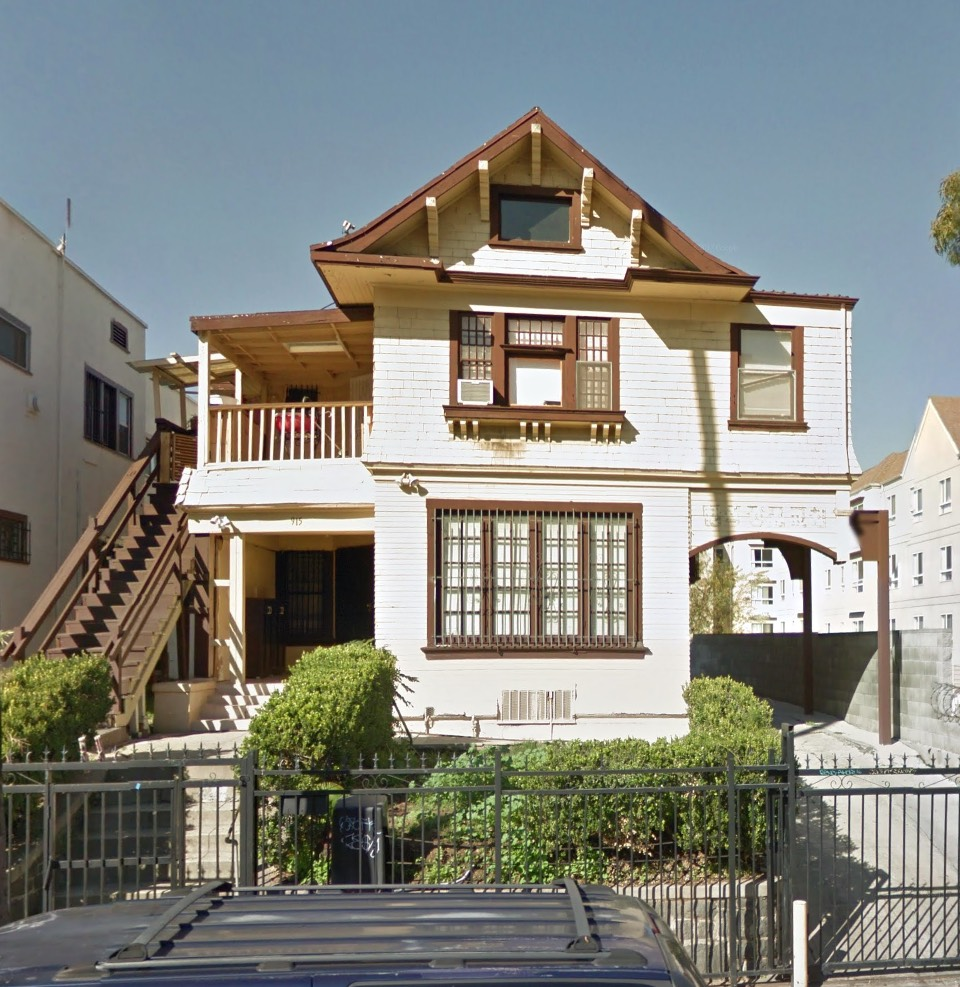

Can't believe it's been nigh on four months since I've posted. I must beg your forgiveness—in September we birthed the [Bunker Hill book with Angel City Press](https://www.angelcitypress.com/products/bunk), thereafter doing lots of publicity, while at the same time I was compiling and designing my self-published [_Bunker Noir!_](https://bunkerhilllosangeles.com/2020/09/15/buy-the-book/) magazine, so it's been a busy autumn. But I've been keeping an eye on things, and there's a lot to talk about.

Of course during these lock'd-down times (to think, I remember when they were just loc'd out) the demolition of Los Angeles has managed to continue apace. While the act of your shopping six-feet-apart at the local mom& pop is _definitely going to kill our collective grandma_ (and no, you're not allowed to go to her funeral either), a yard full of dudes shoulder to shoulder yelling and sweating and tearing down vintage houses to build Khrushchyovkas, well, _that_ in fact makes those fellows _immune_ to Coronavirus. _Trust the science_.

Now then. Let's talk for a sec about a building that has no immediate threat of which I am aware. No permit has been taken out in anger against it. But still.

Here she is, 915 South Grand View St.

_The cornice return says Greek Revival but the little swoop to it almost says Japanesque, which jives with the Craftsmany exposed beams. Homina homina homina_

George W. Stimson, prominent Pasadena developer and prolific builder of early Los Angeles, without whom we'd have no [West Adams-Normandie](https://planning.lacity.org/preservation-design/overlays/adams-normandie) neighborhood, on October 11th 1902 pulled permits to erect three grand homes: 1312 West Fifth Street (demolished in 1954), 457 Westlake Avenue (lost to the Hollywood Freeway), and 915 Grand View. The architect here is George Lawrence Stimson, who did all the architectural work for his father. Read more about G. Lawrence Stimson [here](https://la.curbed.com/2014/12/30/10007350/how-pasadenas-wrigley-mansion-became-tournament-house-1) and [here](https://www.flickr.com/photos/michael_locke/sets/72157648199080191/comments/) and [here](https://la.curbed.com/2015/6/28/9945476/1914-craftsman-by-g-lawrence-stimson-in-south-pasadena-asking-17).

_Note the stone wall hiding behind the fence. And check out that porte-cochère._

915 Grand View was purchased from developer Stimson by William Horatio Sanders, who, though his parents were English, was born in Scotland, in June 1839. He came to America in 1860 at twenty, going to work on the railroads; he married Emma Ellsworth in Minnesota in 1878. He and Emma came to Pomona in the eighties, where W. H. worked as a civil engineer. He became a partner in the Los Angeles-based engineering firm of Quinton, Olmsted & Sanders, and moved from Pomona to Los Angeles to be closer to the action. W.H. also worked as an engineer for the newly-formed United States Reclamation Service Railroad when he and Emma pulled up Pomona stakes and bought Grand View. They lived there until he passed away in the house, in 1924; Emma moved back to Pomona and passed in March 1942 (she was fifteen years his junior).

After 1924 it becomes the home and chiropractic offices of Dr. George Shabo (who builds the garage in back in 1932); he and his wife Vera live there until his death in 1949. It remains single family until owner Joseph Gary converts a couple rooms to apartments in 1961.

_A view down the street_

So why do I bring up this charming old home? It sold last week, on December 21st. The realtor copy—as penned by Paul Yoo of Keller Williams— reads thus:

The mention that 915 is an "excellent opportunity for developers to acquire prime property on an R4 zoned and TOC Tier 3 lot" is what, I would wager, sealed the deal. Therefore, according to its TOC, this 117-y.o. two-unit with the hedges and the rock wall will likely become a thirteen-unit, pushed right to the sidewalk, 22' higher than surrounding buildings, etc. On the other hand, maybe the new owner will keep it a duplex with the church, or _heck_, even return the whole thing to an SFD! Because that happens so often.

Meanwhile, you shelter in place. Your whole neighborhood is clamped down tight. Then why is there no calm in the world? Why, when you are trying to sleep at eight in the morning—because Lord knows you can't go to _work_—there's hammering and high-pitched tile saws everywhere? Because the building of high priced condos is _essential work_. Everybody [knows](https://www.washingtonpost.com/technology/2020/03/28/construction-lockdown-coronavirus/) [that](https://www.latimes.com/california/story/2020-04-02/coronavirus-los-angeles-tenant-renovations).

So keep an eye on your neighbor. No, not to spy on their mask-wearing. On their purchase of moving boxes. Chances are good they're getting the [hell](https://ktla.com/news/california/californias-population-growth-rate-at-record-low-as-more-people-leave/) [out](https://www.livabl.com/2020/10/la-residents-moving-away-2020.html). Then a bunch of investors will swoop in, purchase their place. These newfolk will gleefully tear down what's left of Old LA, and haul in a hundred heavy-breathing workers, a-hammering furiously. A million units built nice and dense, housing crisis ended! Just like the _last_ time a bunch of new units were added to the stock, [which certainly cured us](https://live.staticflickr.com/65535/50768827896_c1f43490ca_o.jpg). This time it may be a little different though. New immigrants into California will pay the rent with...what? The odd $600 check?

I'll just be sad when they tear down 915 Grand View.

- [South Grand View Street](https://www.google.com/maps/search/?api=1&query=34.05398,-118.28142)
