There's a very special part of the world. Beverly Boulevard. You go ahead and cross town on (shudder) the freeways; or traverse the city on, what, Santa Monica (bless your heart); I go in for cruising _Beverly_ when it comes to making my way across Los Angeles.

My favorite stretch on Beverly is this one run, that stretch between Virgil and Western, especially the ten-some blocks between Vermont and Normandie—by and large all one and two-story Spanish-style 1920s structures; the odd car wash; a wonderful 1955 [Catholic church by the great Ross Montgomery](https://live.staticflickr.com/65535/50916250698_87e7e783b5_o.jpg) at Arlington Avenue; an excellent [Late Moderne medical building](https://live.staticflickr.com/65535/50916731162_bdb02d402b_o.jpg), also from 1955, by J. Don Hartfelder at 3919 (oh wait they just [ughed that one up pretty bad](https://live.staticflickr.com/65535/50915917948_6e1480dd78_o.jpg)); and of course looming above it all the famed 1926 Richard D. King-designed [Dicksboro](https://live.staticflickr.com/65535/50916673687_5d624f9c8b_o.jpg) at 3818 Beverly.

I wrote about Beverly in general, and the magical corner of Beverly & Heliotrope in particular, twenty years ago in _[Los Angeles Neon](https://www.schifferbooks.com/los-angeles-neon-1410.html)_:

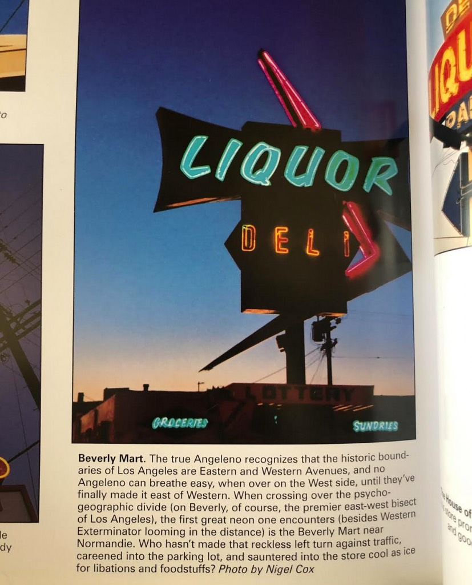

_Along the Beverly side of the structure is one of the best 1930s [Art Deco neon signs](https://live.staticflickr.com/65535/50917170291_9b08fc1ef7_o.jpg) in Los Angeles. [Here](https://live.staticflickr.com/65535/50916158778_15328a7e43_o.jpg) is an ad for the Beverly Mart from December 1938._

Also smack dab in the middle of it all—at Heliotrope, across the intersection from our beloved Beverly Mart Liquor-Deli—is the Rancho Sinaloa Market, known for its Moderne detailing and corner bar the [One Eye Jack](https://labarguide.blogspot.com/2005/07/one-eye-jack.html).

Take a look at the following images. This is one damn amazing structure.

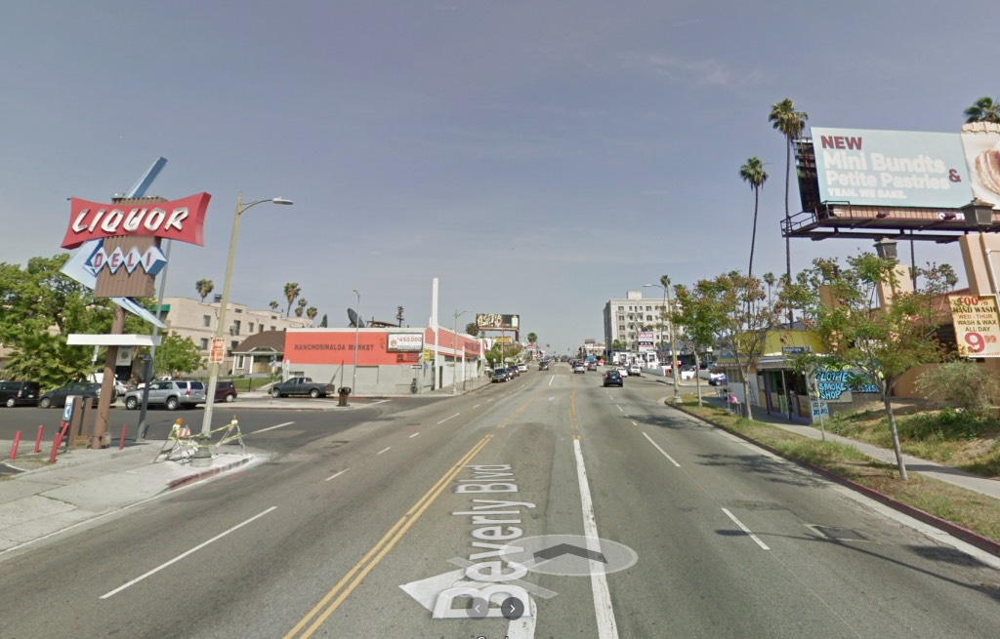

_The left turn spake of in_ Los Angeles Neon_. The market, in orange, at Heliotrope; there's the Dicksboro in the distance, and the 1965 Beverly-Catalina Car Wash hiding in the foliage at right_

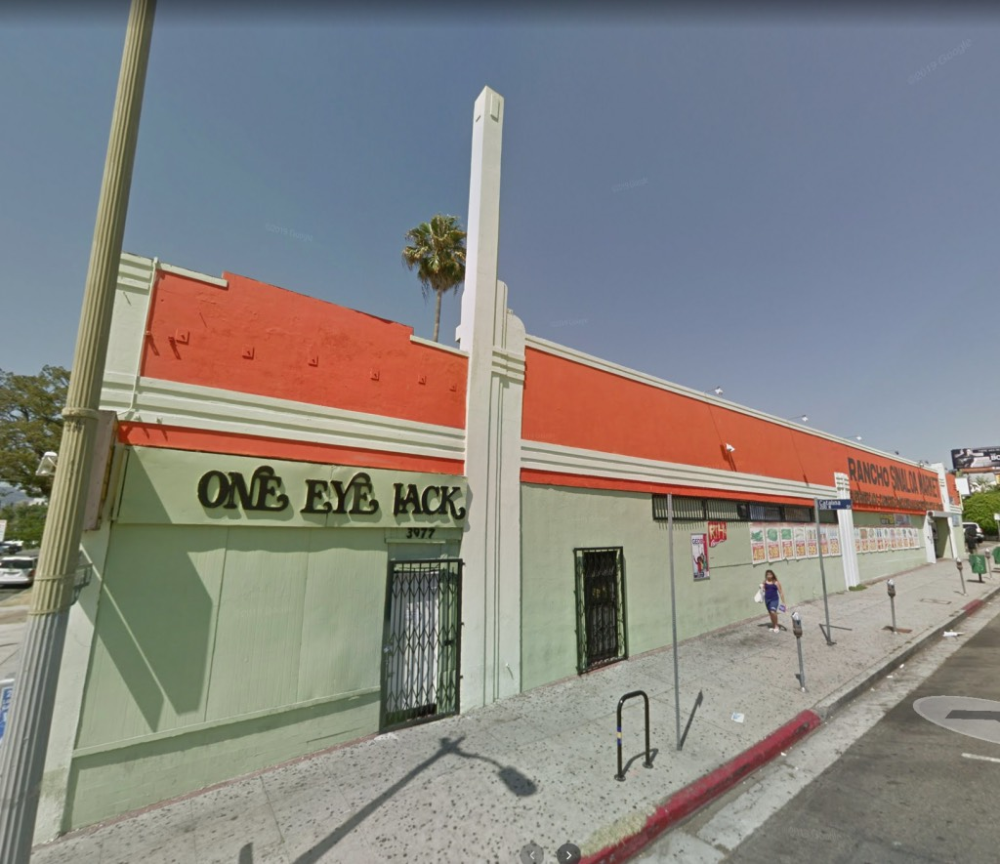

_Bow before me!_

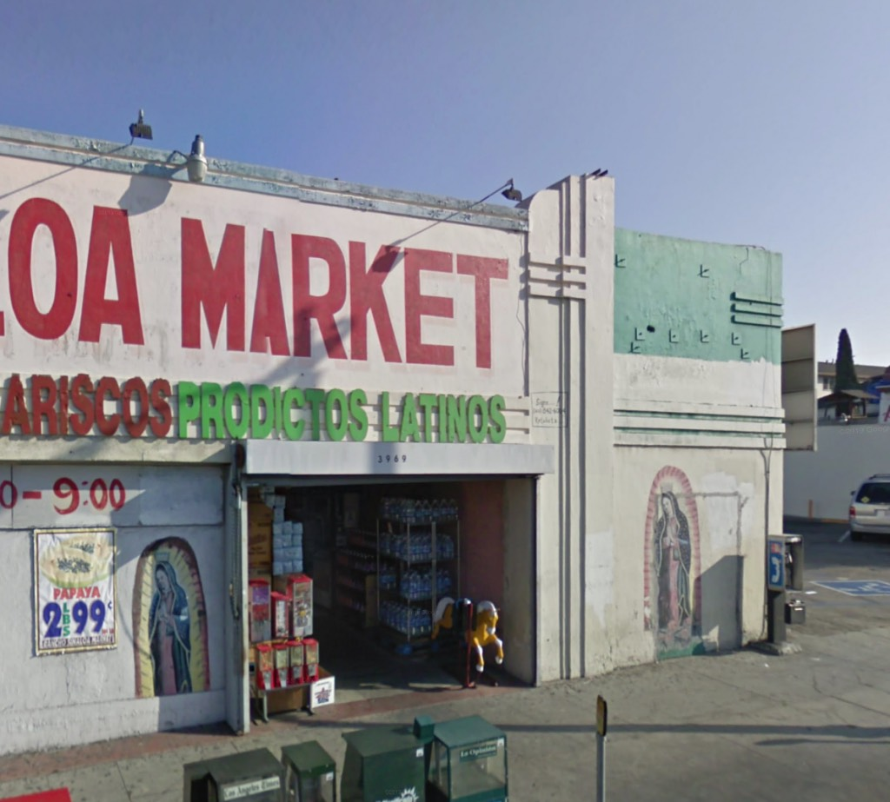

_Jeez kinda reminds me of the tower of the old Morgan, Walls & Clements [KEHE/KFI building](https://live.staticflickr.com/65535/50927290446_490e09615f_o.jpg) that's just a few blocks away on Ver—[oh wait the City tore it town](https://urbandiachrony.wordpress.com/2011/04/20/kehe-radio-building-141-n-vermont-avenue-1940-2011/)_

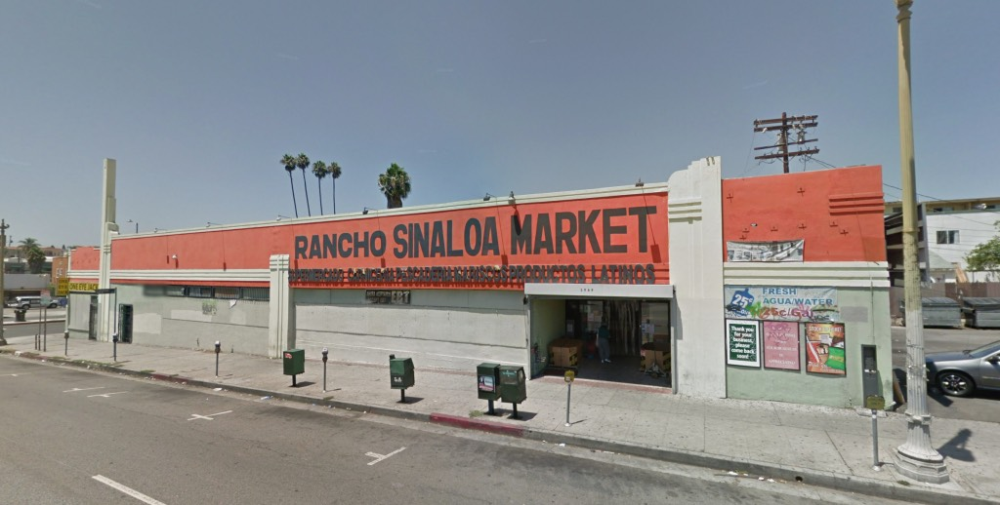

_Like the painted letters, it once would have had large lettering like [this](https://live.staticflickr.com/65535/50927469922_983062c25e_o.jpg). Gads, what I wouldn't give for a shot of this market in 1937._

How is it that stepped pylon remained standing after the Parapet Ordinance of 1949, Sylmar, Whittier, Northridge, _and_ a fire in 1985? Incredible. These kind of intact mid-30s Moderne markets are rare as hen's teeth and a valuable part of the built environment. (Heck, I bet even Kaplan Chen Kaplan would agree with _that_!) In short, it is a rare surviving example of its type and retains its integrity.

3967-3977 Beverly was designed by Edwin Felix Rudolph (1895-1942) and built in the summer/fall of 1936. It was funded by Mrs. Alice B. Cohen who lived next door at 301 N. Berendo (more on 301 N. Berendo later). In 1939 it was the Continental Grocery, by 1945 it was the B & B Meat Market (although I suspect the B & B Meat Market was located _inside_ the Continental Grocery).

_That is, I believe the market rented out to various sub-markets, à la Grand Central Market; case in point, this ad, which dates to September 1939_

Who was Edwin Felix Rudolph? He's not particularly well-known, Sinaloa Market being, in my humble opinion, his best work (or best _known_ work, there's a lot more research to be done on Rudolph). Here is his 1939 Streamline Moderne industrial building for Central Realty at 3101 East 12th St.—

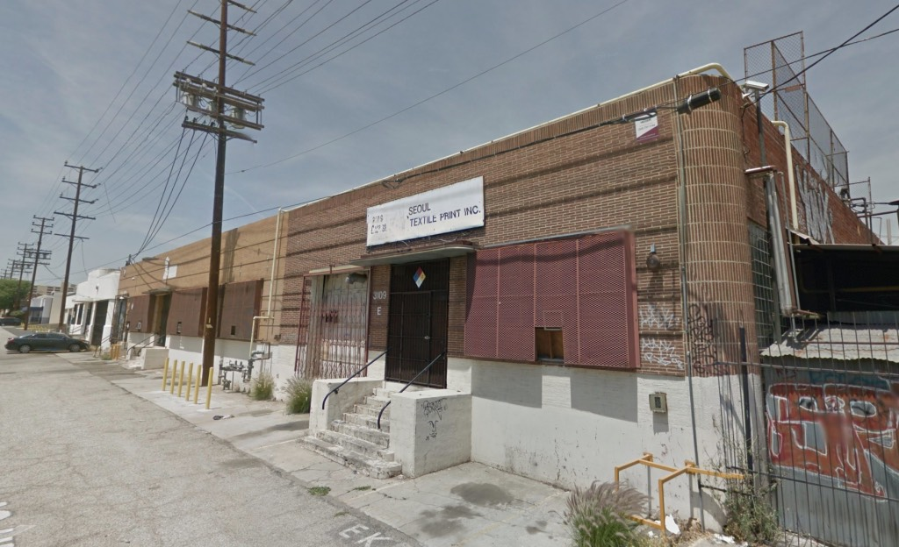

_Look closely and note the glass brick adjacent the rounded corner_

And this is his 1937 industrial building for the Brin Brothers at 631 South Anderson:

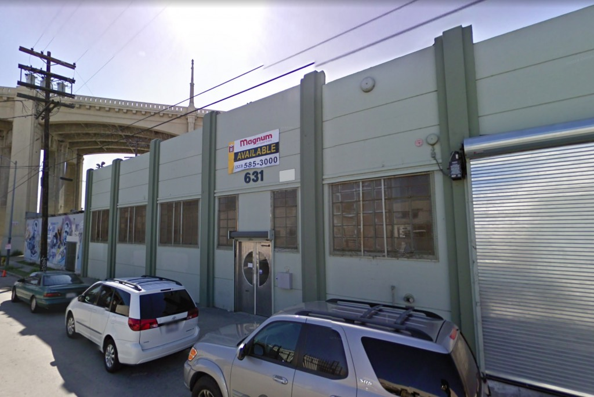

_I'd tell you to personally go take in the glory of that Deco door and marvel at the Streamline pilasters but this building was unfortunately [too near the 1932 Sixth Street Bridge](https://live.staticflickr.com/65535/50920301642_d5251ce16b_o.jpg). Yeah, they [tore that down too](https://live.staticflickr.com/65535/50920301712_197b5baf93_o.jpg)._

Rudolph's also responsible for the 1939 Safeway packing plant on Vernon east of Alameda; a 1939 San Fernando warehouse and feed mill for San Fernando Milling in Van Nuys; a 1934 market at 1070 West Jefferson (damaged in the '92 riots, it was thereafter helpfully demolished by the nonprofit "Rebuild LA" thus ensuring nothing would be rebuilt there, _ever_); and was structural engineer for a number of buildings including the recently-landmarked [Sunset House](https://la.curbed.com/2017/11/7/16621394/hollywood-reporter-building-la-landmark)/[Hollywood Reporter](https://la.curbed.com/2017/10/26/16554516/hollywood-reporter-building-photos-crossroads).

In late 1954 the Continental Grocery/B & B Meat Market became the dental offices of the Hotel and Restaurant Union. In 1967 the market became the home of a typography/printing/darkroom shop called Ad Compositors. It reverted back to groceries in 1975 when it became the Wai Wai Market (and one of the few places in town, noted the _Times_ in 1981, to find Thai staples like makrut, nam pla and pickled egg yolks). It was purchased by Vietnamese refugee Luong Truong in 1985, becoming the Cathay market, and although Truong suffered a disastrous fire there that year, he persevered. It became the Rancho Sinaloa sometime around 2000.

Its corner shop at 3977 began life as a malt shop, became a cleaners, was an insurance agent's office in the 1950s, and got its bar license in 1965, originally called The Yukon—and was a gay bar, according to [the records at the One Archives](https://one.usc.edu/archive-location/yukon)—and was renamed One Eye Jack sometime around 1972.

And because this is RIPLosAngeles, you know where this is going. Yep:

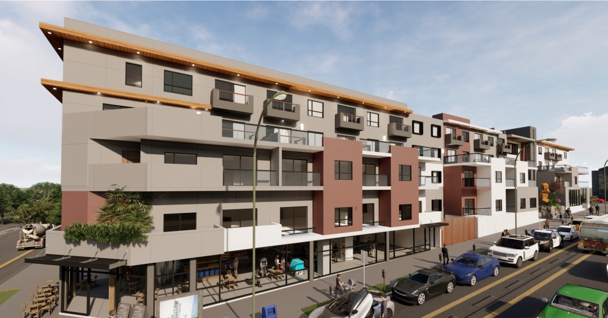

_How many kinds of beige **is** that? I see soiled diaper beige, Depression Beige™, vomit beige and some kind of grayish brown that's not quite beige but trying very hard to be_

Brought to you from the good folks of [4D Development and Investment](https://www.4ddevelopment.us/). The design is by [AFCO Development](http://afcodevelopment.com/portfolio-2/). Every time I do one of these posts I think "well, we've finally hit bottom. A rendering can't get worse than _this_." And then I'm pleasantly surprised-horrified.

And yes, it's TOC-ridden: because seven units shall be low income, it gets a sixteen foot increase in legally allowed height, to sixty-six feet; and a 25% decrease in open space around it. Floor area ratio is upped by 14%, and the whole project has a 70% increase in density. There's only a half a parking spot for each unit.

So, [here's the Department of City Planning report on the site](https://planning.lacity.org/odocument/9377b302-5453-42aa-a7e3-8f81cd3a3e9a/ENV-2019-2766.pdf). It's prepared by some guy named Jason Hernández who, because he works for the City, God bless him, doesn't know what the hell he's talking about. For example, he states that the 1936 market is built in 1942, and two houses from 1919 are from 1922, etc. I mean why should he bother to be sensitive or accurate? After all he works for the City so kind of _has_ to ensure they get torn down—and the poor kid only makes [$92,000 a year](https://calsalaries.com/jason-hernandez-635240) (and that's just part-time), so why should we even expect him to be good at his job?

But then, he's probably just getting his information from what he was given by Kaplan Chen Kaplan, who did the Historic Resource Eval report for City Planning. Hernández wrote on page 26: _"According to the Historic Resource Evaluation conducted by Kaplan Chen Kaplan on November 22, 2019, none of the four (4) existing buildings were found to have historic significance or have the potential to be a historic resource. "_ Well of course not! KCK are high-priced consultants-for-hire, utilized frequently by government and developers, routinely hired to tear down your neighborhood, a fact about which I go into some detail [here](https://www.riplosangeles.com/an-appeal-to-reason-at-1537-south-wilton-pl/). The Office of Historic Resources also says our subject properties are of no historic importance—but only, it states, did it decide so "_after reviewing the Historic Resource Evaluation_." Which was just partisan propaganda _and_, though I guarantee you it was over 200 pages long, contained less pertinent and accurate information in it than _this_ stupid little post does. C'mon OHR, you can do better.

Anyway. The other day this image appeared [on Esotouric's IG](https://www.instagram.com/p/CK0LDk2oUiz/):

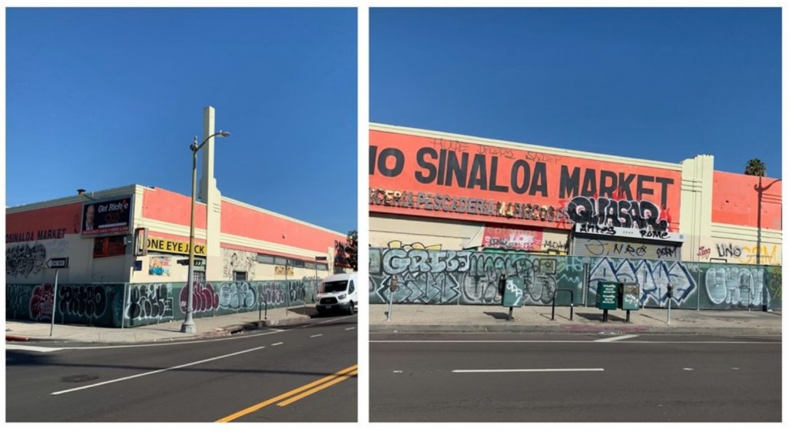

_The writing on the side of the building reads "I am a moral leper, do us both a favor and cut off my hands"_

So that, being demo fencing, is _that_. But wait! Don't answer yet! You'll also receive THE DEMOLITION OF THESE THREE SINGLE FAMILY HOMES!

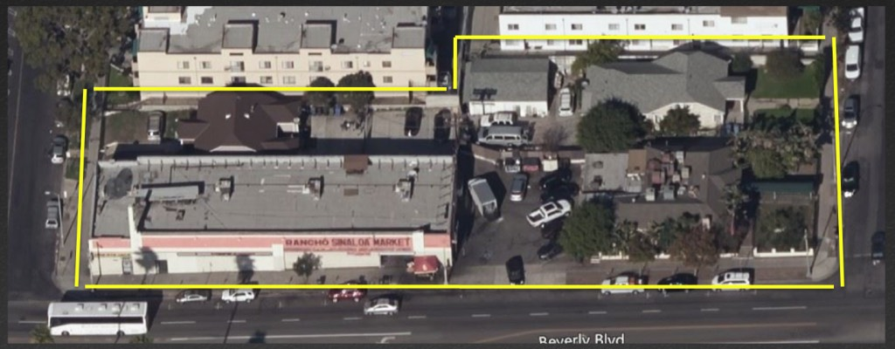

_There's our market bottom left, but they're also tearing down the SFD to its north at 306 N Heliotrope, and the two houses to its west, at 301 & 307 N Berendo_

That's right, immediately to the east, at 301 North Berendo (where Alice B. Cohen lived, who built the Continental/B & B Market, remember?) is this lovely little house, which the City report refers to as a "commercial building," which I suppose is fair. It began as an SFD, and became a commercial building, converted to a restaurant:

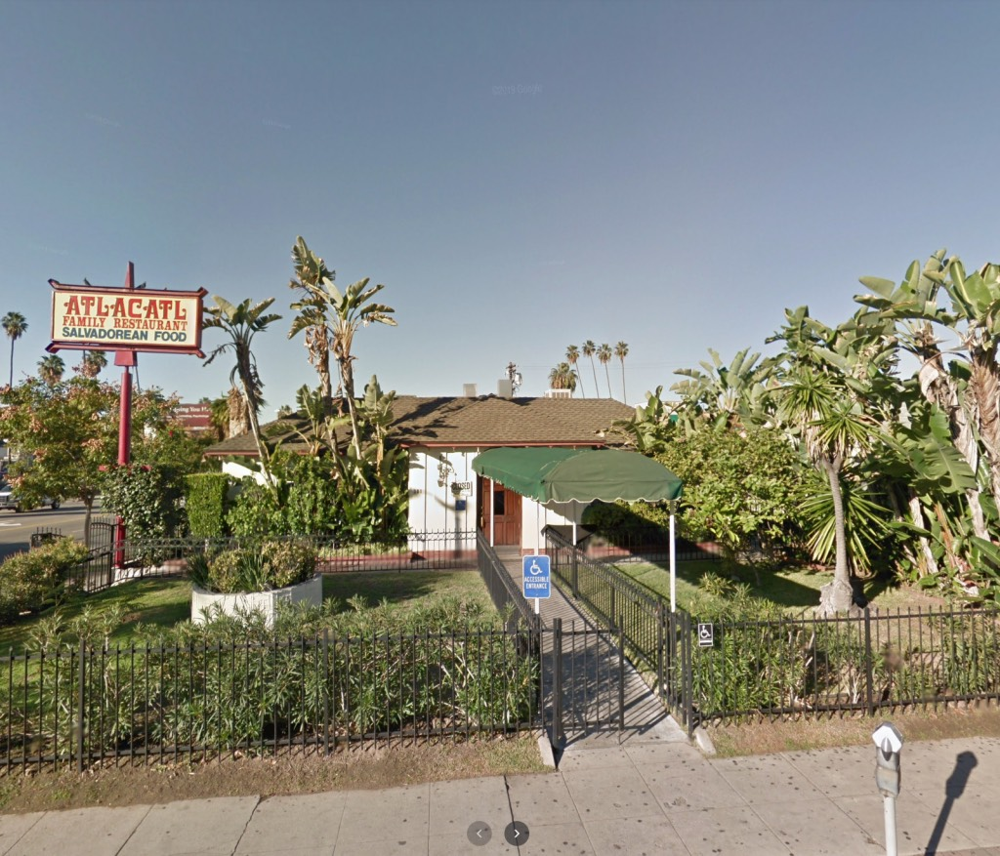

301 was constructed in 1919 by builder Samuel W. Spangler, who acted as its architect; Spangler was one of the many LA entrepreneurs who built and sold concrete bungalows in the teens. It was a restaurant by 1942, when owned by Lucille Rowley, and through the 1950s was Lucille's Cottage.

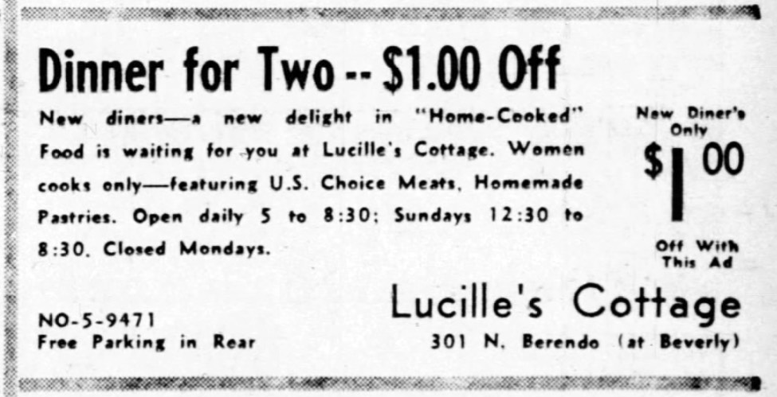

_Women cooks only!_

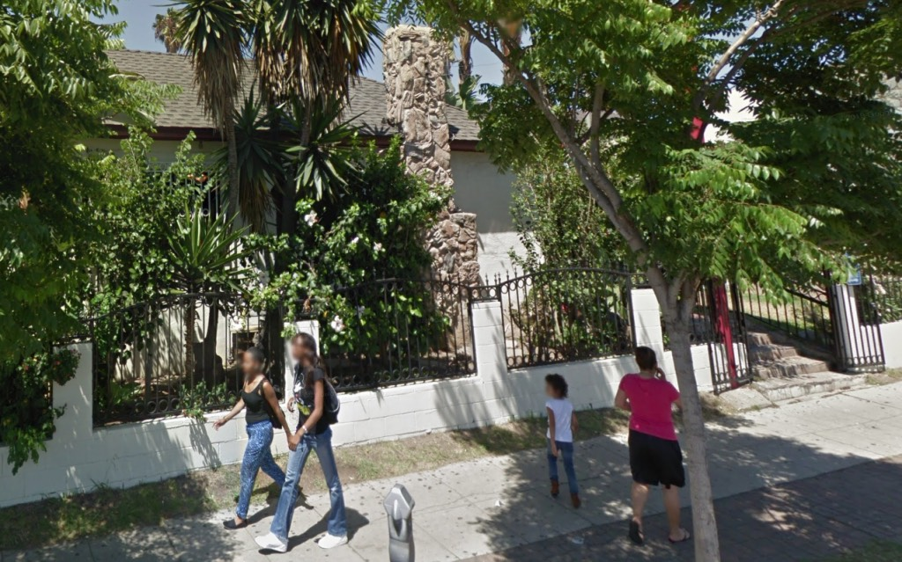

_I see you, rock chimney hiding in the foliage_

In 1961 it became, briefly, Young's Oriental Inn—"[The Oriental Gourmet Spot of Los Angeles](https://live.staticflickr.com/65535/50920947463_67e8fa8ffe_o.jpg)." In 1963 it became the site of the _first Peruvian restaurant in the United States_. Others would follow, but [Inca's](https://live.staticflickr.com/65535/50927797951_ffdeb6cbcf_o.jpg) was first and always considered best, a highly-regarded red table-clothed affair run by Carlos and Ofelia Binasa and managed by son Gabriel, as the only Peruvian easting establishment to feature serious and authentic dishes; it also had art showings. The space became Atlactatl in September 1989, and has (had) the best pupusas in town (the southland's best pupuserias are located in _my_ neighborhood, but _these_, these merited driving to).

This it Atlacatl's neighbor to the north, 307 North Berendo:

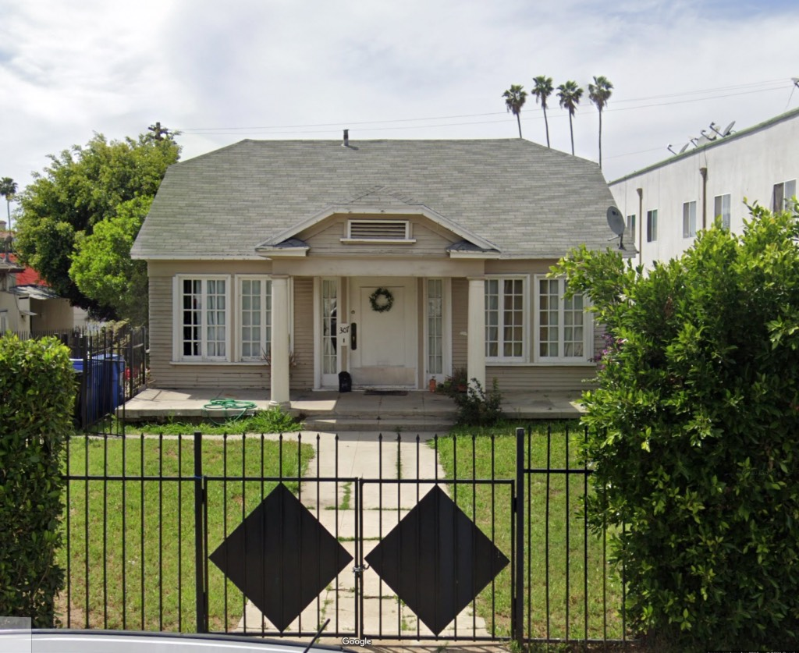

Like Spangler, Ira Allison Marshall was a local realty man, who built, bought and sold bungalows across Los Angeles in the teens, perhaps as many as 250, mostly in the Westlake district. Marshall built this in early 1919. It has a wonderful clipped gable roof, and the traditional American Colonial boxed eave return above the porch. Look at all those original windows! In December 1979, 301-307 N. Berendo became the International Institute of the Maitre-D', which transformed into the National Restaurant Academy in September 1980, and which apparently dissolved in mid-late 1983.

To the west of our friends on Berendo, at the north of our market, is 306 North Heliotrope:

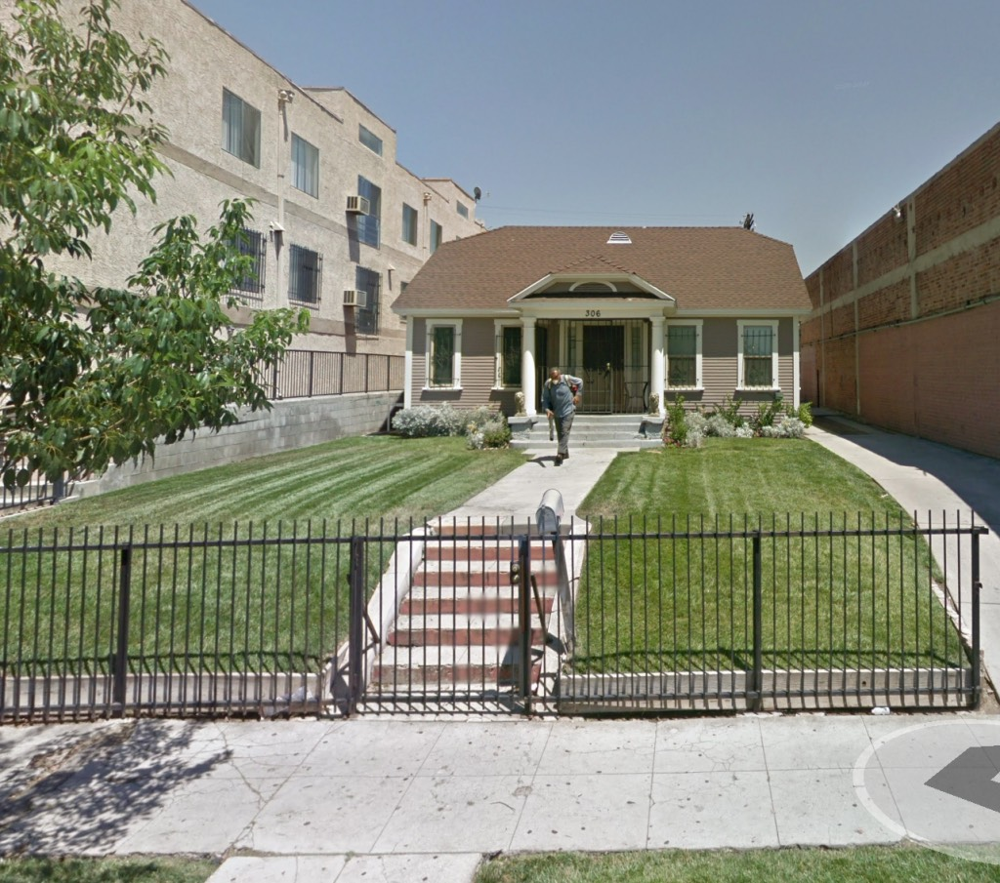

_Look at the pride of place here—Google Street even managed to capture the gardener plying his trade_

Again, American Colonial built in 1919, this time for a Ms. Gretta C. Sutherland; the builder was Charles MacMillan. Gable roofed, hipped n' clipped, with a wonderful matching clipped hip porch gable. Tough to see through the security bars but, like the house behind it on Berendo, original sidelights and windows (double hung in this case) and, I hope I don't have to point out, marvel of marvels, neither house has been stucco'd.

[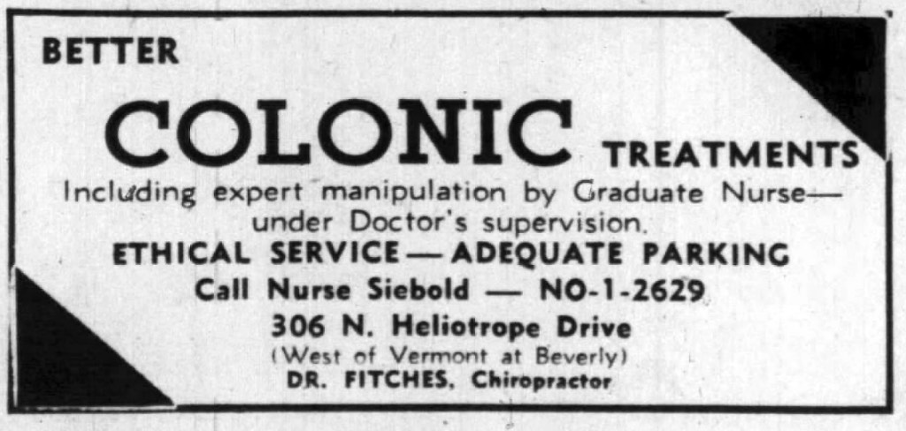](https://www.unigo.com/scholarships/by-major/major-specific-scholarships/dr-james-w-fitches-fellowship)

_Also, in the late 40s this is where you'd go for your colon hydrotherapy—including expert manipulation by a Graduate Nurse_

So as I was saying. All this gets dumpster'd in favor of this—

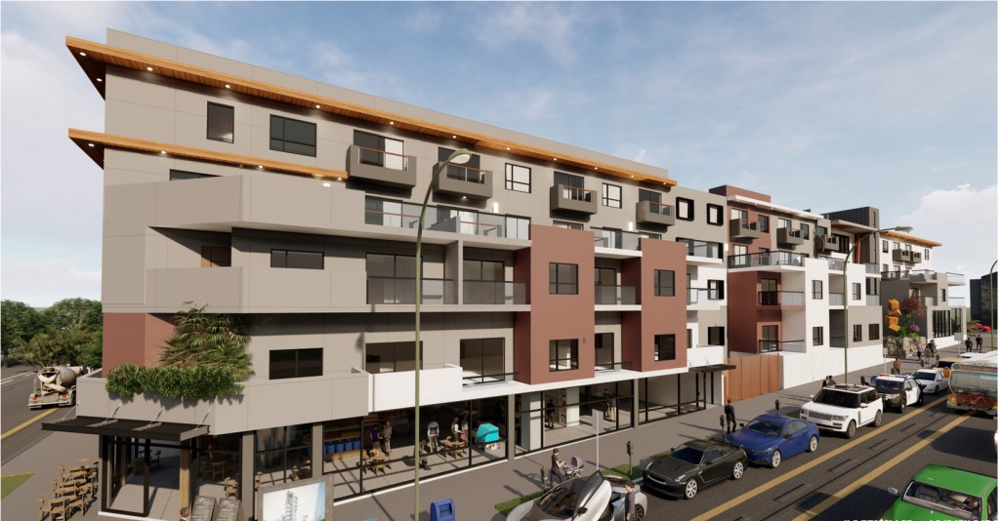

Yes_, build this and the neighborhood will populate with scissor-door cars and baby strollers_

Built to the edges of the street—and monstrous—is a fate we must accept solely for no other reason than it having seven affordable units within. Because you cannot disagree with _housing_, because we _don't build housing_! Except...there's a million of these things going up every day, everywhere. There were 58,437 market-rate units built in Los Angeles in 17-18-19, plus another 10,877 low-income units; for example, in 2018 specifically, Los Angeles gained only 2,000 residents yet built 16,525 units. And the number of units added to market in 2020 (although I am without precise numbers as the Department of Finance has yet to release them) has skyrocketed, in part because of implementation of the ADU Ordinance, even despite COVID (not to mention the 8,000 new units for homeless families, built via PropHHH).

So why, then, are rents so high? Well, as regards newly-built units added to the housing stock, it has much to do with the exorbitant cost of building in Los Angeles—apart from our high land acquisition costs, it runs about $400/sf to build here, given the very steep cost of labor, high cost of construction materials, and meeting our particular building regulatory codes (solar, sprinklers, etc.); our permitting fees, which are nothing compared to all the escalating school, parks, and other government-mandated fees (LAUSD's fee alone for this project will run about $425,000); the pricey soft costs of architects and engineers, and then you have to deal with property taxes, and so on. No-one is going to build if they can't recoup their investment (unless it's a government project, of course) and they wouldn't build this if it wouldn't turn a profit; not turning a profit makes people get fired. It stands to reason, then, _someone_ is paying $4,000/mo to live in a studio.

That said, there has been [much talk](https://www.counterpunch.org/2020/10/06/vacant-housing-and-homelessness-in-la/) about how many of these new units are built as luxury units, and many sit empty, and the answer therefore is slapping the owners with a vacancy tax. I would contend, however, that it is not the private sector's responsibility to alleviate social ills. But they do, in fact, indirectly—the bulk of LA's upkeep is paid for by real estate: of the City of Los Angeles' $5billion annual budget, $3.5billion comes from property taxes and permitting/fees. This year we'll spend nearly a half-billion of that haul on the homeless crisis, which many contend is not nearly enough. You know, $130million of this year's budget is going to the City Attorneys office—_that_ could build subsidized units rather than pay for those endless $400/hr attorneys, right? $52million is earmarked to pay salaries at City Planning, who—as I've demonstrated—hire incompetents and worse, pay for expensive, lavish studies written by venal jackals (who, in their defense, are at least _competent_ at turning out those depressingly repetitious "this significant structure is insignificant!" studies). Cut _their_ budget and spend _that_ money on affordable housing—you know, without cutting Office of Historic Resources, naturally.

But forgive my thinking out loud—I'm neither an authority on housing crises nor their resolutions, so don't take to me task on the previous paragraphs. I just like to look at old buildings. Which is becoming an increasingly difficult pleasure, since developers keep tearing them down, aided and abetted by a local government that's making bank on the process.

- [Beverly Boulevard](https://www.google.com/maps/search/?api=1&query=34.07646,-118.29508)

UPDATE:

_Saving the world from the Streamline Moderne one 1936 market at a time_

_The sad end of 307 N Berendo, which survived unmolested for over one hundred years..._

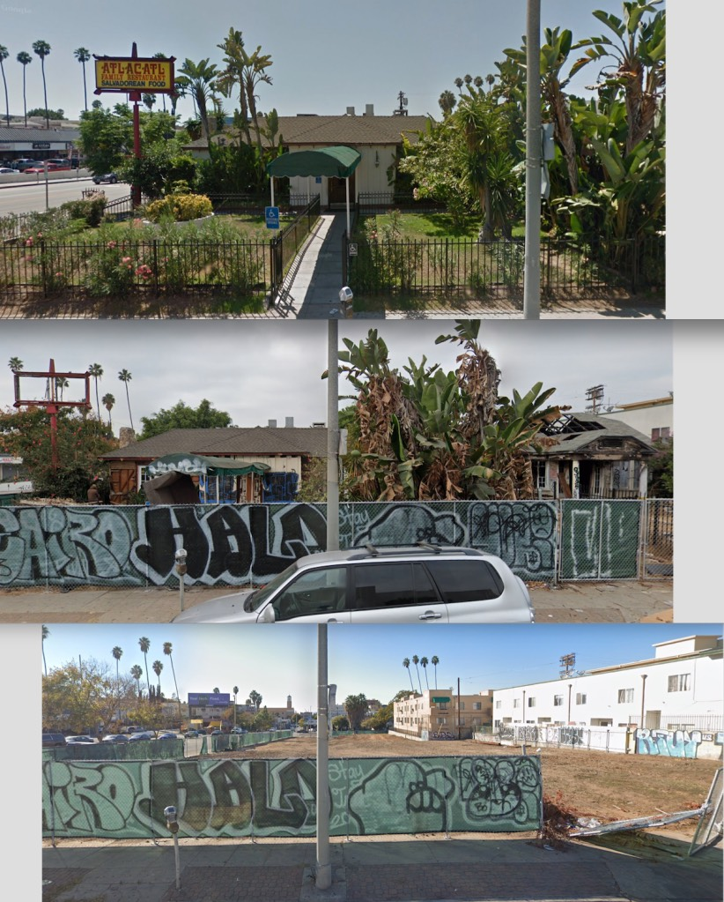

_Atlacatl must die, because some Westside YIMBY said so, you racist_
