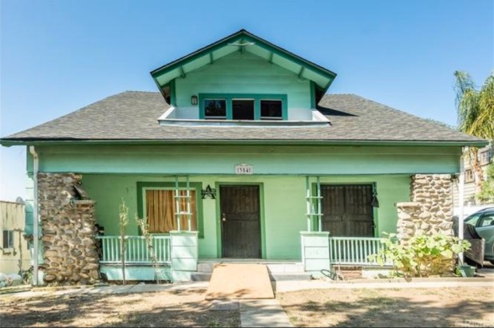

_No no, it's still standing, I'm going to snark about this house in a_ different _way today_

You know, not everything is about the demolition of our built environment in toto. (Like, say, [the razing of an entire Whittlesey](https://www.riplosangeles.com/an-appeal-to-reason-at-1537-south-wilton-pl/).) Sometimes it's more subtle.

Over in Highland Park, there's a house. I confess I'm a _little_ confounded about its background. See, we have it in the permits that Fred C. Coryell (the contractor-builder who designed and built his own house at 225 N Avenue 53, which stood until [replaced by an unusually ugly and depressing building in 1991](https://www.apartments.com/225-north-avenue-53-los-angeles-ca/fdnfb4r/)) built 354 for Asenath Arick "Jane" Copes Phelps, widow of Harlow Jefferson Phelps, in 1909-10. Here's the Highland Park Ebell meeting in the Phelps's brand-new house in October 1910:

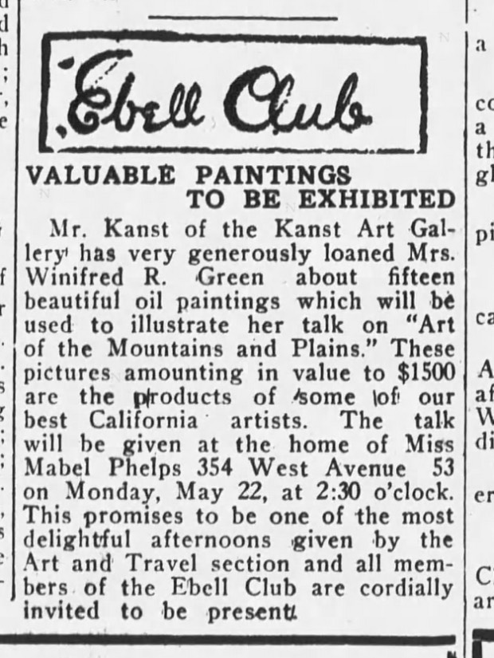

_Mabel Phelps was 32 in 1910. West Avenue 53 was renamed North Avenue 53 about 1927_

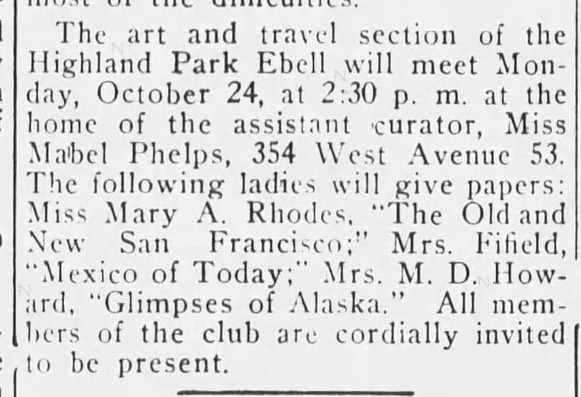

_Here's Mabel hosting folk at the home again in the spring of 1911_

And the Phelps clan are listed in the directories from 1910 on. However, this rather odd bit of whatnot pops up in July 1911:

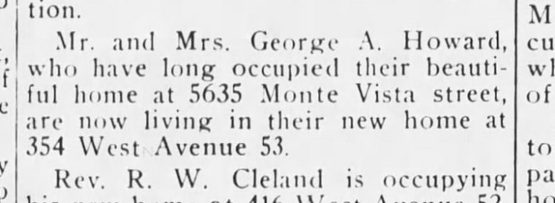

"_Their beautiful home" [replaced by this](https://www.redfin.com/CA/Los-Angeles/5635-Monte-Vista-St-90042/home/7078099)_

Which makes no sense, since as far as we know it's the Phelps' home. Howard's obit a year later notes he's still at 5635 Monte Vista, mind you:

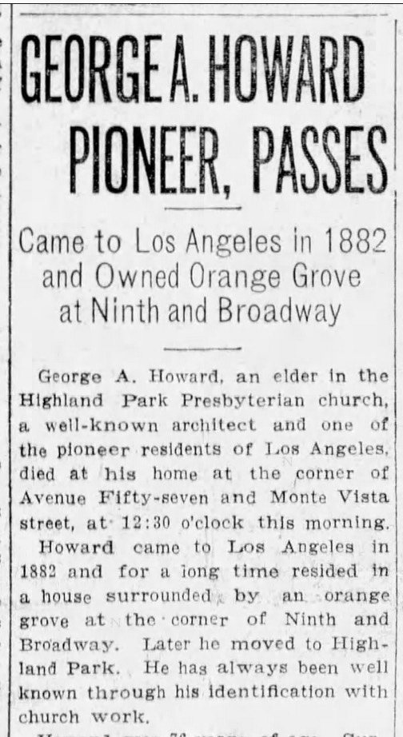

Aaaaanyway, just wanted to give you some early history on the old girl, and point out that her interior remained pretty intact, until hit by the Lowest Common Denominator. It's the kind of thing you hear a lot about [happening in San Francisco](https://www.marketwatch.com/story/new-tech-money-is-destroying-the-streets-of-san-francisco-2015-06-08). Hey, Los Angeles, I thought we were supposed to be better than _up there_.

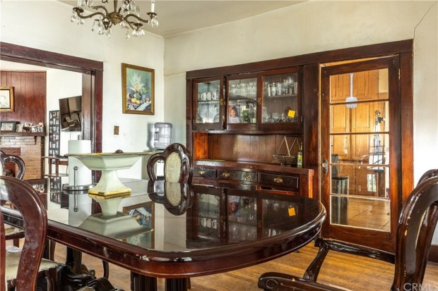

_Note the brick fireplace, left, the built-ins, center, and the glass-paned door with glass doorknob leading to the kitchen_

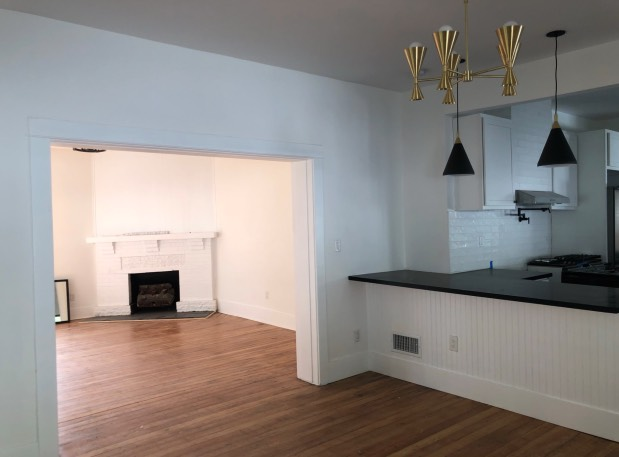

_Which is now this, all sterile and midmod and "openplan." Note the original white oak floors were ripped out and replaced with something else, or that may just be the subfloor, which they stained and figured, good enough._

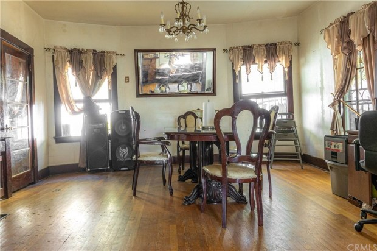

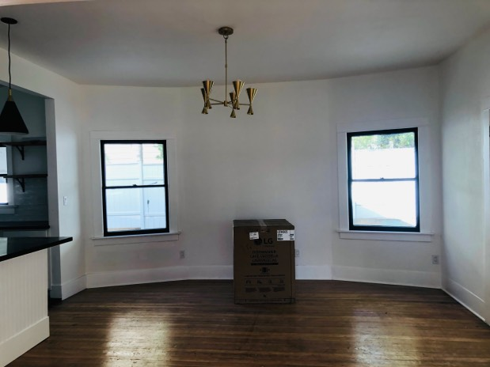

_Yep, better spray those windowsills and baseboard white, except the part you paint black, how delightfully Craftsman_

Carlos Ascencio, a realtor-flipper who works for ReMax, bought the place in February 2021 and got a permit to remodel the kitchens/bathrooms.

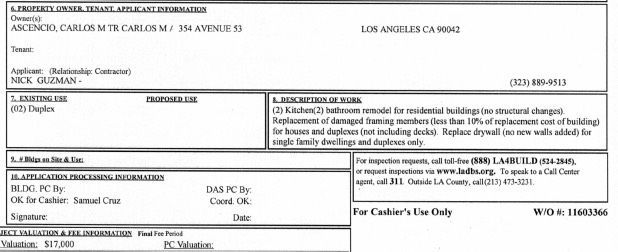

When the permit said "_no structural changes_" I'm sure blowing out that wall falls under that, um, sorta.

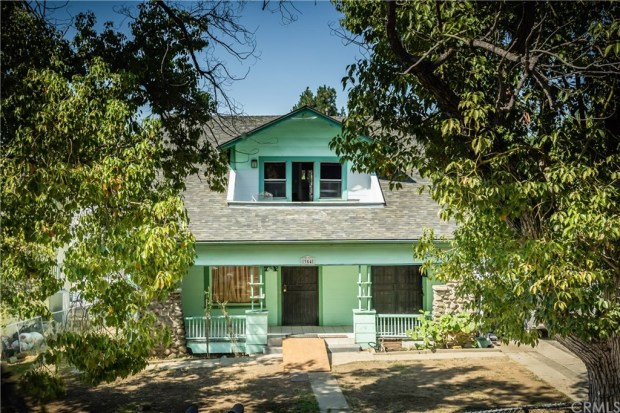

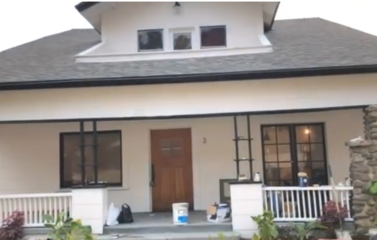

_They didn't paint over the river rock, I'll give 'em that much_

Ascencio/ReMax bought it in February 2021 for $850,000. Blew out the dining room to make a "great room" and sprayed the whole place white. Sold it December for $1,500,000. Made $650,000 with a new kitchen and a whole lot of white paint. Not a bad racket.

_No no, it's still standing, I'm going to snark about this house in a_ different _way today_

You know, not everything is about the demolition of our built environment in toto. (Like, say, [the razing of an entire Whittlesey](https://www.riplosangeles.com/an-appeal-to-reason-at-1537-south-wilton-pl/).) Sometimes it's more subtle.

Over in Highland Park, there's a house. I confess I'm a _little_ confounded about its background. See, we have it in the permits that Fred C. Coryell (the contractor-builder who designed and built his own house at 225 N Avenue 53, which stood until [replaced by an unusually ugly and depressing building in 1991](https://www.apartments.com/225-north-avenue-53-los-angeles-ca/fdnfb4r/)) built 354 for Asenath Arick "Jane" Copes Phelps, widow of Harlow Jefferson Phelps, in 1909-10. Here's the Highland Park Ebell meeting in the Phelps's brand-new house in October 1910:

_Mabel Phelps was 32 in 1910. West Avenue 53 was renamed North Avenue 53 about 1927_

_Here's Mabel hosting folk at the home again in the spring of 1911_

And the Phelps clan are listed in the directories from 1910 on. However, this rather odd bit of whatnot pops up in July 1911:

"_Their beautiful home" [replaced by this](https://www.redfin.com/CA/Los-Angeles/5635-Monte-Vista-St-90042/home/7078099)_

Which makes no sense, since as far as we know it's the Phelps' home. Howard's obit a year later notes he's still at 5635 Monte Vista, mind you:

Aaaaanyway, just wanted to give you some early history on the old girl, and point out that her interior remained pretty intact, until hit by the Lowest Common Denominator. It's the kind of thing you hear a lot about [happening in San Francisco](https://www.marketwatch.com/story/new-tech-money-is-destroying-the-streets-of-san-francisco-2015-06-08). Hey, Los Angeles, I thought we were supposed to be better than _up there_.

_Note the brick fireplace, left, the built-ins, center, and the glass-paned door with glass doorknob leading to the kitchen_

_Which is now this, all sterile and midmod and "openplan." Note the original white oak floors were ripped out and replaced with something else, or that may just be the subfloor, which they stained and figured, good enough._

_Yep, better spray those windowsills and baseboard white, except the part you paint black, how delightfully Craftsman_

Carlos Ascencio, a realtor-flipper who works for ReMax, bought the place in February 2021 and got a permit to remodel the kitchens/bathrooms.

When the permit said "_no structural changes_" I'm sure blowing out that wall falls under that, um, sorta.

_They didn't paint over the river rock, I'll give 'em that much_

Ascencio/ReMax bought it in February 2021 for $850,000. Blew out the dining room to make a "great room" and sprayed the whole place white. Sold it December for $1,500,000. Made $650,000 with a new kitchen and a whole lot of white paint. Not a bad racket.

The whole rip-it-out spray-it-white reminds me of Jorge Cuevo, who did it to the Pig'N Whistle on Hollywood Blvd. According [to this](https://www.instagram.com/p/CWcO1I3poNH/), he intends to do it to 200 restaurants to start.

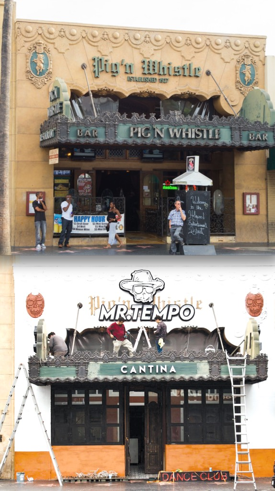

According to [https://www.lataco.com/mr-tempo-mocks-pig-n-whistle](https://www.lataco.com/mr-tempo-mocks-pig-n-whistle)/ it seems Mr. Cueva finds it appropriate to return the generosity and good fortune found in his adopted country, to Los Angeles specifically, with destroying its unique cultural history. This he [does without permits](https://www.lataco.com/pig-whistle-destruction-mr-tempo/), because why would rules apply to him—he has [a red hat!](https://www.instagram.com/p/CXrs_grPb9r/)

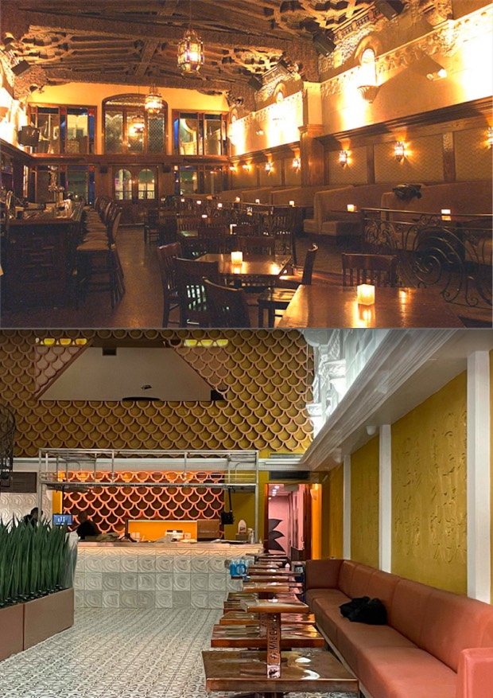

According to [https://www.lataco.com/mr-tempo-mocks-pig-n-whistle](https://www.lataco.com/mr-tempo-mocks-pig-n-whistle)/ it seems Mr. Cuevas finds it appropriate to return the generosity and good fortune found in his adopted country, to Los Angeles specifically, with destroying its unique cultural history. This he [does without permits](https://www.lataco.com/pig-whistle-destruction-mr-tempo/), because why would rules apply to him—he has [a red hat!](https://www.instagram.com/p/CXrs_grPb9r/)

